# Tools of Math Construction: An Aggregate Theory of Concrete Mathematics
# by Leon P Smith, Iterative Systems

In celebration of Rational Approximation Day 02022-07-22, and in the name of Reason and a Reënlightenment, I offer an apology for the Indiana Pi Bill, and offer an Apology for Science, Faith, Reason, and Humanity.  This study guide is a companion to [_Kevin Bacon and the Stern Brocot Tree: a Sermon on Rational Approximation_](../T001_Kevin_Bacon_and_the_Stern-Brocot_Tree/a_Sermon_on_Rational_Approximation.md)

[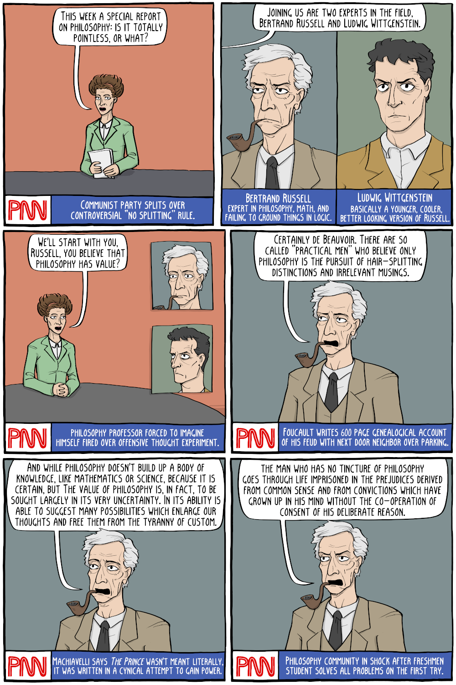](https://existentialcomics.com/comic/365)
[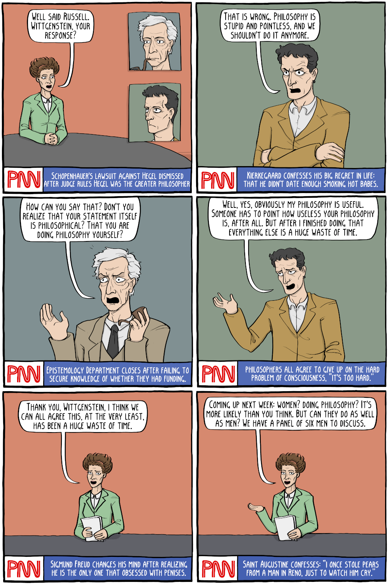](https://existentialcomics.com/comic/365)

If you only ever read a single suggestion, I would ask that you read "Weapons of Math Destruction", as it is directly relevant to the state of the world today and the many contemporary challenges we face. I suspect a great many people should probably read "The Scout Mindset" first, as preparation.

My global suggestions consist of ten primary recommendations loosely divided into three major themes: inductive reasoning and self-awareness, ethics and morality, and the philosophy of math and science. These suggestions are "global" in the sense that I would recommend them to most people, with relatively few conditions or qualifications.

Later, I deconstruct Bertrand Russell and endorse the Weak Paraconsistent Conjecture in memory of Jon Michael Dunn.

Then I share an intellectual history of my thinking on an Aggregate Theory of Concrete Mathematics. These are stories of creative interactions between myself and others that contributed to my learning and occasional re-discovery of some well-known yet widely underappreciated results. These results deserve a much broader audience. This intellectual history doubles as a tribute to Linear Algebra and the memory of Elizabeth Meckes.

In Physics and Metaphones, I share a modern, popularized account of Claude Shannon's Theory of Communication, a modern take on Ludwig Wittgenstein's semantics of language, and engineering considerations for practical implementations. This explores issues of noise, authentication, queueing, protocol, and consensus, and how they relate to things such as amateur radio, emergency management, cryptography, and blockchain. It attempts to provide a holistic summary of several relatively conventional takes on the modern philosophies of the design of communications systems. I deconstruct APRS, the Automatic Packet Reporting System, suggesting that it should inspire a next-generation amateur radio protocol intended towards disaster relief, as a tribute to the memory of the silent key Bob Bruninga, WB4APR.

Finally, in honor of my former classmate and dear friend Yuri Goldfeld, I extend an invitation to the State of California to strengthen the foundation of the elementary mathematical curriculum with the Six Degrees of the Square, the Triangle, and the Tree, constructive symmetry, computer programming, rational approximation, robotics, and induction.

This invitation extends to you personally, as well as the United States of America and all of human kind. Everybody deserves to be included in and benefit from math curriculum reform.

To celebrate, I suggest cutting a pie into sevenths, and sharing it with a circle of six other friends, both new and old. May you have a blessed Rational Approximation Week, and a wonderful Rational Approximation Day.

[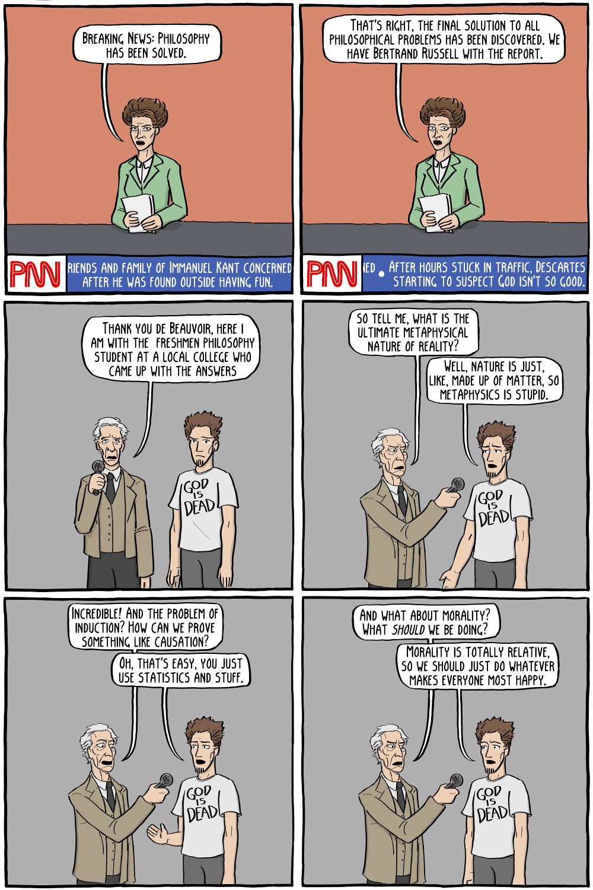](https://existentialcomics.com/comic/191)
[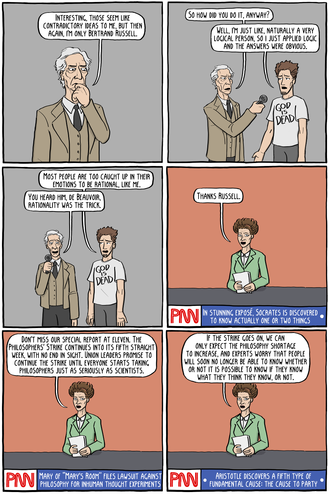](https://existentialcomics.com/comic/191)

> Every difficult problem has a solution that is simple, neat, and wrong.
>
> paraphrased from H.L. Mencken

## Global Suggestions

* Self-aware, Inductive Reasoning:

    1. The Scout Mindset: Why Some People See Things Clearly and Others Don't, by Julia Galef
    2. Benjamin Franklin: A Film by Ken Burns
    3. The Knowledge Illusion: Why We Never Think Alone, by Steven Sloman and Philip Fernbach
    4. The Book of Why: The New Science of Cause and Effect, by Judea Pearl and Dana Mackenzie

* Ethics and Moral Philosophy:

    5. The Ethics of Belief, by William Kingdon Clifford
    6. Weapons of Math Destruction: How Big Data Increases Inequality and Threatens Democracy, by Cathy O'Neil
    7. When Time Is Short: Finding Our Way in the Anthropocene, by Timothy Beal

* Philosophy of Math (and Science):

    8. Proofs and Refutations: The Logic of Mathematical Discovery, by Imre Lakatos
    9. Language, Proof and Logic (2nd Ed.), by Dave Barker-Plummer, Jon Barwise, and John Etchemendy
    10. Statistical Rethinking: A Bayesian Course with Examples in R and Stan (2nd Ed.), by Richard McElreath

Our contemporary culture likes to talk about, use, misuse and abuse math and science a lot, but what are these things, really?  Where does science come from?  What makes science "true"? Does mathematics provide "absolute" truth? What is "truth", anyway?  What are the differences between math and science, and how are they related? What are the material conditions in which math and science are conducted? What responsibilities do we have regarding what we believe to be true?

Every one of these questions is important, and, if we are being honest, every one of these questions is difficult, some moreso than others. At best, simple answers to these questions provide only crude approximations of reality, and at worst are wrong, misleading, and/or harmful. A key goal of my global suggestions is to provide useful answers to the parts of these questions that are relatively well-understood. Another key goal is to introduce schools of thought that have been useful in understanding and approaching the difficulties that these questions pose.

For an invaluable overview of philosophy, I highly recommend "The Great Conversation: A Historical Introduction to Philosophy" by Norman Melchert and David R. Morrow. It is an excellent reference book with an emphasis on Western perspectives.  Steven Pinker's "Rationality: What It Is, Why It Seems Scarce, and Why It Matters" has many significant overlaps with this study guide and its many reading recommendations, and is itself well worth reading.

[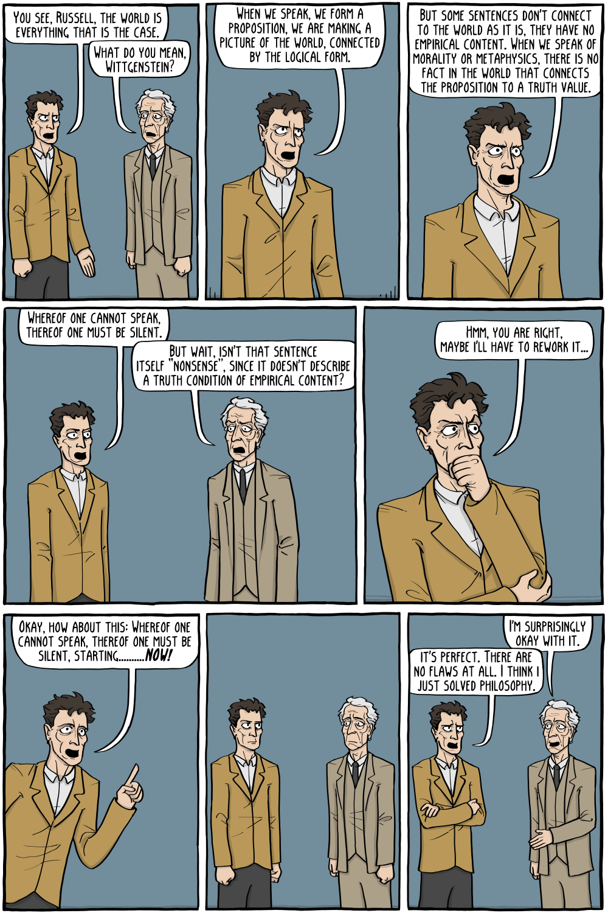](https://www.existentialcomics.com/comic/292)

I didn't draw these comics, they are from Existential Comics.  The author of these comics often provide a useful summary and explanation of the comic, as is done in [Wittgenstein Revises His Thesis](https://www.existentialcomics.com/comic/292) above. Check it out!

## Self-aware, Inductive Reasoning

[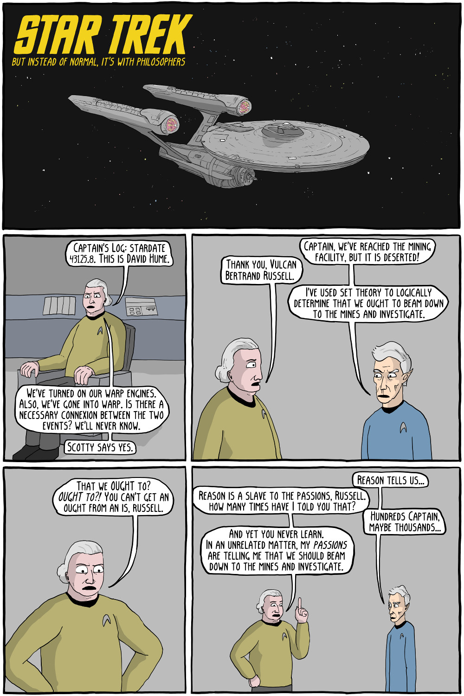](https://existentialcomics.com/comic/92)

The goal of my first theme is to introduce what George Pólya calls the _inductive attitude_:

> In our personal life we often cling to illusions. That is, we do not dare to examine certain beliefs which could be easily contradicted by experience, because we are afraid of upsetting our emotional balance. There may be circumstances in which it is not unwise to cling to illusions, but in science we need a very different attitude, the _inductive attitude_. This attitude aims at adapting our beliefs to our experience as efficiently as possible. It requires a certain preference for what is matter of fact. It requires a ready ascent from observations to generalizations, and a ready descent from the highest generalizations to the most concrete observations. It requires saying "maybe" and "perhaps" in thousand different shades. It requires many other things, especially the following three.
>
> First, we should be ready to revise any one of our beliefs.
>
> Second, we should change a belief when there is a compelling reason to change it.
>
> Third, we should not change a belief wantonly, without some good reason.
>
> These points sound pretty trivial. Yet one needs rather unusual qualities to live up to them.
>
> The first point needs "intellectual courage." You need courage to revise your beliefs. Galileo, challenging the prejudice of his contemporaries and the authority of Aristotle, is a great example of intellectual courage.
>
> The second point needs "intellectual honesty."  To stick to my conjecture that has been clearly contradicted by experience just because it is _my_ conjecture would be dishonest.
>
> The third point needs "wise restraint." To change a belief without serious examination, just for the sake of fashion, for example, would be foolish. Yet we have neither the time nor the strength to examine seriously all of our beliefs. Therefore it is wise to reserve the day's work, our questions, and our active doubts for such beliefs we can reasonably expect to amend. "Do not believe anything, but question only what is worth questioning."
>
> Intellectual courage, intellectual honesty, and wise restraint are the moral qualities of the scientist.
>
> - G. Pólya, "Mathematics and Plausible Reasoning, Vol I: Induction and Analogy in Mathematics", Chapter 1, Section 4. See also "On Rearing Scholars" by Imre Lakatos, as translated by Ninon Leader as Appendix A of "For and Against Method" by Imre Lakatos and Paul Feyerabend, edited by Matteo Moterrelini.

Properly respecting uncertainty and doubt, by learning how to hold onto uncertainty without unreasonably clinging to doubt, is a fundamental ingredient to making inductive reasoning work well. For a contemporary, easy to read, and compelling introduction to the _inductive attitude_, I highly recommend "The Scout Mindset" by Julia Galef. The author provides a brief video overview of her thesis in [Why you think you're right - even if you're wrong](https://www.ted.com/talks/julia_galef_why_you_think_you_re_right_even_if_you_re_wrong) TED talk.

From watching "Benjamin Franklin, A Film by Ken Burns", I believe that this founding father was frequently a master practitioner of the scout mindset throughout his life. Of course there are cases, even in this documentary, where Benjamin Franklin didn't live up to this ethos very well. It's important to remember that the inductive attitude is a process, not a destination. Past performance does not determine future outcomes. The Scout Mindset is not a label to be acquired or trophy to be won. Instead, the scout mindset is an often deteriorating state of being that can always be improved upon and can only be re-earned. The scout mindset has very little to with where you currently are at, and a lot to do with your attitude about where to go next. Compare this to "Don't Label Me" by Irshad Manji, and NBC's philosophical comedy "The Good Place".

George Pólya observed that we "have neither the time nor the strength" to carefully examine everything we believe. In "The Knowledge Illusion", Steven Sloman and Philip Fernbach expand on this idea in at least two ways. Firstly, the authors draw a distinction between the things of which we have direct, immediate knowledge, and the things of which we have indirect, referential knowledge. Secondly, they argue that people have a cognitive bias to believe that they have direct knowledge of a topic in cases where their knowledge is in fact referential. Kevin deLaplante provides a very nice introduction and summary of [The Knowledge Illusion](https://www.youtube.com/watch?v=LC6O_2vDDwc) on his YouTube channel.

I believe it likely that we, as a society, stand to all substantially benefit by being more honest about referential knowledge. Making that a reality would seem to involve at least three ingredients. Firstly, large numbers of individuals need to make fewer mistakes of confusing confusing their own referential knowledge for direct knowledge. Secondly, we need commonly understood linguistic cues that succinctly communicate whether the knowledge you claim to have is referential or direct. Thirdly, we all need to live in a society of peers with a keener understanding of both the value and the limitations that referential knowledge represents. After all, if we as a society routinely dismiss the referential knowledge of others out of hand, then future conversations are less likely to be had, and the linguistic cues are less likely to be used. All three steps promote a common theme: raising the self-awareness of all the individuals of a society.

Note that "direct knowledge" versus "referential knowledge" is my own terminology, not used by the authors. My thinking is by analogy to the theory of computer programming languages. For example, in some programming languages like C or Pascal, arguments to a procedure may be passed directly, or by reference. This particular distinction becomes semantically meaningless in purely functional programming such as Haskell, yet there are other analogous notions of "direct, immediate" versus "indirect, referential" that are relevant. Extending the analogy, "dereferencing" would be taking referential knowledge and turning it into direct knowledge, by the process of learning it for yourself.

"The Book of Why: The New Science of Cause and Effect" by Judea Pearl and Dana MacKenzie is written for the general public as an introduction to causal modelling via dot-and-arrow diagrams. It introduces The Ladder of Causality as a metaphor for the fundamental capabilities of observational statistics, causal inference, and counterfactual reasoning. Classical observational statistics does not intervene and thus cannot definitively answer questions of causality, so it forms the lowest rung of the ladder.

The tools of causal inference can be used to turn hypothetical models of relevant causes and effects into _estimands_, if possible, or say that no such estimand exists. Estimands are like statistical ovens that bake empirical data into estimates. It is impossible to definitively test a hypothetical causal model from observation alone.  For this, interventions are required in order to go one rung up on the Ladder of Causality. Yet formal causal models are the price to ascend another rung of the ladder, and in return enable repeatable counterfactual reasoning.

A conterfactual question is a "what if" question.  Formal counterfactual reasoning can be used to study the plausibility of the many different possible answers to such a question, all at the same time.  This uses a process that is repeatable, understandable, and can produce formal justifications for the answers that the model can represent.

Some level of awareness, either consciously, unconciously, by design, and/or by evolution, seems to be an essential ingredient in inductive and counterfactual reasoning. Self-awareness seems to be especially fundamental to making informal inductive reasoning work well in humans. Daniel Kahneman's "Thinking, Fast and Slow" reflects on a number of cognitive biases we all exhibit to varying degrees. Kahneman, Sibony, and Susstein's "Noise: A Flaw in Human Judgement" delves deeper into the cognitive mistakes humans naturally make and that groups sometimes amplify.

See also "Not Born Yesterday" by Hugo Mercier, which reflects upon the nature of persuasion, skepticism, and belief in individuals and societies. Douglas Hofstadter's "Gödel, Escher, Bach: a Eternal Golden Braid" is in part a speculative thesis on how human self-awareness might arise from strange loops, and in part an informal introduction to metamathematics and the art of self-reference.

[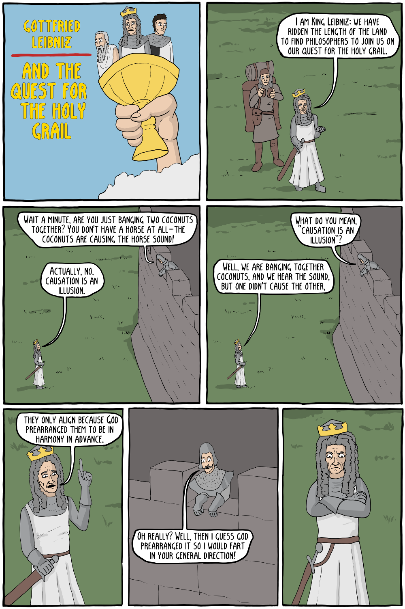](https://existentialcomics.com/comic/108)

[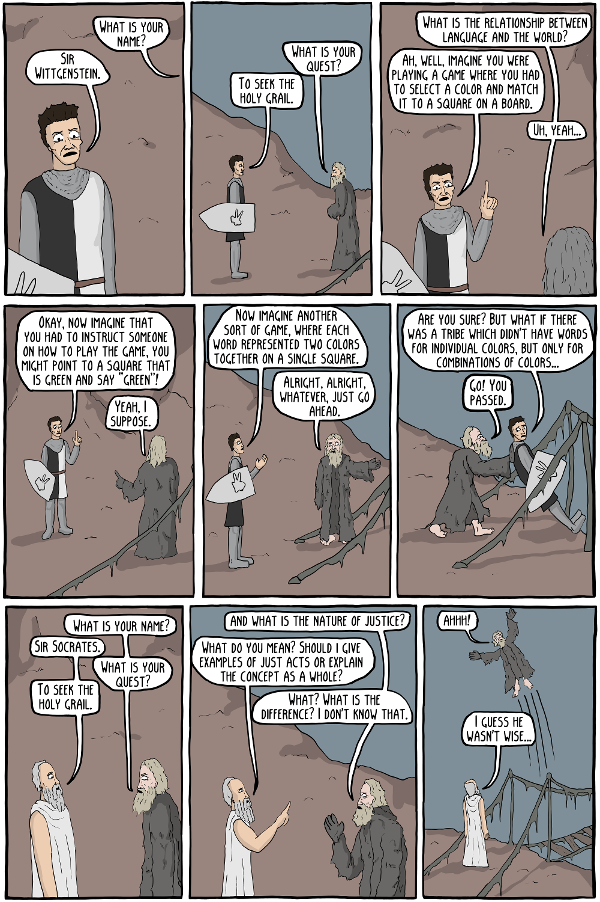](https://existentialcomics.com/comic/108)

I've read translations of Leibniz's Monadology a couple of times, including when attending lectures of Larry Moss's. I don't know how the Monadology relates to those lectures, except by the shallowest of puns, or a perspective that includes metaphysical discussion the of lectures and its participants themselves (which might or might not include  the content of said lecture).

The Monadology is pretty short, but it is decidedly not easy reading. I've yet to understand most of it. Existential Comics provides their own original summary for this comic on their site.  This summary gave me a reason to reread the Monadology again. Check it out!

## Ethics and Moral Philosophy

[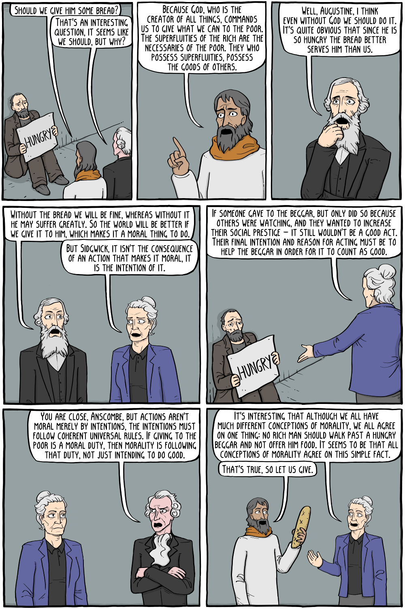](https://existentialcomics.com/comic/258)
[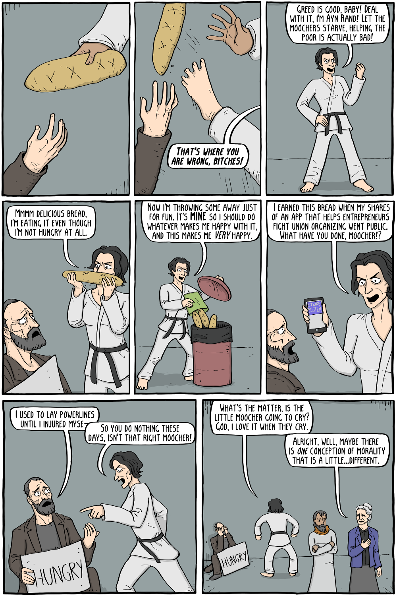](https://existentialcomics.com/comic/258)

This would be an example of a just act. See also ["What I Think About Atlas Shrugged" by John Scalzi](https://whatever.scalzi.com/2010/10/01/what-i-think-about-atlas-shrugged/), and "The Common Good" by Robert Reich.

[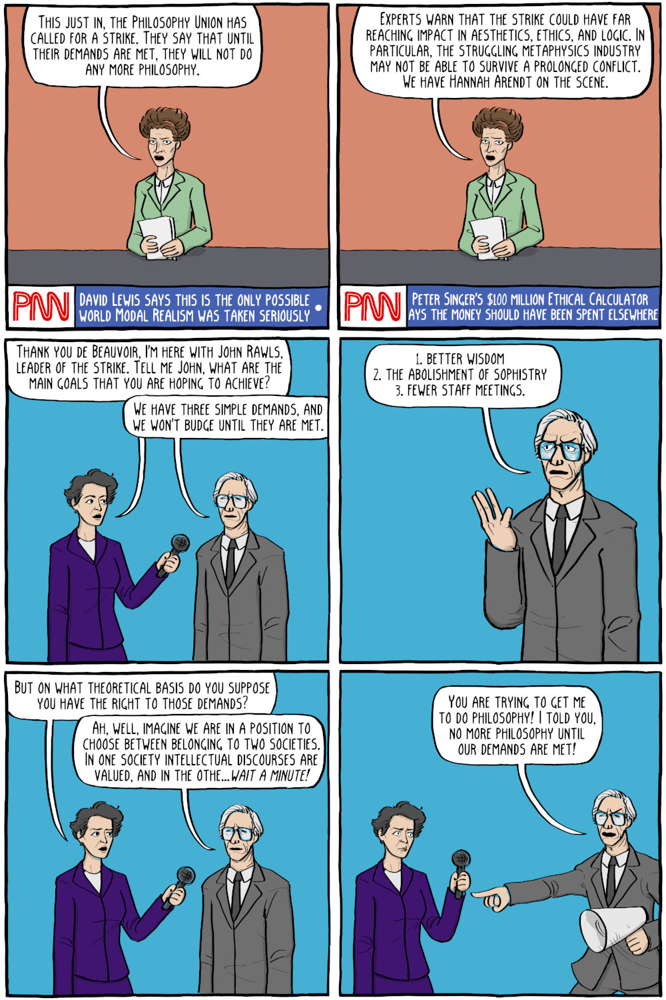](https://existentialcomics.com/comic/199)
[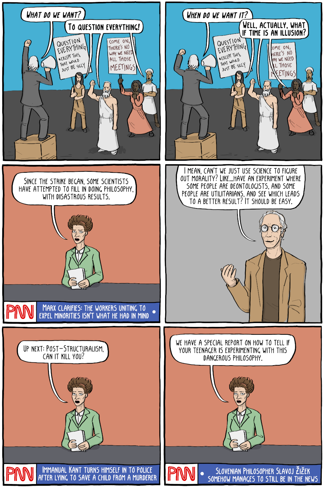](https://existentialcomics.com/comic/199)

John Rawls is known for "A Theory of Justice". Lawrence Krauss is known for "The Physics of Star Trek". Simone de Beauvoir is known for "All Men Are Mortal".

My second theme is ethics and moral philosophy, of the kinds most immediately relevant to the difficulties we currently face. Philosophy, science, and mathematics are tools of criticism and analysis. Although these tools are frequently capable of informing what we believe and how we behave in valuable ways, they are capable of compelling neither belief nor action. At the same time, what we believe impacts how we act, and how we act impacts the real world in tangible ways, thus creating _epistemic responsibility_: our moral responsibilities about the things we believe to be true.

William Kingdon Clifford famously wrote about epistemic responsibility in his classic short essay "The Ethics of Belief". It is best known for fable about ship's owner being recklessly optimistic about the seaworthiness of his vessel. I am very much convinced by Clifford's fable that epistemic responsibility exists,  even if I remain unconvinced by Clifford's attempt to extrapolate a more general theory of epistemic responsibility from his fable. For a discussion of the meaning of the word "reckless", and an introduction to the concept of _mens rea_ in general, I recommend [The Illustrated Guide to Law, by Nathan Burney](https://lawcomic.net). I found parts of Clifford's essay quite difficult to read, so I highly recommend [a short video on epistemic responsibility from Crash Course Philosophy](https://www.youtube.com/watch?v=AYkhlXronNk), which highlights William James' similarly important short essay "The Will to Believe" as the classic counterpoint to Clifford.

In terms of our moral, ethical, and epistemic responsibilities, the information technology sector is currently an disaster area to an apocalyptic degree. I very much hope that you do read Cathy O'Neil's "Weapons of Math Destruction". Further assessments can be found in "Algorithms of Oppression" by Safiya Umoja Noble, "Automating Inequality" by Virginia Eubanks, and "The Loop" by Jacob Ward. Significant social problems arising from the misuse of information technology were anticipated in the final chapter of the 1999 book "The Limits of Software" by Robert Britcher.

This phenomenon of highly problematic, suspect uses of "math", "science" and "reason" is not new:  see "The Mismeasure of Man" by Stephen Jay Gould for examples that predate modern information technology, such as phrenology. In fact, much of the earliest work on inductive logic, correlation, and statistics by Charles Sanders Peirce, Francis Galton, Karl Pearson, Ronald A Fisher and others was in fact motivated at least in part by trying to provide a justification for slavery, social Darwinism, class inequality, eugenics, and/or scientific racism.

While these motivations should rightly be recognized as moral refutations produced by our very human history, these delusions also produced geniune insight as a byproduct.  It would also be a mistake to dismiss that insight. However, please recognize that this is not a "Get Out of Jail free" card. Even today, issues that rhyme with these moral refutations continue to echo and to be recreated afresh under different guises. We very much still do need to address issues of how to use statistical ovens appropriately and how to interpret their estimates wisely.

Rounding out a crash-course in the moral dimensions of our current situation, I highly recommend Vaclav Smil's book "How the World Really Works", as well as Tom Murphy's blog "Do The Math" and his textbook "Energy and Human Ambitions on a Finite Planet: Assessing and Adapting to Planetary Limits". An evaluation of the thermodynamic bases of the economies of ancient cultures can be found in a number of Jared Diamond's books, including "Guns, Germs and Steel" and "Collapse". I admire the IPCC and the Long Now Foundation, and the work of Stewart Brand, James Hansen, and Michael Mann among many others.

I cannot imagine a more profound human tragedy than contemporary Christian eschatological fantasies enmeshed with the delusions of today's economic orthodoxy becoming a self-fullfilling prophecy. It would be a profound failure of humanity's moral imagination if we never even seriously attempted to address these issues. Unfortunately, this scenario is an objectively live option in the real world today. I highly recommend Timothy Beal's "When Time Is Short: Finding Our Way in the Anthropocene", as an attempt to answer the question why we don't look up. We as human societies also need to quickly figure out how to break out of a self-destructive fixation on GDP growth.  Elinor Ostrom's "Governing the Commons" and Kate Raworth's "Doughnut Economics" seems like promising starts.

On the topic of doughnuts, I suggest meditating on the Talmudic parable of The Oven of Akhnai, and "Sifting Through the Embers", a retelling of the fable of the Sibylline books found in Douglas Adams and Mark Carwardine's "Last Chance To See".  On the topic of meditations, I can't but help of thinking of Chidi's response to Simone's behavior in "The Good Place", and Yonatan Zunger's thoughtful essay "[Tolerance is not a Moral Precept](https://extranewsfeed.com/tolerance-is-not-a-moral-precept-1af7007d6376)".

> Chidi: No offense, but solipsism, as a philosophy, is pretty juvenile, especially for a person with multiple advanced degrees. And it's also impossible to refute, because everything you see is confirmed by your belief. However... [Chidi sticks his finger in Simone's frozen yogurt]
>
> Simone: Dude!
>
> Chidi: What? If none of this is real, then it really shouldn't matter, right? In fact... [Chidi boops her on the nose with his yogurty finger]
>
> Simone: Dude!
>
> Chidi: What? It's not real. None of this matters. Leave that on your nose for the rest of time.
>
> Simone: Fine. Point sort of taken.
>
> Chidi: You know, in a larger sense, if you go around acting like no one else matters, then you end up doing things like knocking over cakes, and pushing people into pools and just generally acting like a jerk. Why not treat them better, just in case they're real? I mean, what do you have to lose by treating people with kindness and respect?
>
> Simone: Okay. Keep talking, probably-fake but-maybe-real philosopher man.

[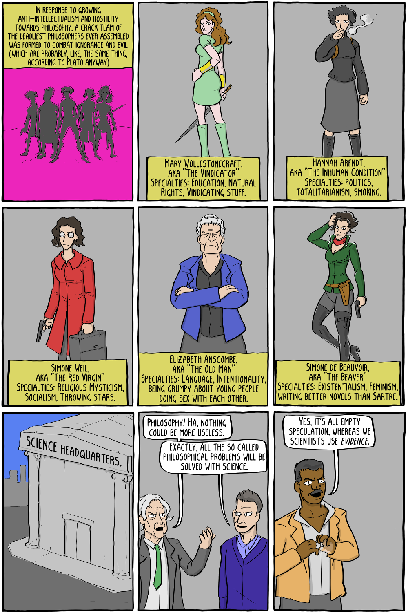](https://existentialcomics.com/comic/190)
[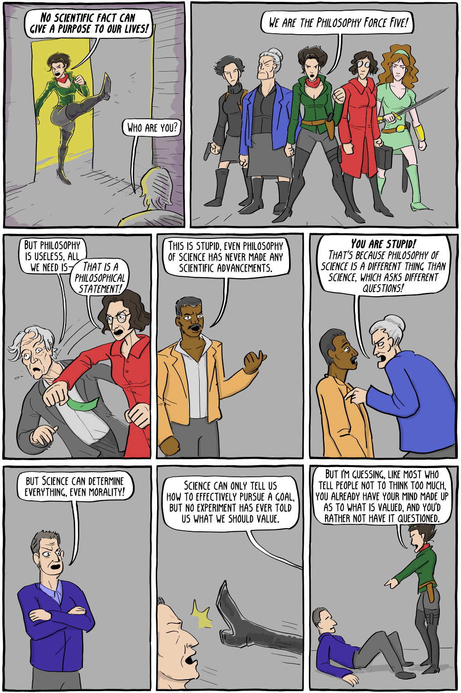](https://existentialcomics.com/comic/190)
[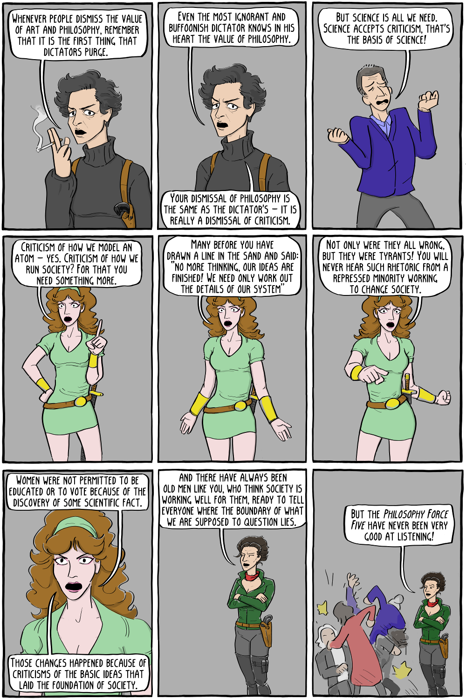](https://existentialcomics.com/comic/190)

I agree with the original summary provided by Existential Comics: in ways relevant to this essay, Neil deGrasse Tyson certainly seems ontologically distinct from the rest of the men depicted in this comic. I very much look forward to reading "Starry Messenger: Cosmic Perspectives on Civilization".

Gertrude Elizabeth Margaret (G.E.M.) Anscombe is well known as a moral philosopher in the analytic tradition, and for being a student, close friend, and translator of Ludwig Wittgenstein. She is strongly associated in my mind with "Anscombe's Paradox": the observation that if at least 5 electors vote on least 3 proposals passed by simple majority, and you consider the set of electors who voted against a majority of the proposals that passed, then that set might constitute a majority of the electors. It's not hard to synthesize a hypothetical example: it's essentially the same as "packing and cracking" in gerrymandering. Try it!

Elizabeth Anscombe pointed out this paradox, and demonstrated that if you try to use a supermajority rule to eliminate any possibility of this ever occurring, then a 3/4 supermajority is both a necessary and sufficient threshold. Any threshold less than 75% could theoretically allow this paradox to occur in some cases, though it certainly won't occur in all cases: with enough electors voting in increasingly specific ways, this outcome is an _a posteri_ empirical possibility, however unlikely. Whereas a 75% threshold would rule out any possibility of this outcome _a priori_, with the sole empirical assumption being that the rules are ultimately respected. We should realize by now that this is not always a safe assumption.

On the topic of practical social choice theory, in particular I support approval voting for single-winner elections and proportional representation for multi-winner legislature races.  I enthusiastically endorse the Center for Election Science, as well as "Gaming the Vote" by William Poundstone.  Among others I particularly admire the work of Birch Bayh, Rob Richie, John Anderson, Ka-Ping Yee, Brian Olson, Warren Smith, Aaron Hamlin, Jameson Quinn, J. Alex Halderman, Kenneth Arrow, Amarya Sen, and Elinor Ostrom.

## The Philosophy of Math (and Science)

[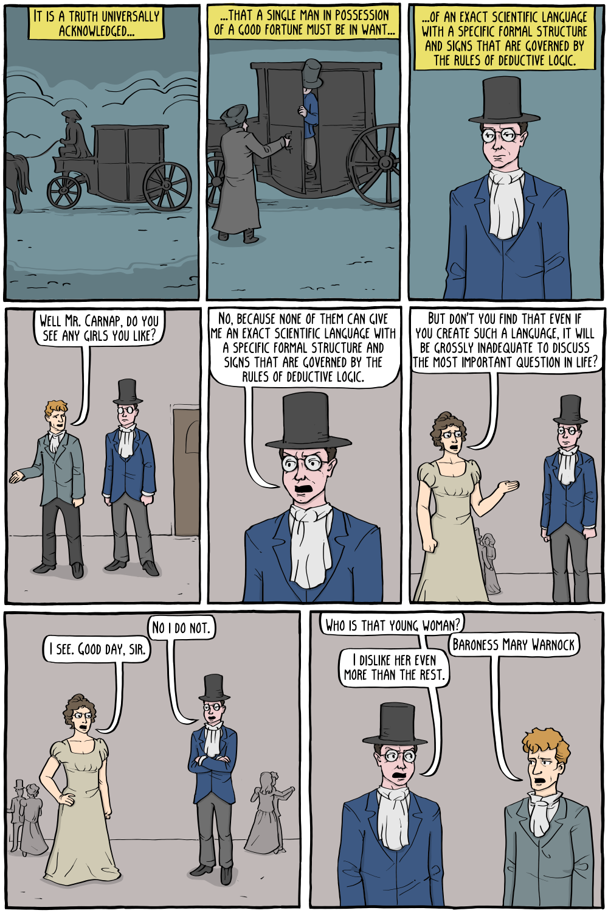](https://existentialcomics.com/comic/413)
[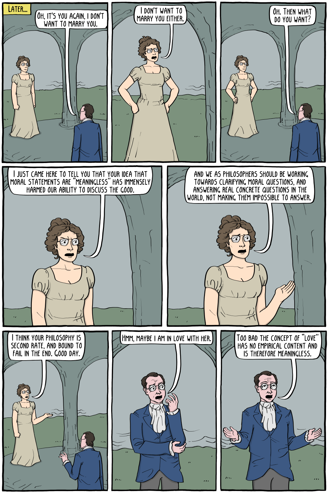](https://existentialcomics.com/comic/413)

"Proofs and Refutations: The Logic of Mathematical Discovery" by Imre Lakatos is an unusual book, not least because it explicitly argues in favor of informal mathematics. One of Judea Pearl's theses in "The Book of Why" is that discussing and formalizing causal inference has been so difficult, even controversial, precisely because we are naturally pretty good at it. By analogy, I suspect that discussing[^formalizinginformalmath] the philosophy of informal mathematics is in a similar situation. By constrast, classical statistics, deductive logic, and algebra come far less naturally to the human mind, which in some ways makes it easier to appreciate why they are important and interesting ideas to hold on to.

I am currently unaware of any single book that I feel could have had a greater positive impact on my mathematical education, than if had I read "Proofs and Refutations" while I was taking geometry my sophomore year of high school. I do believe this book could have dramatically improved the results of my math education along multiple axes. There certainly are many introductions to the Euler characteristic well worth recommending on their own terms, including David Richeson's "Euler's Gem", David Singer's "Geometry: Plane and Fancy", Tristan Needham's "Visual Differential Geometry and Forms", Aigner and Ziegler's "Proofs from THE BOOK", and sarah-marie belcastro's "Discrete Mathematics with Ducks". However, nothing I know of has the philosophical content of Lakatos' classic, delivered with humor and great historical depth.

Lakatos's philosophy of informal reasoning revolves around a sophisticated understanding of Pólya's inductive attitude and Popperian fallibilism as applied to mathematics. In fact, it starts where Pólya's "Mathematics and Plausible Reasoning" left off in its coverage of the Euler characteristic, and presents the history of this idea as a rational reconstruction of a boisterous class of students, with the "teacher" being a metaphor for the theorem itself and a narrative device to occasionally inject Lakatos's philosophy. It's title is an homage to both "Conjectures and Refutations" and "The Logic of Scientific Discovery" by Karl Popper. All of these books are well worth reading in their totality, but the preface to "Proofs and Refutations" is well worth reading sooner than later.

In fact, I was provided a very important lesson about the limitations of formal mathematics, when I was carefully evaluating Warren Smith's claims about Arrow's Theorem the first time I happened across them.  The lesson I took from my proof analysis is that Warren Smith is correct, and that his proof analysis helped highlight a very subtle pitfall of formal methods I had only been vaguely aware of, and that is the problem of attaching informal interpretations to our formal proof artifacts in correct and reasonable ways.   I call this the _Pitfall of Interpretation_.

These informal interpretations can be subtly incorrect in ways that can be infuriatingly difficult to detect. Informal reasoning can be done well or it can be done poorly, but to some degree or another, informal reasoning is _inescapable_. So an aspiring mathematician might as well embrace the situation and learn to do it well.

The good news is, with some basic social skills, a wise teacher or two, and few good role models, learning informal mathematics really isn't really that hard for most people most of the time.  I believe this fact explains why, most of the time, mathematicians can get away with pretending that we don't ever do informal mathematics.  I believe it explains why, most of the time, our pretensions seem to have little consequence. The consequences of these pretensions are much more subtle, and can be supremely difficult to disentangle from other causes when breakdowns do occur. This makes it very difficult to fully diagnose and easy to even outright misdiagnose the root causes of such a breakdown.

What I am saying should not to be misconstrued. To clarify, learning about a new-to-you mathematical idea in an informal way can be difficult, and is often very much so!  Rather, I am saying that learning the practice of informal mathematics is not so difficult _most_ of the time, because we do informal mathematics instinctively. In general, I recommend trying to always be open to learning how to improve your informal reasoning. The goal of informal reasoning is to become less wrong, and the very heart of informal reasoning is the _inductive attitude_.

However, inductive reasoning alone isn't nearly enough, especially not informal inductive reasoning such as the _inductive attitude_. Inductive reasoning must be formalized in order to truly come into its own. Formal inductive reasoning requires understandings of probability, statistics, and causal inference.  Formal inductive reasoning often requires careful experimental design that intervenes in the world in some way, and observes the results of that intervention.

Before we can reasonably do all of this, we need deductive reasoning, which gives us the tools to preserve truth, to justify truth, and to reliably reproduce truth.  Humanity's first introduction to deductive reasoning came to us via Euclidean geometry.  Here informal deductive logic proved very useful despite the fact that, by modern standards, the explication of deductive logic wasn't entirely clear and complete. As a result mathematicians were prone to making subtle deductive errors, falling short of modern standards of formality and rigor.

Yet at the same time, informal deductive reasoning was useful enough that the results were truly revolutionary, and maybe a little _too_ revolutionary in some ways. Among Western philosophers, Euclidean geometry became the received wisdom for more than two thousand years, before we took some Arabic and Semitic influences and Galileo started to push beyond Euclidean geometry with early investigations into the continuum and Calculus circa 1600.

It wasn't until 1830s or so until non-Euclidean geometry was commonly recognized as a logical possibility by well-informed mathematicians.  Work by Boole, Frege, Whitehead, Russell, and others from 1848-1917 that brought formal deductive reasoning up to modern standards of clarity and rigor.  This facilitated a revolution in metamathematics, computation, and algorithms by Gödel, Church, and Turing, among many other crucially important contributors.

And yet, the facade of mathematical dogmatism has stayed quite intact to this very day.  I believe it's possible, perhaps even plausible, that automated deductive theorem proving could enable and motivate a new golden era of informal mathematics.  Why, you might ask?

To borrow a turn of phrase, "The bottleneck is dead, long live the bottleneck!" is a simple summary why. If you can be quite confident that there does not exist a subtle but crucial mistake buried deeply in a formal proof, then you have more time and mental resources with which to contemplate mistakes in the informal interpretations and perceived practical real-world implications of that proof.  Very good mathematicians make mistakes on this count.

Also, because it seems likely that we could eventually find ourselves creating formal deductive proof artifacts for theorems far more complicated and ornate than what we've contemplated so far, it seems plausible that would induce demand for improving skills in informal mathmatics.

Of course, I am not suggesting that every proof must be formal, let alone sufficiently formal that a proof assistant can understand it! Good informal proofs are still interesting! Nor am I suggesting that every mathematician should be using a proof assistant. But I am suggesting that everybody should be familiar with deductive reasoning.

However, the modern world has already provided alternative options for learning deductive reasoning outside of geometry. I believe those options will be preferred by many students. Computer programming, logic puzzles, discrete math, and model theory are just a few of the better established alternatives. I am confident many more alternatives can be found and developed, especially in terms of the auxiliary topics used to motivate and discuss deductive logic. Indeed, I hope people do put the effort into finding and developing these paths, so that they may help serve better the goal of getting everybody acquainted with the basics of logical deduction.

[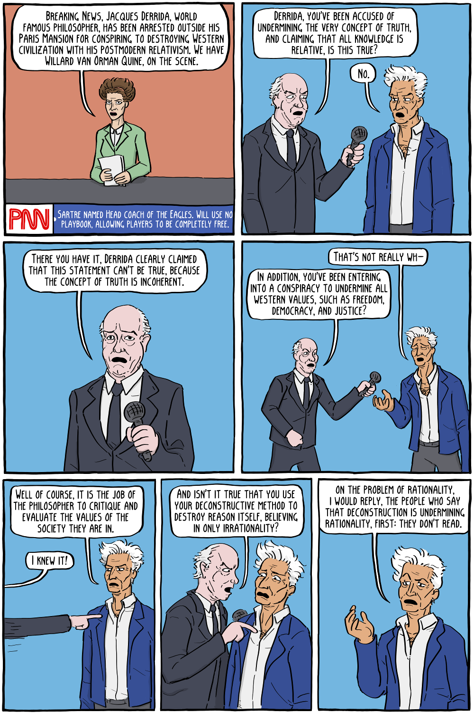](https://existentialcomics.com/comic/185)

[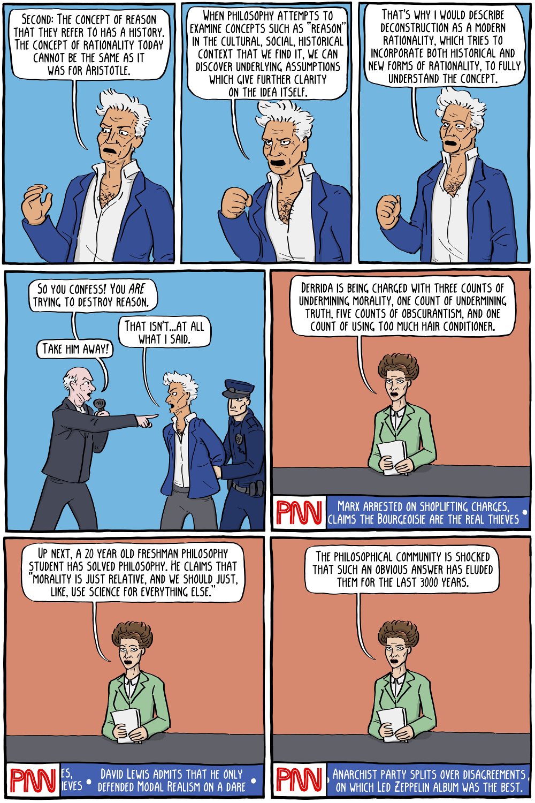](https://existentialcomics.com/comic/185)

"Language, Proof and Logic" is an introduction to formal deductive logic and model theory, and seems well suited for self study via computer-based exercises and online lectures. From the introduction, the sections "The special role of logic in rational inquiry", "Why learn an artificial language?", and "Consequence and proof" are particularly well worth reading sooner than later.

The title invokes "Language, Truth, and Logic" by A.J. Ayer, which was a popular English-language introduction to the logical positivism of Rudolph Carnap and the Vienna Circle. Bertrand Russell, Ludwig Wittgenstein, G.E.M. Anscombe, and Willard Van Orman Quine are other high-profile analytical philosophers whom appear in the Existential Comics I reference in this document. Logical positivism was an early form of analytical philosophy, which has grown into a workhorse of science, math, and computer engineering.

"Statistical Rethinking" by Richard McIlreath provides a modern introduction to statistics. The first chapter, "Statistical Golems" introduces the parable of the Golem of Prague as a metaphor for what this essay has been calling _statistical ovens_, or more properly _estimands_. The second chapter, "Small Worlds and Large Worlds", reflects on the difference between the small world of a mathematical model, which should ideally exhibit reproducable reasoning, and the large world of empirical reality, which does not, and indeed cannot.

Both chapters explicate serious deficiences with the philosophy of science as currently practiced today. They are available to download free of charge from the author's website, and are well worth reading sooner than later.  They harmonize well with both "The Knowledge Machine" by Michael Strevens, and "The Book of Why" by Judea Pearl and Dana Mackenzie.

Honestly, though my understanding of "Statistical Rethinking" is largely referential at this point, I am excited by this book the way I was excited when I first stumbled upon "Programming with Standard ML" while semi-exhaustively searching the CS stacks at Bracken Library at Ball State University. Personally, I had difficulty engaging with statistics; I always found the attitude of "the philosophy of statistics is for me but not for thee" that seemed to pervade my (very limited) direct exposure to the subject as a student to be extremely off-putting. It should be noted that never took statistics classes at Case Western Reserve University, which has a wonderful statistics department, so this comment is quite irrelevant to my undergraduate department.  In contrast, this introduction to statistics is grounded in philosophy, which is refreshing.  I see why there is buzz about this book; so thank you, Ozgun Ataman, for recommending it!

These three primary recommendations are all challenging. Most people will require extended study and practice in order to truly make the knowledge your very own. I would still very much recommend reading the preface and first chapter or two of each book sooner than later. If you don't go much deeper, that's okay. I believe referential knowledge very much has value.

It is also important to turn referential knowledge into direct knowledge, analogous to how one might dereference a pointer in the C programming language, or force the evaluation of a suspended computation in the Haskell programming language. I encourage students, especially older children and younger adults, to do deep dives into each of these three books: the initial learning curve may be difficult, but the reward is well worth the effort.

You can't really learn mathematics and computer science without also doing. I strongly encourage students to seek out problem sets they enjoy solving, and also to try creating your own problem sets. I highly recommend "Project Euler".

It's to be expected that you will want and/or need gentler introductions to these books. In preparation for "Proofs and Refutations", George Polya's "How to Solve It" is a classic and popular introduction to basic problem solving heuristics. Or you may find you prefer Polya's  "Mathematics and Plausible Reasoning". I know I found it difficult to stay engaged with "How to Solve It" when I was in high school, because so much of it seemed obvious to me. I probably would have enjoyed "Mathematics and Plausible Reasoning" and would almost certainly have benefitted a great deal from it, especially with a bit of guidance and help.

I do believe that mathematicians and computer programmers, among other professionals, stand to benefit greatly from having higher-quality, more frequent conversations about tradeoffs between problem-solving heuristics. Personally, I've been slow to pick up on the finer points of why heuristics are valuable and interesting. What I've come to deeply appreciate is that heuristics that might be abundantly obvious to some people, are not at all obvious to others. I've been on both sides of that divide, many times. A heuristic that is a good fit for a situation is indispensible, and developing the wisdom to evaluate and choose between heuristics for a given purpose, allows you to accomplish things that can astonish even yourself.

I suspect that many students will appreciate "How to Prove It" by Daniel Velleman as an introduction to "Language, Proof, and Logic", or possibly even a substitute for it. "How to Prove It" provides an introduction to deductive logic with an emphasis on discrete math. Referring to an auxiliary topic, such as discrete math, allows certain issues of syntax and semantics to be treated more informally while still providing a very rigorous introduction to formal deductive logic. I believe many students will prefer this approach, especially if the auxiliary topic is one that the student has a genuine interest in.[^auxiliary-topics-for-deductive-logic]

On the other hand, "Language, Proof, and Logic" provides hints towards model theory. Model theory is a more inward-looking view of the semantics of formal logic itself, with less reference to external ideas. This perspective is an important one, and graduate-level model theory eventually meets up with univeral algebra and algebraic topology. However, the study of formal logic tends to emphasize the aspects of a proof many mathematicians find to be the least interesting. This isolated perspective frequently poses a special challenge to some students, myself included; in these cases "Gödel, Escher, Bach" may be a useful adjunct to "Language, Proof and Logic" for getting comfortable in the foothills of model theory.

For a more comprehensive, up-to-date resource about how to become a logician, I recommend Peter Smith's "Beginning Mathematical Logic: A Study Guide", which is available in digital formats free of charge, as well as inexpensive printed versions. It provides an excellent overview and guide to the modern literature of logic.

[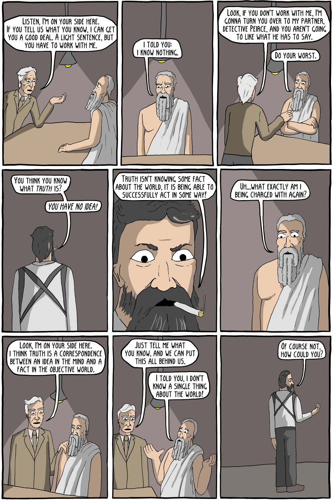](https://existentialcomics.com/comic/115)
[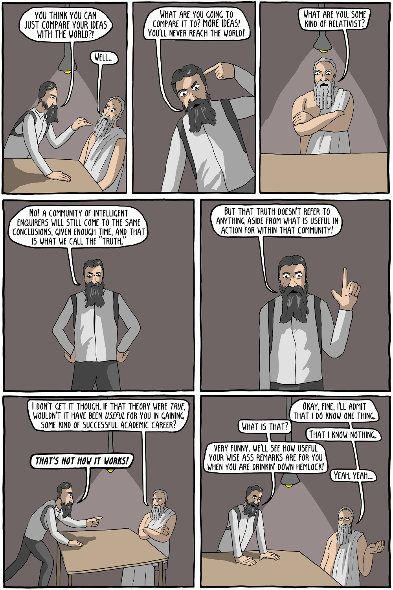](https://existentialcomics.com/comic/115)

> So you believe in that garbage, too—theories of knowledge, infinity, laws of probability. I can make no sense of it, and I don't believe you can either, and I don't think your god Peirce knew what he was talking about.
>
> - H.L. Mencken

Charles Sanders Peirce was an American logician and philosopher in the pragmatist school of thought.  He was personally acquainted with William James and Bertrand Russell. He is also known for being an early pioneer in the philosophies of probability, statistics, and inductive logic. In the realm of deductive logic, Peirce's law `((A → B) → A) → A` is equivalent to the law of the excluded middle `A or not A`. Curiously, Scheme's `call-with-current-continuation` operator can be given a type that corresponds to Peirce's law.  This correspondence is part of the Curry-Howard isomorphism, named after Haskell Brooks Curry and William Alvin Howard.  The type theory of the simply typed lambda calculus corresponds to intuitionalistic logic. Thus, adding a typed `call/cc` to the underlying computational calculus results in a type theory that corresponds to classical logic.

* "Mathematics, morally" by Eugenia Chen
* "An Introduction to the Philosophy of Science" by Rudolph Carnap
* "The Knowledge Machine" by Michael Strevens
* "The Road to Reality" by Sir Roger Penrose

[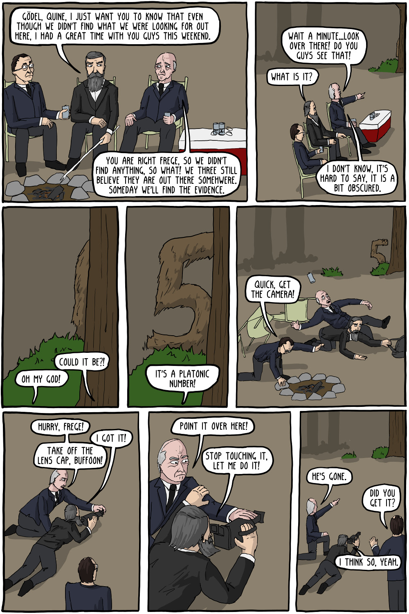](https://existentialcomics.com/comic/36)
[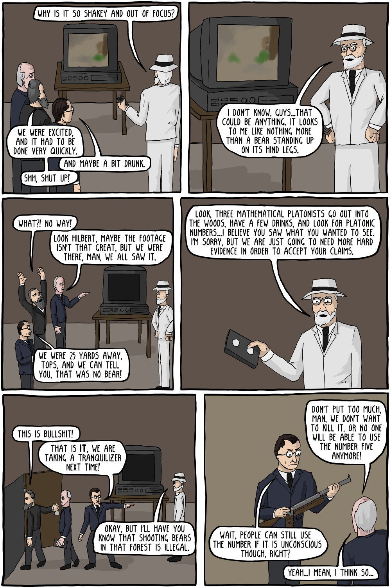](https://existentialcomics.com/comic/36)

* "Lectures on the Philosophy of Mathematics" by Joel David Hamkins
* "The Two Cultures of Mathematics" by W. T. Gowers
* "Mathematics: an Experimental Science", by Herbert S. Wilf
* "Enumerative and Algebraic Combinatorics", by Doron Zeilberger
* "Where Mathematics Comes From" by George Lakoff and Rafael E. Núñez
* "The Logical Syntax of Language" by Rudolph Carnap

[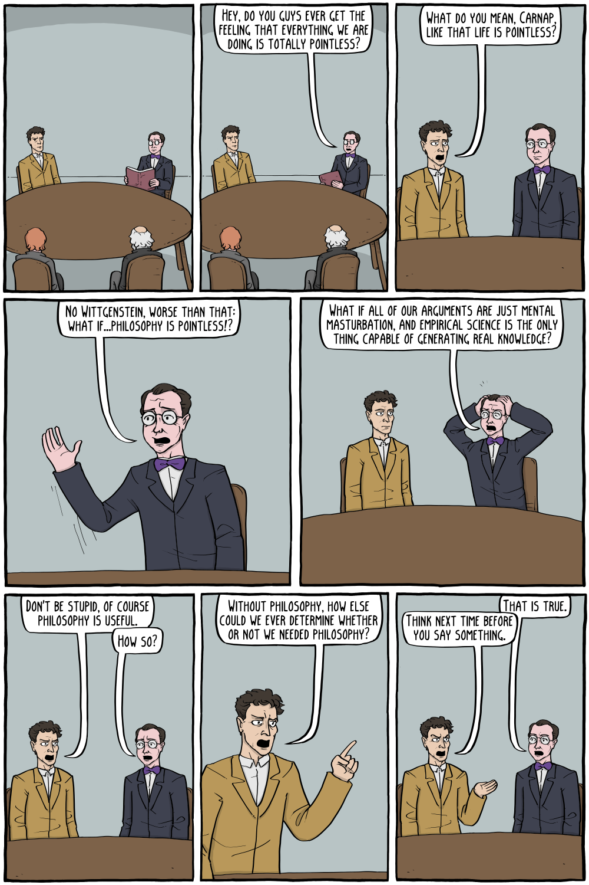](https://existentialcomics.com/comic/408)

* [What is Inductive Logic?](https://www.youtube.com/watch?v=4ZKa1S1wPy4) by Kevin deLaplante
* "The Emergence of Probability", by Ian Hacking
* "Bernoulli's Fallacy: Statistical Illogic and the Crisis of Modern Science", by Aubrey Clayton

* "An Introduction to Probability and Inductive Logic", by Ian Hacking
* "Causal Inference in Statistics: A Primer", by Judea Pearl, Madelyn Glymour, and Nicholas P. Jewell
* "Causality: Models, Reasoning, and Inference", by Judea Pearl
* "Probabilistic Graphical Models", by Daphne Koller and Nir Friedman
* "Introduction to Statistical Inference", by Jack Carl Kiefer
* "Incerto", by Nassim Nicholas Taleb

[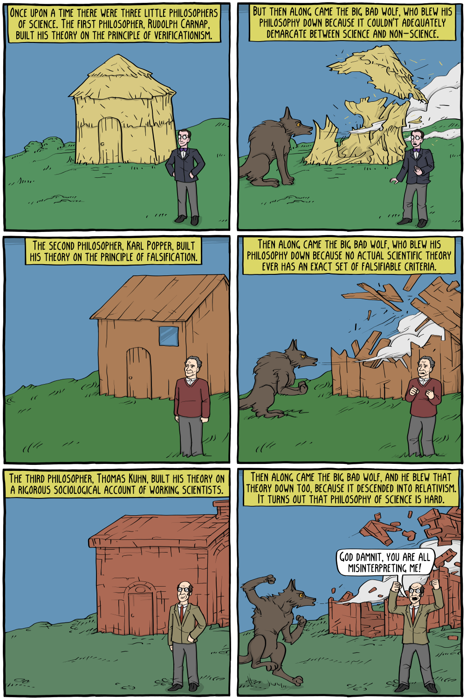](https://existentialcomics.com/comic/358)

* "The Logical Foundations of Probability" by Rudolph Carnap
* "Conjectures and Refutations" by Karl Popper
* "The Structure of Scientific Revolutions" by Thomas Kuhn
* "The methodology of scientific research programmes" by Imre Lakatos
* "Against Method" by Paul Feyerabend
* "Representing and Intervening", by Ian Hacking
* "For and Against Method" by Imre Lakatos and Paul Feyerabend, edited by Matteo Moterrelini

Imre Lakatos's philosophy of science and mathematics is a rich source of wisdom, by contrast, Imre Lakatos's life is a rich source of moral refutation. If you'd like to take a close look at the latter half of this dichotomy, I suggest "Chocolate and Chess: Unlocking Lakatos" by Alex Bandy. Do be aware that portions of this book can be rather disturbing, and is best reserved for mature audiences.

[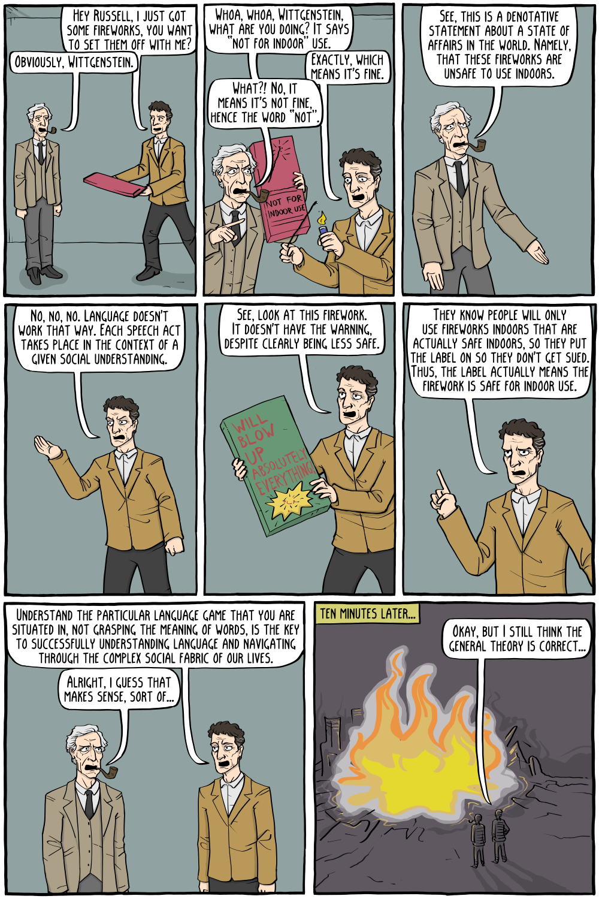](https://existentialcomics.com/comic/381)

## Deconstructing Bertrand Russell

[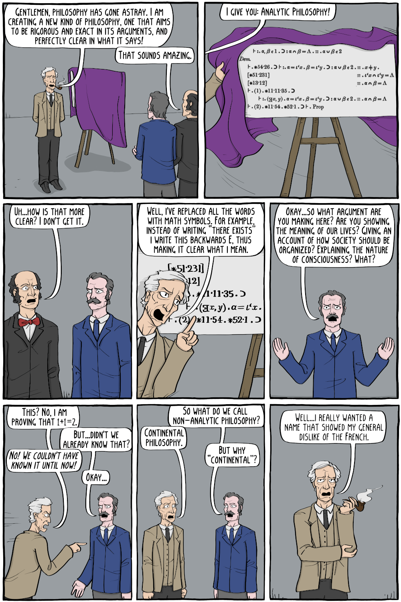](https://existentialcomics.com/comic/342)

> Language is the vehicle by which we express our thoughts, and the relation between those thoughts and our language is a subtle and involuted one. The nature of language actually shapes and models the way we think. [...]
>
> A language design should *at least* provide facilities which allow the comprehensible expression of algorithms: *at best* a language suggests better forms of expression. But language is *not* a panacea. A language cannot, for example, prevent the creation of obscure programs: the ingenious programmer can always find an infinite number of paths to obfuscation.
>
> - William Wulf (1977), via "Programming Language Concepts, 2/E" by Ghezzi and Jazayeri

> In the best of worlds, an architecture emerges. Architects dig into the whys and wherefores and weigh the "what must be" against "what cannot be" until landscapes, or machinescapes, become evident, as with jigsaw puzzles. Then forms simply become obvious, the by-product of intent. A baseball is a near-perfect marriage of purpose and form. Its form suggests its use. A toddler finding a ball in his way will try and throw it. A cat will swat it.
>
> - Designing, in "The Limits of Software" by Robert Britcher

> Caught in the middle are the ranks of humanities scholars who simply want to do good work in their fields; to read things, and think about what they mean; to tease out conclusions about the past and present through a careful analysis of evidence; to delve deeply into language, number, art, artifact, culture, and nature. This is what the arts have always been and done. This is what the university was established to do. [...]
>
> The confusion over the purpose of the humanities has nothing to do with their relevance. The humanities are no more or less relevant now than they ever were. It is not the humanities that we have lost faith in, but the economic, political, and social order that they have been made to serve. Perhaps we only demand a case for the humanities because we cannot fathom having to make a case for anything else.
>
> - Justin Stover, "There Is No Case for the Humanities"

In this interlude I deconstruct an apocryphal proof of Bertrand Russell. I argue that even if an "argument from absurdity" is a formally correct material implication, the resulting theorem is itself often absurd in the dadaist non-sequitor sense of the word. Bertrand Russell is deservedly much more famous for _Russell's Paradox_, which revealed an inconsistency hidden inside Gottlob Frege's attempt at understanding mathematics in terms of a formal logic. Thus in a strict technical sense, Frege's first attempt at formal logic imploded into triviality, because Russell's Paradox provided the absurdity needed to prove every statement true, provided that it is syntactically correct.

Two answers to Russell's paradox emerged: Russell's type theory, and Zermelo-Frankel (ZFC) set theory, though other variant logics have also been studied. Among those are a family of variants known as paraconsistent logics; such ideas can be found in Paul Feyerabend's book "Against Method". Among paraconsistent logics there is a subfamily of variants known as relevance logics, a topic that J. Michael Dunn was particularly interested in. His Ph.D. dissertation "The Algebra of Intensional Logics" provided relevance logic with an algebraic semantics, which is a type of formal model of logic.

Kurt Gödel proved that it is impossible to definitively rule out the possibility of another black swan philosophical event like Russell's Paradox from occurring again in the future in most mathematical formalisms of interest, not least in ZFC set theory. Of course, such a black swan event may in fact be impossible, but we cannot ever know that for certain. As the language of naïve set theory is popular and used widely in modern mathematics, this leads some people, including my former self, to ask whether latent inconsistencies of the Russell-Gödelian type could cause modern mathematics to implode. However, my experience has lead me to embrace the Weak Paraconsistent Conjecture, which states that these concerns are implausible even if one assumes the existence of a latent inconsistency in ZFC set theory. So keep calm and carry on!

> The story goes that Bertrand Russell, in a lecture on logic, mentioned that in the sense of material implication, a false proposition implies any proposition.
>
> A student raised his hand and said "In that case, given that 1 = 0, prove that you are the Pope."
>
> Russell immediately replied, "Add 1 to both sides of the equation: then we have 2 = 1. The set containing just me and the Pope has 2 members. But 2 = 1, so it has only 1 member; therefore, I am the Pope."
>
> - Taken from [Andy Long's resources for learning MAT 385: Discrete Math at Northern Kentucky University](http://ceadserv1.nku.edu/longa/classes/mat385_resources/docs/russellpope.html)

> And I think that Russell was right, but that's irrelevant, friend.
>
> - Dessa, on the track "Low Light Low Life", on the album "Never Better" by P.O.S.

[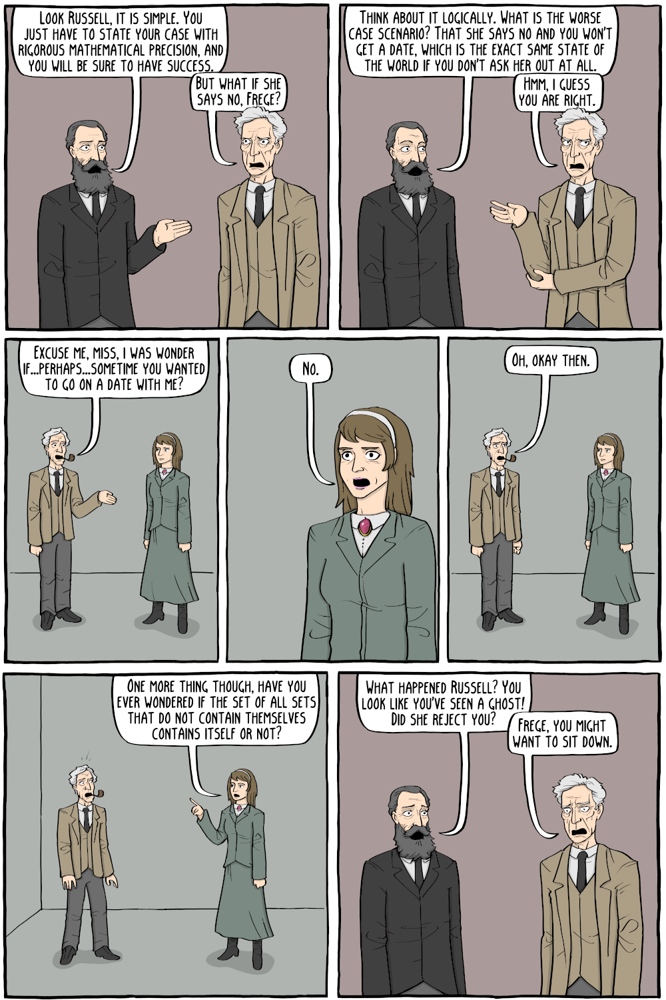](https://existentialcomics.com/comic/416)

If you want another take on the "what's the worst that can happen" joke, Tucker & Dale vs. Evil is a comedy horror film that you might enjoy.

[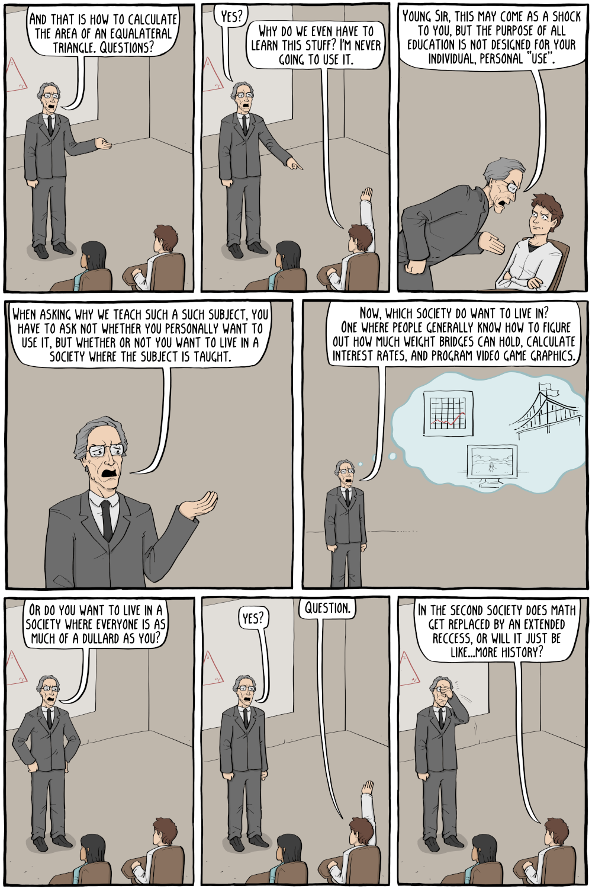](https://www.existentialcomics.com/comic/449)

Of course, here the comic depicts John Rawls using an _original position_ type thought experiment in an attempt to justify society's need to teach mathematics.  John Rawls is addressing his argument to a less-than-enthusiastic math student, whereas Justin Stover's quote is in the context of school and government administrators among others demanding a justification for the existence of humanities scholars.

Once in a great while, when I understand certain common weaknesses in communities and contexts, I enjoy trolling. I do try my utmost for my trolling to be playful and creative. The last thing I want to be, is your boorish garden-variety gnome. Paraconsistency is certainly one of those topics that has a tremendous potential to provoke, whether one seeks to be provocative or not. So those who desire to discuss paraconsistency are frequently perceived as trolls and/or gnomes, whatever their desire is in actuality.

It is common weakness among many people, including mathematicians, scientists, certain philosophers, and certainly H.L. Mencken, to assume that if you don't personally understand some idea, that it is therefore nonsense. I myself was a bit overly dismissive of informal mathematics, once upon a time. And I believe that there are people not unlike myself, perhaps attracted to formalist research programs exemplified by the likes of Bertrand Russell, Alonzo Church, and Haskell Brooks Curry, who remain overly dismissive of informal mathematics.

It is a fact that legitimate ideas get dismissed as nonsense. It may be true that a majority of dismissed ideas are in fact nonsense, but it's certainly true that some legitimate ideas do consistently get dismissed as nonsense. What would you think, and how would you feel, if you were one of these ideas, consistently labelled as nonsense and thus removed from further consideration?   Therein lies the problem. We can all stand for a little more honesty, and a little more grace, in how we treat other people and ideas.

For some destructive historical examples, consider the experience of Galileo, the Catholic Church, and the Reformation and Counter-Reformation, and how that influenced mathematical debate and the early development of Calculus in Renaissance Europe. This era was highly creative, but it also unnecessarily destroyed human ideas, and human lives. These topics are discussed in depth in "Infinitesimal: How a Dangerous Mathematical Theory Shaped the Modern World" by Amir Alexander. I particularly recommend this book as Galileo's experience is a canonical example in the philosophy of science and mathematics, and the greater historical context deserves to be better appreciated. Thank you, Doron Zeilberger, for recommending it!

Kronecker v Cantor was a rather unsuccessful attempt to suppress and destroy ideas. While Leopold Kronecker's boorish, personally aggressive attacks on George Cantor over an academic dispute wasn't very effective, it did lead to significant negative outcomes for Cantor personally.  After his experiences with Kronecker, Cantor had an an acute attack of anxiety that lingered for the rest of his life.

Pearson v Wright successfully suppressed Sewall Wright's work on path analysis outside the realm of animal breeding and some evolutionary theorists for decades, and arrested further mathematical development of Wright's work until the 1980s. See for example, "The Book of Why" by Pearl and Mackenzie. Even today, it can be difficult to acknowledge that as a practical matter, causality exists, causality can be mathematically modelled in useful ways, causality does have empirical content, and that correlation cannot correctly model causality, let alone infer it. The anti-patterns of behavior established by Karl Pearson and Ronald A Fisher are still very much with us.

Fisher v Bayes needlessly discouraged a large number of mathematicians from even considering non-frequentist interpretations of probability and statistics, impacting the reception of fuzzy logic, as documented in Bart Kosko's "Fuzzy Thinking."  I myself fell into this category for a few years. This is one of the examples I was specifically alluding to in "Kevin Bacon and the Stern-Brocot Tree" of an example of where I as a student reacted poorly to a topic by dismissing it outright. Even today it can occasionally be difficult to talk about alternative interpretations, though Bayesian statistics is pretty non-controversial among an increasingly broad spectrum of professionals these days.

For a humorous and decidedly more hopeful look at the way mathematics could be practiced, Imre Lakatos's "Proofs and Refutations" is indispensible. Jim Al-Khalili's "House of Wisdom" tells stories of intellectual creation during the golden age of Arabic scholarship that are often happier than the stories of the Renaissance. For a modern and ongoing controversy, consider paraconsistent logic and the philosophical writings of Paul Feyerabend in "Against Method".

That is part of the joke of my selection of the "Derrida Arrested!" cartoon to introduce analytical philosophy in the previous section.  Willard Van Orman Quine is a high-profile analytical philosopher who argued against "deviant logics" and Carnap's Principle of Tolerance. In this context, "deviant logic" is referring to non-classical logics,  variant systems of logic that differ from the classical logic commonly used by nearly all mathematicians today. Rudolph Carnap was deeply curious about these non-classical logics, and how they might be useful in various contexts. Quine was curious too, though he argued against deviant logics on largely pragmatic grounds, arguing that the costs that they necessarily impose had yet to be justified by a clearly demonstrated benefit to reasoning within a context.

I am not specifically aware that Quine himself ever exhibited the vulgar reactions found in the comic, let alone anything even vaguely in the category of the vulgarities that my words hope to address. However, there is a diverse abundance of vulgar interpretatations of Derrida, Feyerabend, "post-modernism", and much more, all readily available. Richard Feynman was at times among the high-profile vulgarians of his day.

And then there are common vulgar interpretations of analytical philosophy that invoke Russell or Carnap or Quine name or by idea, and these vulgarities are rather bellicose in many senses of the word. This seems fundamentally at odds with Bertrand Russell, Rudolph Carnap, and Willard Quine in particular, and much of the history of analytical philosophy in general.

Meanwhile, Quine's writings have inspired significant research and work on the deviant logics he disapproved of. Several of these logics have seen use in industry, such as modal and temporal logics in the design and verification of hardware and software systems. However, the current trend in interest seems to be away from non-classical logics towards classical logic as realized in SMT solvers, proof assistants, and extended static checking. For a non-classical example whose practical usage is currently prospering, linear logic deeply informed the affine type system of the Rust programming language.

Many variants are of well-established academic interest, including Leopold Kronecker's intuitionalistic logic,[^proofsandrefutations_logic] Bertrand Russell's type theory, Alonzo Church's lambda calculus, Henk Barendregt's lambda cube, and the research program Robert Harper calls _computational trinitarianism_. The Curry-Howard-Lambek correspondence is the most high-profile result of this program, braiding together computation, logic, and algebraic topology into one grand isomorphism. These results have already provided fundamental insights into the design space for programming languages, type systems, proof assistants, computer algebra systems, and more.

Relevance logic is a subfamily of the paraconsistent logics, and an area for which Jon Michael Dunn is known for working in. I am not personally aware of a well-established domain of application for paraconsistent logic. One idea I have is to explicate what I call the "Weak Paraconsistent Conjecture".[^iep-paraconsistent]  Kurt Gödel proved that we can never quite definitively rule out the possibility of another black swan philosophical event like Russell's Paradox. In light of Russell's "proof" that "1 = 2 implies that I am the Pope", one might come to believe that latent inconsistencies of the Russell-Gödelian type could have catastrophic consequences for all of mathematics!

I certainly entertained such thoughts, at one point in time. However, my experiences as student, a mathematician, and an engineer have lead me to embrace the Weak Paraconsistent Conjecture. The Weak Paraconsistent Conjecture states that these concerns are implausible, even if you assume the existence of a latent inconsistency. Any latent inconsistency in a formalism is unlikely to be terribly relevant beyond that formalism: the fallout from that inconsistency is likely to be mostly contained. More concretely, in the event that an inconsistency is found in formal ZFC set theory, it is likely to have little to no impact on any other mathematical subject, even though the language of naive set theory is widely used throughout those subjects. It will, however, be a wonderful day to be a set theorist!

After all, a philosophical black swan event approximately as worrying as an eruption from a science fair volcano. A  philosophical event cannot possibly be relevant to daily life, at least at first. Sure, someday there may be problems exposed with our current conception of the foundations of mathematics, but it's not like we are Wiley E Coyote, who falls to the ground only after he looks down and realizes he isn't standing on anything at all.

Even if flawed foundations were used to reason about and justify the correctness of the algorithms currently deployed in production in real-world use cases, such as Wifi modems. Those algorithms aren't going to suddenly change their observed behavior as a result of somebody recognizing that there is a previously unknown but very real philosophical problem baked into calculus, or Bayesian statistics, both of which deeply inform a modern radio protocol such as Wifi.

In some strange way, science, technology, and engineering verifies mathematics. Maybe they don't verify mathematics in exactly the way we currently believe it does.  Yet our unprecidented abilities to use mathematics to control the physical world around us means that we have verified _something_, even if that something is somewhat different than what we currently think it is. In this hypothetical scenario, "large" differences seem implausible, even if "small" differences are taken as a given. Science and technology often give mathematicians good reason to believe that what we think we know is correct, more or less.

A deeper proof analysis suggests that Russell's proof consists largely of what Littlewood and Hardy called "gas", that is, "rhetorical flourishes designed to affect psychology, pictures on the board in the lecture, devices to stimulate the imaginations of pupils"[^proofsandrefutations_gas]. Firstly, there is a diverse abundance of non-trivial domains of discourse where, morally speaking, 1 = 2. If you jump out of the logical formalism, this observation feels like a global counterexample. Secondly, even if you assume that 1 = 2 is in fact an outright contradiction, what practical domain of discourse allows somebody to translate a contradiction about numbers into a statement conflating the identities of two different people?[^computer_bugs] Even if the first observation is not applicable to the domain of discourse, this second observation feels like an attempt to explain why this reasoning still feels like an absurd, irrelevant, dadaist non-sequitor.

In the opening chapter of "Against Method", Paul Feyerabend calls attention to the rhetorical elements sometimes found in a supposedly mathematical proof, and provides a clear statement of a paraconsistent thesis:  "Considerations such as these are usually criticized by the childish remark that a contradiction 'entails' everything. But contradictions do not 'entail' anything unless people use them in certain ways. And people will only accept them as entailing everything only if they accept some rather simple-minded rules of derivation."[^againstmethod_paraconsistent]  I first heard a ever so slightly stronger (or at least, more concretely instantiated) version of this argument in lectures of Jon Michael Dunn. He argued that in practice, entailment is not used in this way by working mathematicians except as a joke, which certainly comports to my own experience.

This proof analysis reveals that Russell's proof, by itself, is far less interesting than Russell's Paradox, which Bertrand Russell is better known for, and deservedly so. The actual content of the proof is simply a formally correct _material implication_, and contains little to no further content. Material implication an inherent consequence of classical formal deductive logic, yet, if taken literally, and used with impunity, material implication seems to lead to absurd, dadaist reasoning.

From a paraconsistent perspective, these absurdist uses of material implication are dubbed "explosive", and thus "material implication" is dubbed "the principle of explosion". The Weak Paraconsistent Conjecture amounts to the observation that all observed uses of material implication by working mathematicians are non-explosive in context, in large part because explosions seem to destroy something fundamental about what makes a proof interesting. Whichever synonym you choose, the _principle of explosion_ is an indelible part of classical formal deductive logic, and many non-classical variants as well. If we acknowledge these issues and replace rhetoric with content,  Russell's proof turns into something far more interesting.

As Peter Smith explains in his excellent study guide, the _principle of explosion_ is a consequence of insisting on the principles _disjunctive syllogism is valid_, and _entailment is transitive_. In stark contrast to explosive uses of material implication, working mathematicians appeal to these two properties all the time! That's quite a riddle! Perhaps there are non-obvious restriction(s) on the ways we apply _disjunctive syllogism is valid_ and/or _entailment is transitive_ in practice? This give some clues of how we might proceed, if we wish to develop deeper insight into this phenomenon that seems to be already present (in possibly differing forms) in human reasoning.

Why might somebody want to formalize this aspect of reasoning?  To me, the result of this proof analysis is reminscient of the "junk theorems" that naturally arise when we model mathematical phenomena in a formal language, such as modelling the natural numbers in set theory.[^hamkins]  Analogously, "junk behaviors" arise all the time in software. This is unavoidable to some degree, and it is important to remember that not all junk behaviors are created equal. Some are quite benign, while others can be far more pernicious. Every combination and shade thereof is certainly possible, and wisely judging whether a junk behavior is benign or pernicious can be rather non-obvious and context-dependent.

For example, C and C++ are absolutely riddled with _undefined behavior_, a particularly pernicious form of junk behavior in any context. Surprisingly many professional C and C++ programmers are completely unaware of this situation, let alone how these issues endlessly create frustratingly obscure security vulnerabilities and other bugs, which endlessly suck up time and resources, all for shockingly little long-term benefit in most cases.

There are many ways to tell me you don't know C, without telling me you don't know C. Examples include 1. "K&R is sufficient to write C competently",  2. "if you don't know how some part of C works, you can figure it out by experimentation",  3. "const doesn't matter: the most it gives you is a warning, which you don't need to worry about anyway",  4. "coding is just a tool, don't learn any more than you have to".

Honestly, the fact that modern software even vaguely works at all, when so many of its creators don't even know basic fundamental facts about the _public interfaces_ of the tools they use and so often mindlessly defend, seems to me to be compelling evidence for the plausibility of the Weak Paraconsistent Conjecture.

Debunking the first example, Kernighan and Ritchie's "The C Programming Language" doesn't mention undefined behavior, so reading John Regehr's "A Guide to Undefined Behavior in C and C++, Part 1" would be essential supplementary reading for getting up to speed with C.  There's nothing wrong with suggesting K&R, but it should also be understood that K&R alone is insufficient.

Debunking the second example, unconditionally adopting this attitude will lead you astray. It often a great idea to perform experiments in order to develop understandings of a C codebase. But it is important to be aware of the limitations of experimentation, especially when it comes to the C language itself. Some familiarity with and the ability to read and carefully interpret Harbison and Steele's "C: A Reference Manual", as well as relevant language standards and compiler documentation, is an absolutely necessary skill needed to use C competently.  You should always know the limits of your tools. In this case, you need to know the limits of learning C (and C++ and Fortran) by experiment.

Most other programming languages can much more readily be used via understandings obtained via experimentation. The C and C++ languages are notably exceptional in this respect, due to the existence of undefined behavior. Fortran makes a different assumption with similar implications. Fortran assumes that memory aliasing doesn't exist, and no two pointers reference the same block of memory.

This assumption allows the Fortran compiler to make more aggressive and predictable optimizations of kinds often useful for high-performance numerical code, but it can lead to similarly subtle and unpredictable bugs when aliasing does in fact occur. The difficulty arises because the overall correctness of some of those optimizations depend on executions of the source code being alias-free. If this assumption is violated in the execution of an actual program, the precise result can be extremely difficult to predict, due to extremely intricate interactions with the optimizations applied by a particular version of a particular Fortran compiler with particular option flags set. On the other hand, my impression has been that Fortran still leads the pack regarding automatic vectorization of computer code, and I can believe that this Faustian bargain is a causal factor.

If you dereference these examples and learn about them yourself, it should become obvious that ignoring undefined behavior in C or pointer aliasing in Fortran will almost certainly turn out to be an eternal wellspring of bugs and security vulnerabilities. For the time being, it's suprisingly easy to find examples of experienced, professional programmers who aren't overly aware of these facts, even though they personally use these tools all the time at work!

Moreover, the resulting bugs can be so incredibly subtle and frustratingly obscure that those who aren't aware of these issues are highly unlikely to ever fully diagnose the resulting bug correctly via experimentation alone.  In these cases, there is no substitute for knowing the fundamentals of your tools.

Debunking the third example, the third attitude towards `const` is particularly ill-advised, for three reasons. Firstly, using `const` helps the compiler generate better machine code. Writing _const-correct_ code is invaluable for documenting aspects of the semantics of a C subroutine, for helping the human to write more efficient source code, and for sanity checking your design and your code.

Secondly, updating something labelled "const" is undefined behavior. If undefined behavior actually does happen in an execution, the compiler is at that point under no obligation to have generated code that does any particular thing, even if it impacts something that happened "before" the undefined behavior occurred. At that point, anything goes. The compiler can still legitimately say it's compliant with the relevant language standards.

Warnings in C are the equivalent of brown M&Ms. Warnings are a signpost marking the start of a trail that leads to hostile inputs invoking undefined behaviors latent in the C code, possibly resulting in a security vulnerability. Warnings in code you write should always be investigated and eliminated, or at least documented.  Warnings in other codebases should be investigated, especially if that codebase is of unknown quality.

However, keep in mind that if you keep the codebase exactly the same, and change compilers, you can see a different list of warnings. Also, time and care must be taken to understand the foreign codebase extremely carefully. This includes understanding any relevant domains of discourse. For example, there was a rather famous Debian bug, where somebody unfamiliar with the foibles of cryptographic code, accidentally eliminated the entropy for a cryptographic random number generator. Documenting the warning would have likely prevented this accident.

I have frequently observed the fourth attitude in the electrical engineering and embedded programming communities.  Often, I hear "coding is just a tool", often to discourage delving deeper into the art of computer programming.  Nothing could be further from the truth!  Is painting just a tool to paint things?  I agree that paintbrush is "just" a tool, as is a computer, but using a paintbrush to paint or a computer to calculate can demonstrate great creativity, artistry, and/or mastery of a body of knowledge.

The attitude that creative processes are "just a tool" seems an incredibly reductive and dehumanizing attitude to adopt. A compiler is just a tool, but learning to use a particular compiler really effectively often takes years of practice and scrupulous attention to detail, even if you already know how to code. Coding is a creative act, not a tool, even if the resulting software artifact is indeed "just a tool".  I admit that the resulting software artifact is often "just a tool"! The problem is that pointing this attitude at the act of creation itself, sells human creativity very short.  If you adopt this attitude, then it's easier to sell humanity itself, short.  If you adopt this attitude, then it's easier to sell individual humans, very short indeed.

Creating software inherently and unavoidably involves a design process. This is true regardless whether resulting artifact is intended to be "just a tool" or aspires to be something more. This is true regardless whether the design was ever really considered, let alone written down.  Trust me, the attitude that "coding is just a tool, don't learn more than you have to" really does show through in the resulting quality and usability of a lot of open-source embedded software.

For better results, I encourage software developers to be more curious in general, and in particular to pay closer attention to the fundamentals of the tools they use. I also recommend developing an appreciation for good design and some of the practical challenges that this poses.  Even judging the strengths and weaknesses of a design can be a fundamentally difficult problem, let alone arriving at a good design.

And lastly, while certain elements of coding are fundamentally difficult, coding should not typically be difficult in the ways imposed by C and C++'s undefined behaviors. In fact, this sentiment is a major motivating factor driving interest in the Rust programming language today.

The long-term benefit to eliminating or reducing the relevance of "junk behaviors" exhibited by widely-used software artifacts can be substantial, even transformative. That's especially true when that artifact is a widely-used programming language, communications protocol, operating system, database engine, computer algebra system, library, framework, or subroutine. Understanding this is a fundmental part of good design philosophy.

Often, this philosophy seems to be practiced reasonably well in many of the programming language theory (PLT) communities notably including but not limited to Scheme, Haskell, and Rust.  However, this design philosophy seems widely neglected outside PLT: the Axiom computer algebra system, the PostgreSQL relational database system, and a handful of (mostly embedded) operating systems are a few notable examples that do quite well in this regard, relatively speaking.

However, the fact is is that in any widely used software artifact, very few of those "junk" behaviors are entirely junk: eventually some other software developer starts relying on that specific behavior for the correct functioning of their own program. This can also be true of a "bug", which suggests a behavior deemed flatly incorrect, in contrast to "junk", which suggests a behavior deemed unintential. Then "fixing" or "eliminating" a bug or a junk behavior, can involve updating multiple downstream software artifacts, which in turn frequently involves stakeholders crossing many political and even temporal boundaries.

In most cases, a geniune bug fix has fewer and smaller downstream impacts on clients. XKCD's comic uses a highly implausible scenario as an dadaist element of humor, but it hits upon a fundamental truth. I've received requests to mitigate a change that seemed outlandish to me. I'm sure I've made such requests that seemed outlandish to those receiving them. I strongly prefer to make decisions that avoid creating either kind of situation in the future.  For example I wouldn't want to end up depending on the rise of CPU temperature to do anything that is irrelevant to that specific situation, for the simple reason that I prefer not to be that guy, that longtime user depicted in the comic once the CPU temperature issue is fixed or improved.

Cleaning up junk, on the other hand, tends to involve renegotiating an interface's (often unwritten and poorly understood) contract with its clients, which exhibits a reliable tendancy to have far more substantial (and time consuming and expensive!) downstream impacts on those clients. The work-creation multiplier of such changes can be incomprehensibly humongous, barring access to the entire codebase and heavy use of sophisticated automated refactoring tools.

Only the largest software companies, notably Google, have thus far been overly successful at making a go at this latter approach. The difficulty of the approach and extreme cost overheads it imposes has thus far made it economically impractical in small companies. Even then, Google has incurred other less-obvious costs imposed by the "clean it up" culture this enables.  Furthermore, I'm not aware of an open-source effort along these lines, where a community might share an economy of scale. Any adoption of this methodology would require an understanding of, and answer for, the practical implications of the political borders within the community. This problem seems far more difficult in an open-source community in comparison to a relatively monolithic corporation.

These political borders mean that some software artifacts never get updated. This is especially true when people and companies that created a software artifact move on, creating a temporal boundary between the client of an interface and the provider. Sometimes this creates intense motivation to build "bugwardly" compatible re-implementations of a software artifact that is widely depended upon.

In these scenarios, specifications are secondary. Instead, duplicating the undocumented behaviors of another implementation is paramount, regardless of whether the specifications are written well, written poorly, or even exist at all. This often requires time to carefully reverse-engineer the implementation, hopefully resulting in a revised specification that clarifies the original and carefully documents the junk behaviors required.  A second approach is to run the two implementations in parallel for an extended period of time, with the reimplementation acting as a mock understudy, carefully noting any differences in behavior. These approaches aren't mutually exclusive, and in fact complement each other very nicely.

Reimplementing these junk behaviors can substantially reduce the degrees of freedom that a re-implementation effort has available to it. Sometimes this loss of freedom makes it very difficult or even impossible for the reimplementation to achieve its goals. This is rarely a pleasant state of affairs.

For example, consider Postel's Law. This "Robustness Principle" is a maxim about computer communication protocols to be strict in what you send and tolerant in what you receive. The cost this design philosophy often imposes, is that under certain common conditions, it induces demand for bugwardly compatible reimplementations while simultaneously making the exuberant creation and proliferation of junk behaviors practically inevitable. This is especially true when the initially popular implementation lacked good design discipline up front, as was the case with HTML and JavaScript, and is often the case elsewhere. These costs are becoming more widely appreciated, see for example the recent IETF draft "The Harmful Consequences of the Robustness Principle".

It's important to remember that these labels involve judgement calls, and people can legitimately disagree whether or not a behavior is a bug, is pernicious junk, is benign junk, or is in fact a desirable behavior. There's a stereotype that the Haskell and OCaml communities are inclined to try to prohibit junk,  whereas the Lisp and Scheme communities are inclined to try to spin junk into gold. Neither is a complete answer in and of itself, but it is deeply satisfying to take behavior commonly deemed "junk", and find changes in perspectives and/or implementations that make that behavior desirable.

While the benefits of eliminating or transmuting junk behaviors are often vastly underestimated or even plainly ignored, occasionally software programmers will instead vastly underestimate the costs of change, which leads to sagas like Perl 6 (now Raku), Python 3, Haskell, and more than a few SQL migration projects.  Moreover, these path dependent costs of change has made deep investigations into alternative operating systems designs often impossible in practice, outside a handful of heroic efforts like Plan 9, academic attempts such as SPIN, and a few special contexts such as embedded programming and Tock OS.

By analogy, maybe it also makes sense to reduce and eliminate junk theorems contained within our mathematical formalisms? The wisdom of that research program seems less clear to me. I suspect an answer will slowly be revealed, as we build a culture around how to use proof assistants effectively to build proof artifacts, as we develop the judgement needed to informally interpret those proof artifacts wisely, and as we invent and discover additional use cases.  Proof assistants provide an additional automated perspective into mathematical epistemology, which is pretty cool in and of itself.  Further use cases are already being explored and important ones have already been found.

If the effort is put forth, it seems inevitable that someone working in this research program will eventually find motivations and use cases for various deviant logics. Artificial intelligence, machine learning, statistics, and causal inference also feel like potentially fertile ground for exploring deviants, possibly even a relevance logic.

Even a shallow referential awareness of issues like these create mental associations. Those mental associations can turn into clues when you are trying to solve a problem. Then you might discover that you have a natural motivation to follow the reference and start making that knowledge more deeply your own, with the hope of finding a useful tool that fits your situation. If you care deeply about design, it certainly doesn't hurt to at least be aware of issues like these. They can help some unexpected day in some unexpectedly huge way.

Even if a mathematical topic isn't immediately useful, that doesn't make it inherently uninteresting. Carl Fredrich Gauss and other early number theorists took great pride in the fact that number theory was an entirely useless branch of mathematics with no practical application. Cryptographers have and should take great pride in demonstrating that label of being "useless" couldn't be more wrong.

Personally, I take great pride in arguing that there's another dimension to how useless that label really is. I enjoy arguing that carefully selected, concrete examples from number theory and abstract algebra are in fact an _important_ part of elementary math education. I hope that I can someday take great pride that some aggregate theory of concrete mathematics has had a widespread practical impact on early childhood math education, thanks to the introduction of computer programming and rational approximation.

For the time being, I'm not aware of an obviously practical application of paraconsistent logic. If you can come up with high-quality examples for a paraconsistent logic, whether pedagogical and/or motivating in nature, it's very likely going to contain original creative thought! It might also be the best way to boost the field at this point. Could relevance logic be used to improve computer error messages? I don't know! How do any of the existing variants dubbed a "relevance logic" actually relate to informal notions of what is relevant and what is not? Good question!

Does the semantic web and non-monotonic logic have a germ of an idea that might possibly help lead humanity out of our current epistemic crisis? Well, that's a very complicated question Guo-Qiang Zhang was interested in when I was an undergraduate; I guess I am still deeply skeptical, but I have come to keely appreciate the relevance of such a research program. We could all undoubtly benefit from some high quality design efforts put into practical epistemic engineering right about now.

Paraconsistent logic can undoubtly be a difficult subject. Some years ago, I was at a conference chatting with Reid Barton over dinner, and the topic of relevance logic came up. Dr. Barton admitted he had looked at it, and couldn't make the slightest bit of sense out of it. I admitted I had looked at it more, and couldn't make much sense of it either, but I did at least very much understand (and am largely sympathetic with) some of the underlying motives and goals. And, I remember talking about a log anomaly I had recently investigated and documented, during which paraconsistent logic almost started making sense to me.

I myself certainly do not understand paraconsistent logic in any formal sense. Peter Smith's opinion is that mathematical logicians can cheerfully skip it. That seems perfectly reasonable to me, but also in the spirit of J. Michael Dunn and Paul Feyerabend, I do believe that a steady trickle of students need to keep taking up this banner. If you might be one of those students, be aware that paraconsistent logic does seem like a rabbit hole, and you almost certainly want to spend plenty of time working on other things too. In any case, whatever choices you make, I hope you enjoy yourself and have fun!

> The humanities and the university do need defenders, and the arts have had advocates as long as they have existed. The way to defend the arts is to practice them. Vast expanses of humanistic inquiry are still in need of scholars and scholarship. Whole fields remain untilled. We do not need to spend our time trying to come up with reasons. All we need to do is put our hand to the plow. Scholarship has built institutions before, and will do so again. Universities have declined, and com e to flourish once more. The humanities, which predate the university and may well survive it, will endure—even if there is no case to defend them.

> The conclusion of "There Is No Case for the Humanities", by Justin Stover

In any case, I do highly recommend reading the entirety of Justin Stover's excellent essay!  Thank you, Erin Clair, for recommending it!

[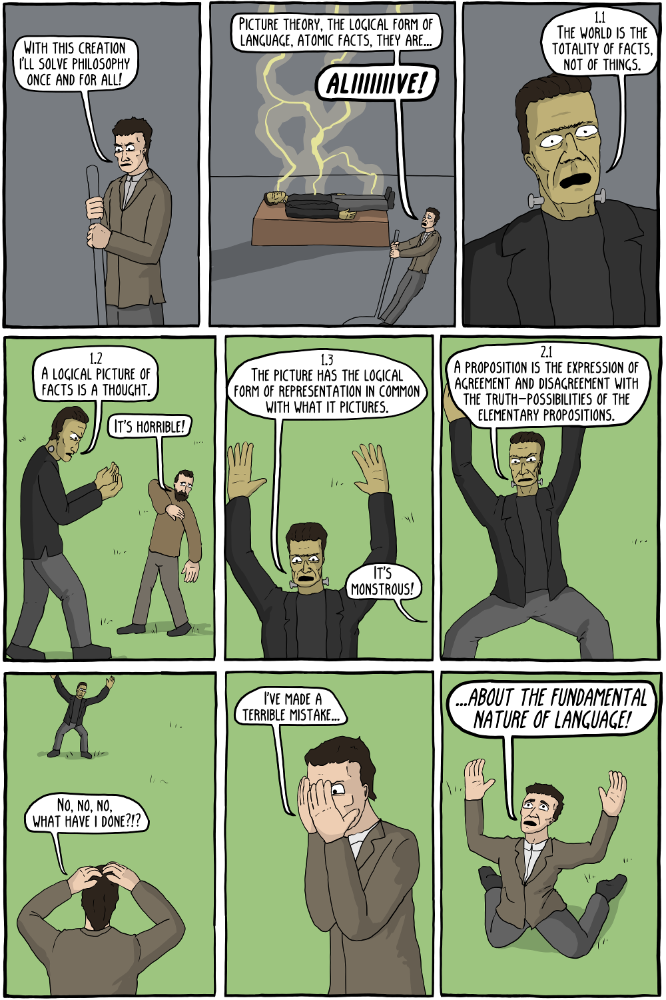](https://existentialcomics.com/comic/117)
[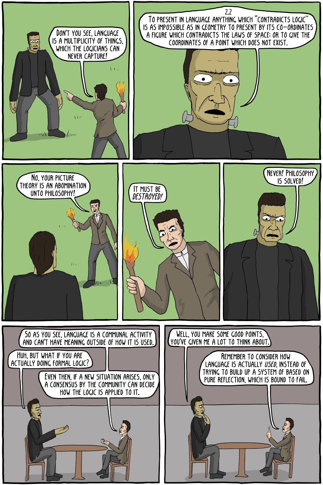](https://existentialcomics.com/comic/117)

Of course, the classic novel "Frankenstein" was written by Mary Shelley, who was Mary Wollstonecraft's daughter. Ludwig Wittgenstein is famous for writing the "Tractatus Logico-Philosophicus". In his later lectures, Wittgenstein came to disagree with his past work. His rebuttal can be found in "Philosophical Investigations", which was translated to English by G.E.M. Anscombe and first published after Wittgenstein's death.

[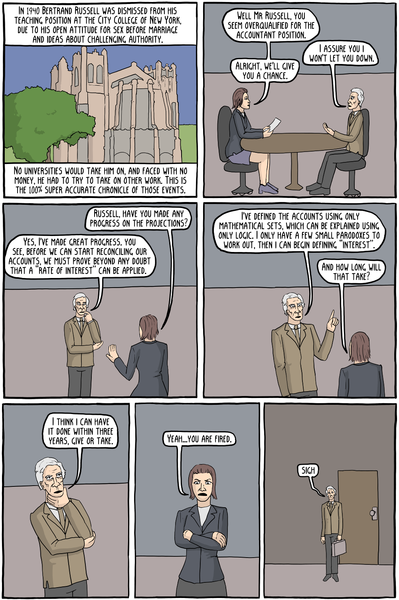](https://existentialcomics.com/comic/149)
[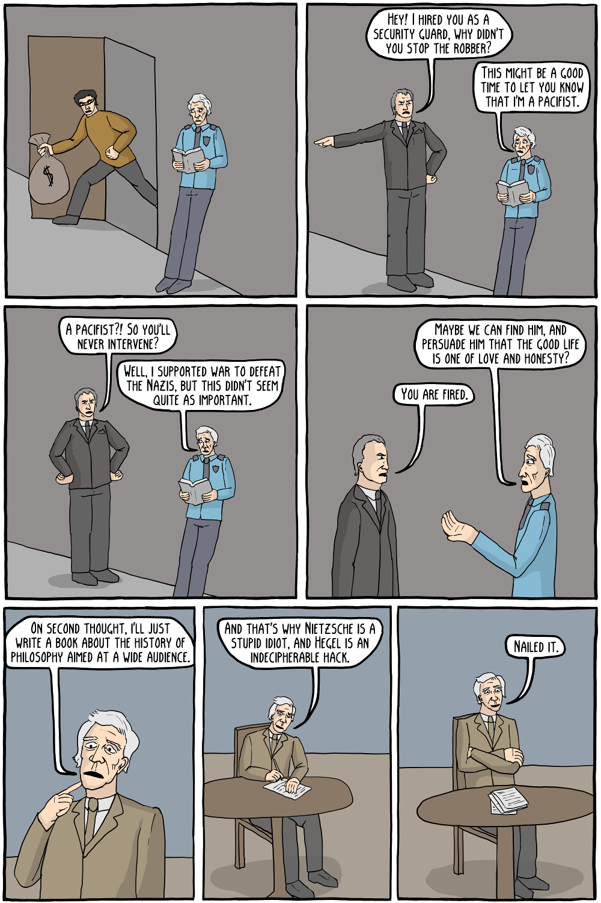](https://existentialcomics.com/comic/149)

"The Hegel Myths and Legends" by Jon Stewart et al, contains essential supplemental readings for those who have read or plan to read Bertrand Russell's "A History of Western Philosophy" or Karl Popper's "The Open Society and Its Enemies", among many other English-language discussions of Georg Wilhelm Friedrich Hegel.  Debunking the myths and legends that surround the Anglo-Saxon interpretations of Hegel can make for some interesting reading otherwise, if one is so inclined.

For an alternative to Russell's history, I recommend "The Great Conversation: A Historical Introduction to Philosophy" by Melchert and Morrow.  While Karl Popper's writing is essential reading in the philosophy of science, sometimes there is an attitude that Popper "solved" the philosophy of science, which I could not disagree more with.

[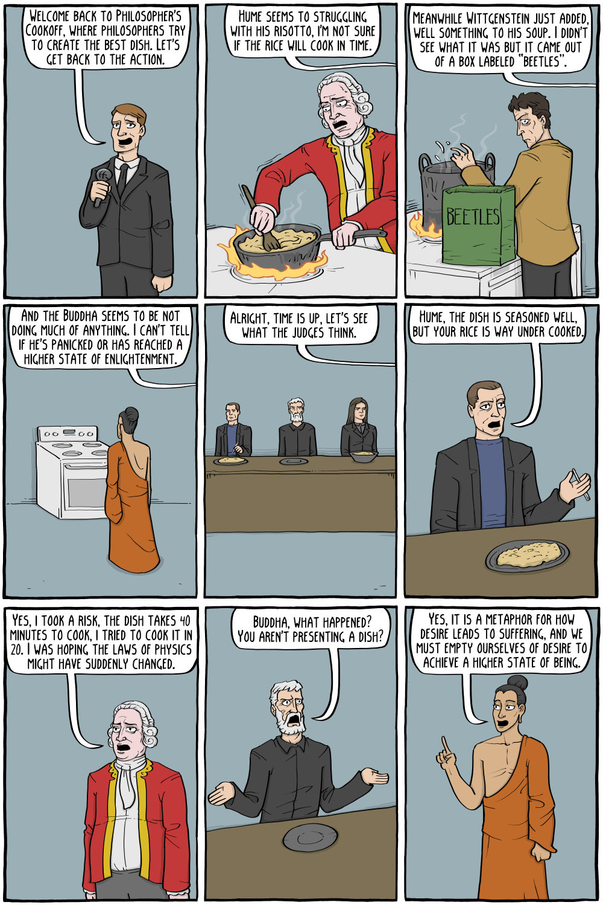](https://existentialcomics.com/comic/405)
[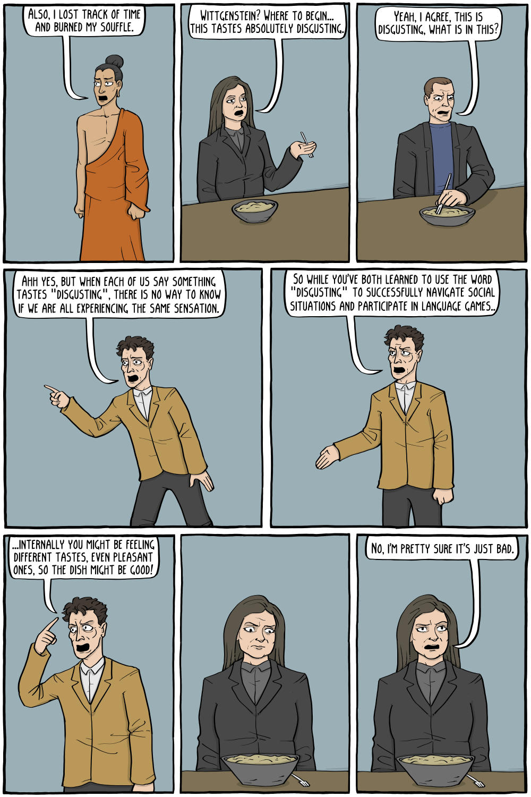](https://existentialcomics.com/comic/405)

[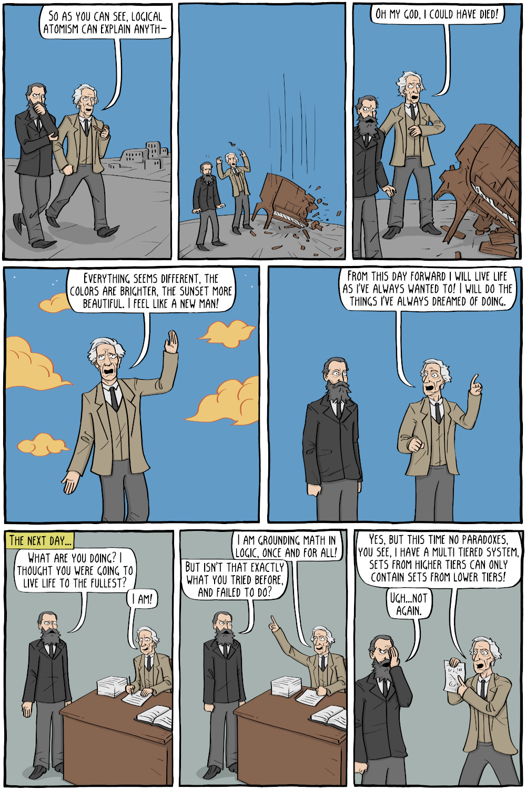](https://existentialcomics.com/comic/304)

The joke's on Existential Comics, I want types and dimensional analysis early and often in elementary math education!  Specifically, I want simple, concrete examples of types, such whole numbers, fractions, Cartesian coordinates, and units of measurement. I want simple, concrete examples of dimensional analysis, such as length, position, area, volume, ratios, and rates of change. I want demonstrations and discussions of how these ideas inform problem solving heuristics. I also want some of that analytical philosophy as well... later.

## Suggestions for studies in Religion and Moral Philosophy:

[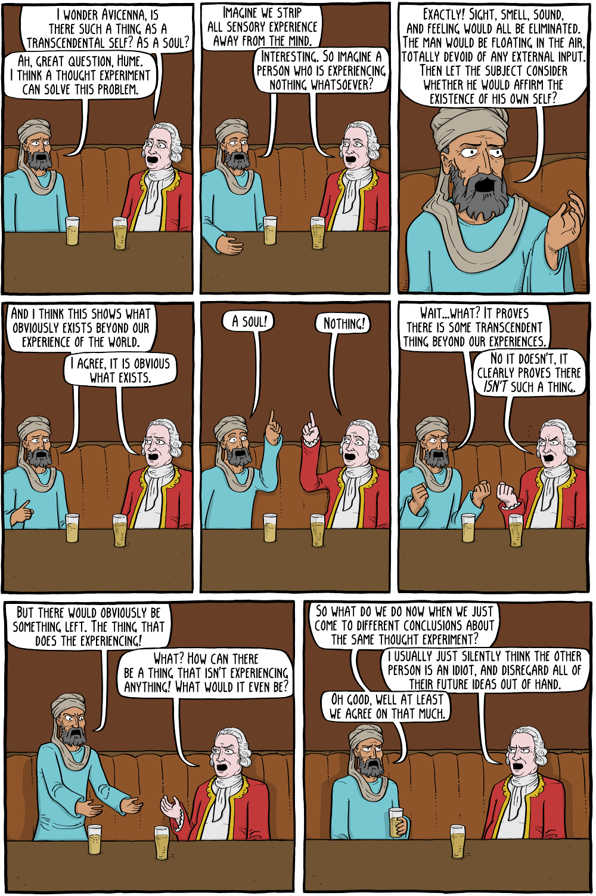](https://existentialcomics.com/comic/267)

I'm pretty sure Leibniz's answer is "monads".

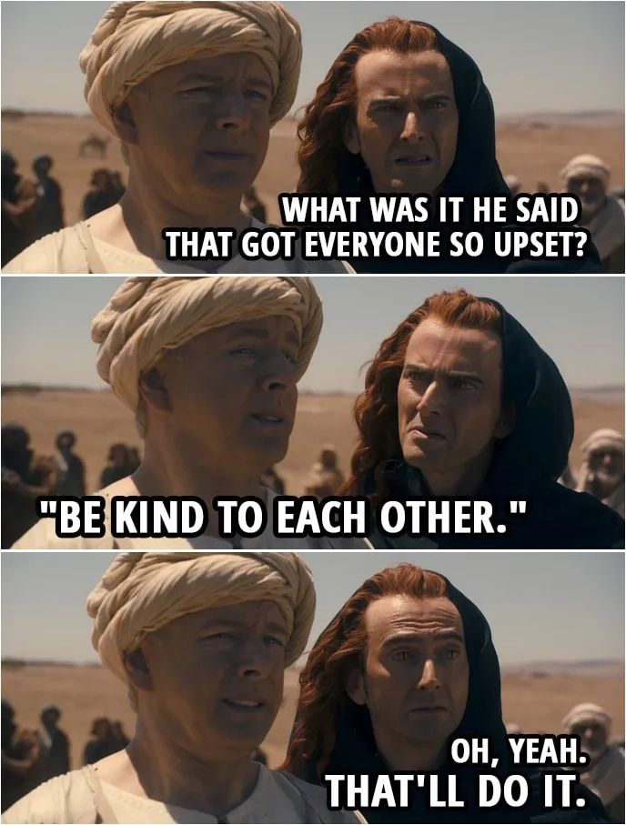

> Never forget in the story of Jesus, the hero was killed by the state
>
> - Dick Gregory, via Killer Mike, in "Walking in the Snow", on "Run The Jewels 4"

I believe in the profoundly creative potential of taking two or more things that may initially seem to be contradictory, and instead of dismissing the combination outright, lean in to the contradiction and treat it like a riddle. You may come to believe that these two things aren't actually contradictory. Once in a while, you may even discover that these apparent contradictions are actually two sides of the same coin, and that there is insight to be gained by more deeply understanding their nuance and their interaction.

Numerous variations on this idea have existed and recurred in many human societies throughout history: examples include the Yin and Yang of ancient Chinese philosophy, Heraclitus's principle of opposites in ancient Greek philosophy, Janus, the Roman two-faced god of endings and beginnnings, the illuminated poetry of the English artist William Blake, and the philosophies of Fredrich Hegel, Nels Bohr, Bertrand Russell, and Paul Feyerabend among many others.

I believe that moral philosophy has an analog of Imre Lakatos's mathematical philosophy of "Proofs and Refutations".
I believe that there exist analogous notions for "evidence", "proof", "refutation", "counterexample", "inconsistency", and "truth" in morality. I believe it's self-evident that judging the plausibility of a moral argument can be (and often is!) quite different from judging the plausibility of an informal mathematical proof. I believe it's similiarly self-evident that interpreting the practical consequences of a moral argument can be quite different from interpreting the practical consequences of a mathematical argument. Yet, I still believe this analogy is useful, and often deeply insightful.

I hope that you will grow to appreciate some of the many contradictions that can be found from browsing the materials I reference, both inside and outside the category of "religion and moral philosophy".

[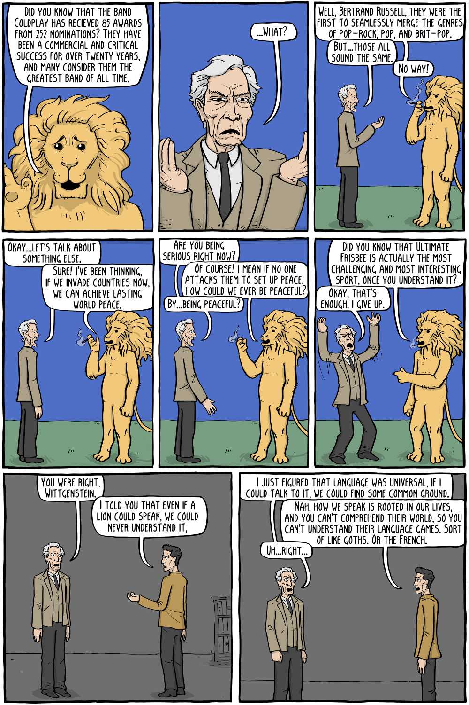](https://existentialcomics.com/comic/245)

1. The Good Place, created by Michael Schur

   I was raised in the Church of the Brethren, which claims Alexander Mack as a founder and early leader. From what I understand of Mack's worldview and theology, I believe that he would be delighted by "The Good Place".
   * We need more optimistic, non-dystopian fiction, like the original Star Trek.
   * See "Ted Lasso", compare to Monty Python's "Philosophers' Football Match"
   * See "Manifest"
   * https://www.jacobinmag.com/2022/04/parks-and-recreation-good-place-how-to-be-perfect-michael-schur-book-review

[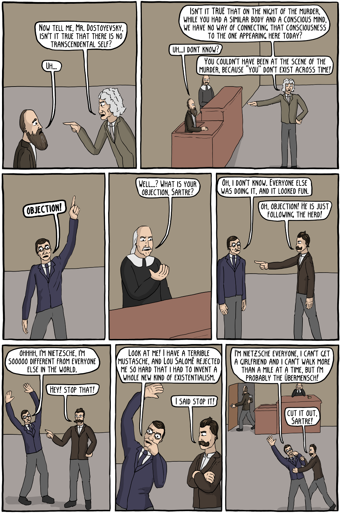](https://existentialcomics.com/comic/107)

2. Царство Божие внутри вас (Лев Николаевич Толстой) ([epub](external-assets/Leo_Tolstoy/RU/%D0%A6%D0%B0%D1%80%D1%81%D1%82%D0%B2%D0%BE_%D0%91%D0%BE%D0%B6%D0%B8%D0%B5_%D0%B2%D0%BD%D1%83%D1%82%D1%80%D0%B8_%D0%B2%D0%B0%D1%81_(%D0%A2%D0%BE%D0%BB%D1%81%D1%82%D0%BE%D0%B9).epub), [wikisource](https://ru.wikisource.org/wiki/%D0%A6%D0%B0%D1%80%D1%81%D1%82%D0%B2%D0%BE_%D0%91%D0%BE%D0%B6%D0%B8%D0%B5_%D0%B2%D0%BD%D1%83%D1%82%D1%80%D0%B8_%D0%B2%D0%B0%D1%81_(%D0%A2%D0%BE%D0%BB%D1%81%D1%82%D0%BE%D0%B9)))

   The Kingdom of God is Within You, by Leo Tolstoy ([epub](external-assets/Leo_Tolstoy/EN/The_Kingdom_of_God_is_Within_You.epub), [txt](external-assets/Leo_Tolstoy/EN/The_Kingdom_of_God_is_Within_You.txt.gz), [wiki](https://en.wikipedia.org/wiki/The_Kingdom_of_God_Is_Within_You))

      
   I have been deeply exposed to the philosophies mentioned and advocated in this book, and for that I am profoundly grateful. This is a difficult and challenging book, and that is a signficant part of the reason I suggest it.
   * See also: [MCC and National Socialism](https://mcc.org/media/resources/10441)

[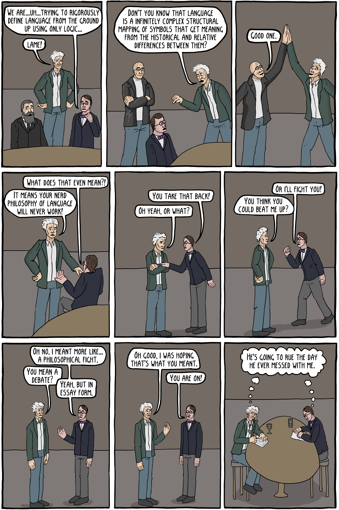](https://existentialcomics.com/comic/146)

3. [Tolerance is Not a Moral Precept, by Yonatan Zunger](https://extranewsfeed.com/tolerance-is-not-a-moral-precept-1af7007d6376)

   Best counterpoint I know of to "The Kingdom of God is Within You", I like to re-read this short, thoughtful and informative essay every few years.

4. The Universal Christ, by Richard Rohr

5. Faith Unraveled: How a Girl Who Knew All the Answers Learned to Ask Questions, by Rachel Held Evans

6. Don't Label Me: An Incredible Conversation for Divided Times, by Irshad Manji

7. Sojourner Truth: A Life, A Symbol, by Nell Irvin Painter

8. Martin Luther King, Jr. on Leadership, by Donald T. Phillips

9. A Sin By Any Other Name, by Robert W. Lee
   Bernice King calls this book a love letter to the church and to the South. I am honored to make Robert W. Lee's important testimony part of this study guide, which I intend as a pandemic love letter to Science, Faith, Reason, and Humanity.

10. The Third Reconstruction, by The Reverend Dr. William J Barber II

11. The Uncommon Knowledge of Elinor Ostrom, by Erik Nordman

12. Dorothy Day: The World Will Be Saved by Beauty, by Kate Hennessy

13. Accidental Saints: Finding God in All the Wrong People, by Nadia Bolz-Weber

14. Anarchy Evolution: Faith, Science, and Bad Religion in a World Without God, by Greg Graffin and Steve Olson

    Greg Graffin is a scientist, philosopher, and lead vocalist of the punk rock band "Bad Religion". He is also a faithful athiest, and is very respectful of belief. Chapter titles include "The False Idol of Natural Selection", and "The False Idol of Atheism". Perhaps someday I'll try to write a personal take on "The False Idol of Belief in God".

    Greg Graffin certainly has been a minister to this Marginal Mennonite over the years. I have long appreciated his punny lyrics, intelligent wordplay, and humanistic outlook. I wasn't aware of this book until after I had largely finished my sermon on rational approximation, yet it is easy to find many instances of convergent "evolution" of thought and thesis. I was occasionally bored with Graffin's experiences as a rock star, but then I found the perspective on the death of Dan Bradbury and the album "Into the Unknown" to be very interesting, so thank you, Dr. Graffin, for your honesty.

15. Why I am an Athiest Who Believes in God, by Frank Schaeffer

16. The Better Angels of Our Nature: Why Violence Has Declined, by Steven Pinker

17. Words that Hurt, Words that Heal: How the Words You Choose Shape Your Destiny, by Joseph Telushkin

    I attended a lecture of Rabbi Teluskin's many years ago, and several of his lessons from his lecture and from his books have carved a way into my heart. For that I am both a better person and profoundly grateful.

18. Why Won't You Apologize?: Healing Big Betrayals and Everyday Hurts, by Harriet Lerner Ph.D.

19. How to Have an Enemy: Righteous Anger and the Work of Peace, by Melissa Florer-Bixler

20. Confronting Christofascism, by Carolyn Baker

21. Jesus and John Wayne, by Kristen Kobes Du Mez

22. Pipestone: My Life in an Indian Boarding School, by Adam Fortunate Eagle

23. Education for Extinction: American Indians and the Boarding School Experience, 1875-1928, by David Wallace Adams

24. An Indigeneous Peoples' History of the United States, by Roxanne Dunbar-Ortiz

[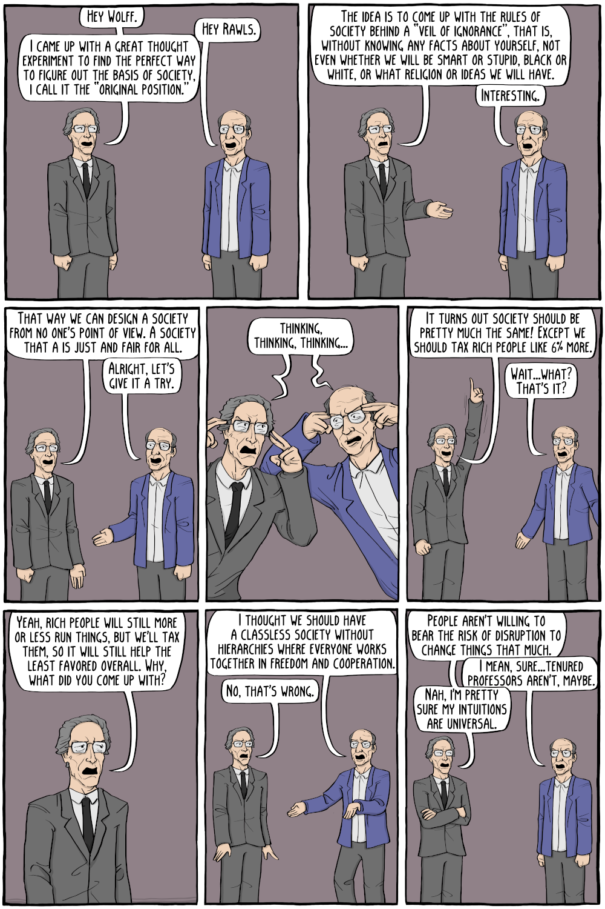](https://existentialcomics.com/comic/350)

25. A Theory of Justice, by John Rawls

26. What We Owe to Each Other, by T.M. Scanlon

27. Love is the Way: Holding on to Hope in Troubling Times, by Bishop Michael Curry

28. Persuade, Don't Preach, by Karen Tibballs

29. A Call to Friends: Faithful Living in Desperate Times, by Marty Grundy

30. Theory for Religious Studies, by William Deal and Timothy Beal

   I found both a degree of solace and a writing voice in both William Deal's and Timothy Beal's classes on religion and comparative ethics at Case Western Reserve University, in which I occasionally trialled arguments that informed my sermon on rational approximation and this study guide. I bought this book as I was broadening my literature search, and it turned out to be unexpectly very useful. I had considered using the word "simulacrum", but when researching the cultural context surrounding this word, decided against it, in part to my difficulty understanding the basics of Jean Baudrillard. This book was invaluable to the reversal of that decision.

[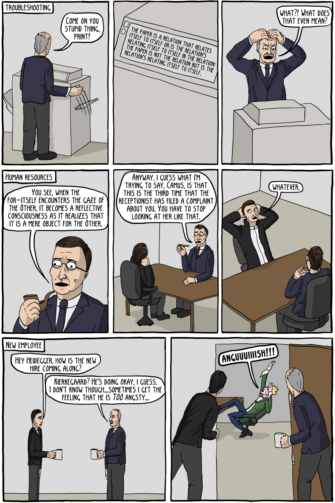](https://existentialcomics.com/comic/79)
[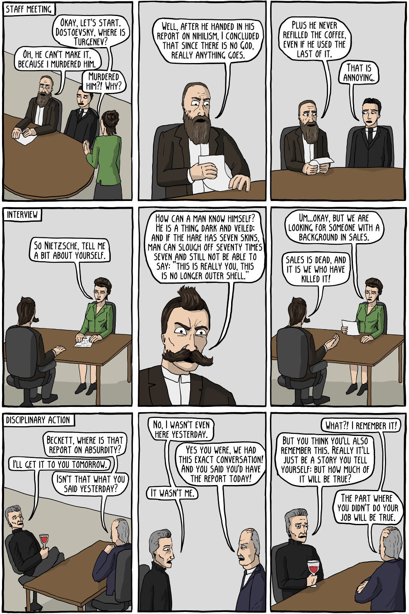](https://existentialcomics.com/comic/79)
[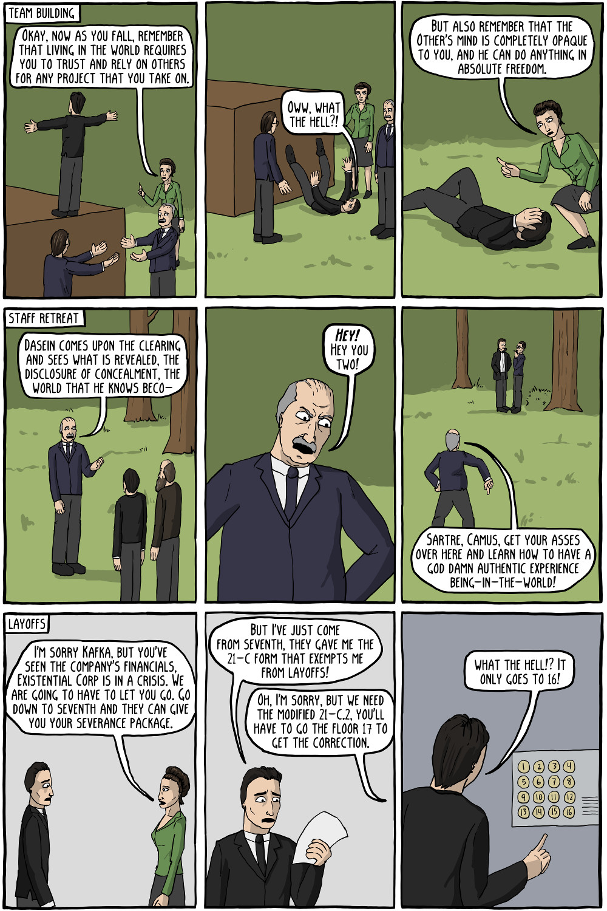](https://existentialcomics.com/comic/79)

[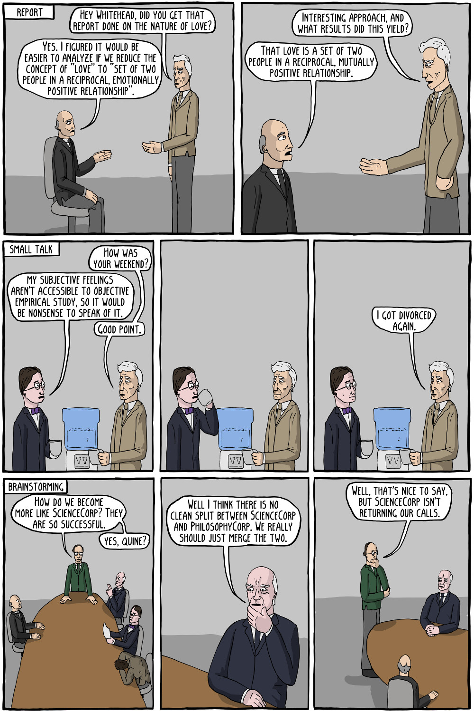](https://existentialcomics.com/comic/89)
[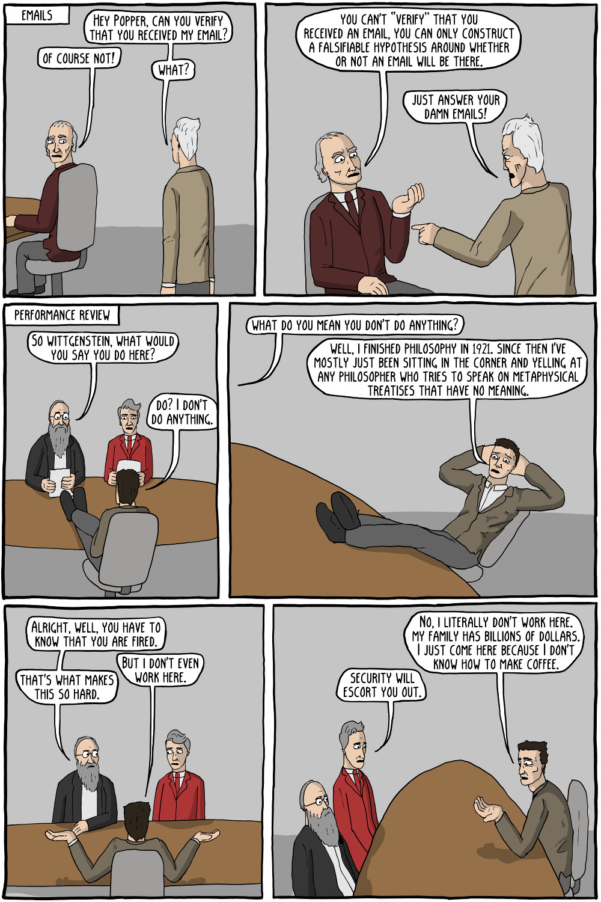](https://existentialcomics.com/comic/89)

Mathematicians are a flock of odd birds. Does that make existential philosophers a herd of cats?

## Suggestions for Studies in Mathematics:

* Indra's Pearls: The Vision of Felix Klein, by David Mumford, Caroline Series, and David Wright
  * A state-of-the-art introduction to computer graphics, fractals, mathematics, and much more.
  * reminds me a lot of examples from "Oh! Pascal!", but much more in-depth.
  * Like "Proofs and Refutations", this book has a similarly high potential for improving my math education, had I been able to read it in high school.
  * Chapter 7 covers modular group
  * Potentially pairs well with:
      * Chaos, by James Gleick
      * Euler's Gem, by David S Richeson
      * The Knot Book, by Colin C Adams
      * Visual Group Theory, by Nathan Carter
      * Visual Complex Analysis, by Tristan Needham
      * Visual Differential Geometry and Forms, by Tristan Needham

* Introduction to Experimental Mathematics, by Søren Eilers and Rune Johansen
  * A continuation of _the inductive attitude_ theme of this essay
      * The Scout Mindset, by Julia Galef
      * How to Solve It, by George Pólya
      * Mathematics and Plausible Reasoning, by George Pólya
      * Proofs and Refutations, by Imre Lakatos

* Concrete Mathematics (2nd Ed.), by Ronald L Graham, Donald E Knuth, and Oren Patashnik
  * Exercise 4.4: Depends on interpretation.
     * if interpreted as pair, then (1,1) /= (-1,-1), and
          * then it's four of the eight lobes of the group SL(2,Z)
          * SL(2,Z) is the transitive closure of these lobes under group multiplication.
     * if interpreted as ratio, then 1/1 == (-1)/(-1), and
          * it's two of the four lobes of the modular group PSL(2,Z), each duplicated twice
          * PSL(2,Z) is the transitive closure of these lobes under group multiplication.
     * the function \x -> x * ((0 1)(-1 0)) is a bijection between the provided lobes and the missing lobes
  * see scanned notes
  * should rewrite essay in TeX to expand on this answer.
     * a free presentation of the modular group based on pointwise product of D_4 * SL(2,N) * D_4
     * syntactic correspondence (computable by a small and simple Mealy-type finite-state machine) of the _coproduct_ (also known as the _free product_) of Z_3 and Z_2
     * include a more careful writeup of the results in my notes, alluded to in KB&SBT and the tribute that follows
  * Synthesizing this answer with "Algebra: Chapter 0" by Paolo Aluffi should be a very fertile exercise.

### An intellectual history of the Aggregate Theory of Concrete Mathematics: a tribute to linear algebra and Dr. Elizabeth Meckes

I knew Elizabeth and Mark from my undergraduate days at Case Western Reserve University when we were all students. As an undergrad, I was often overly fixated on the decidedly non-linear design problems that programming languages pose, which was extremely weird for the department. I stumbled my way to a math major, and earned a computer science minor about three times over.

It was obvious to me that Elizabeth and I shared many philosophical principles of math education, and I admired Elizabeth's enthusiasm for curriculum reform. We both believe that it is important to refer to key concepts early and often. Introducing linear algebra via gentle introductions to matrix arithmetic and linear transformations are deeply baked into my theory of math education. While this emphasis on preparing students for linear algebra was not always intentional, neither is it entirely accidental. Rather, it is a byproduct of chance guided by a philosophy of design.

Linear algebra is easy to underappreciate, even if you have a reasonable understanding of it and its importance.[^graphicallinearalgebra]  In fact, developing my Aggregate Theory of Concrete Mathematics has brought deeper practical appreciations of linear algebra repeatedly over the period of many years. Linear algebra is among the grandest mountain ranges of modern mathematics, and Linear Algebra is indeed one of the most important math classes you'll ever take.

After I graduated from Case Western Reserve University, I taught some remedial algebra classes at Ivy Tech Community College for fall of 2004 and spring of 2005, and I found myself very much in want of a better way to illustrate the basic algebraic properties of associativity and commutativity. As a secondary motivation, I wanted a way to efficiently break mistaken assumptions about what numbers are, and provide a suggestive hint of what they can be.

Around that time I first read Dr. Doron Zeilberger's Opinion #65 on Gelfand's Principle, which I immediately found absolutely fascinating. It comported with my pre-existing pedagogical philosophy and also nicely elucidated it. It inspired me to go above and beyond: I wasn't content with developing one example for a few lessons. I wanted to discover examples to cover and recover many times, in a logical progression of ideas! Ideally, it could be introduced in early elementary school and extend all the way through the high school college-prep curriculum and beyond. I wanted to leave students better prepared than I was for as a diverse a selection of university-level undergraduate math classes as possible.

With this in mind, for the specific problem I was seeking to address, I wanted the simplest, most naturally motivated, most interesting example of something that was associative, but not commutative.[^nandnor]  So I thought back to my class with Dr. Dong Hoon Lee, taught from Fraleigh's abstract algebra book. I wanted a simple non-abelian group I could conceivably use. I quickly focused my attention on D_4, the symmetry group of the square, because rotating the the area of a rectangle explains why multiplication is commutative, well within the wheelhouse of the class I was planning this lesson for.[^alternatives]  In fact, these lessons could even be adjacent to each other, and hopefully reinforce each other.

I was also attracted to D_4 because of it's particularly simple action on the cartesian coordinates, which lead to particularly simple and pleasing connections to graphing equations, the unit circle, complex arithmetic, and trigonometry, all well within my longer-term college-prep target. I was keenly aware that attempting to teach D_4 the way it was taught to me, in the class I was contemplating using it in, was an absolute non-starter. So I started relearning the symmetry group of the square again for the first time.

A year or so later I demonstrated my explanation of D_4's action on the cartesian coordinates to Larry Moss. He was amused, laughed, and said "Oh you've got your linear transformations right there!"  I was struck with the force of revelation, because in my mind I had written down anonymous functions. In retrospect the connection was so blindingly obvious that I was amazed that I had overlooked it.

Yet somehow, I clearly had overlooked this connection. I almost certainly would have spotted it eventually. My introduction to matrices in Algebra II focused on row reduction and solving systems of linear equations, whereas my first deep dive into linear transformations came later in linear algebra, and I simply had not thought that far ahead in terms of curriculum implications. On the other hand, I reviewed Fraleigh (5th Edition) early on in my process of relearning D_4. I clearly remember reviewing pages 94-95, but I suspect I didn't take a close enough look at the exercises on page 96, which in retrospect seems like a significant heuristic blunder. No matter, after my interaction with Dr. Moss I made sure that linear algebra was on my hotlist of free mental associations with D_4.

One of the first things I remember Dan Friedman telling me was that whenever you write a program to do something, you should also write the program to undo that thing. I remember thinking "that's a nice idea in theory", and then my mind first raced to undoing cryptographic hash functions, and second to undoing the Euclidean Algorithm. Of course, cryptographic hash functions are specifically engineered to try to be computationally infeasible to undo, and properly appreciating the design of that kind of function requires a deep understanding of how to undo a lot of things!  But I didn't have an answer to the latter question that satisfied me, so I filed a mental note to "write a program to undo the Euclidean Algorithm" away, and promptly forgot about it.

At the time, I was well aware of the Extended Euclidean Algorithm from David Singer's number theory class, which can very reasonably be said to "undo" the Euclidean Algorithm in the sense I was looking for. However, the more obvious connection is number-theoretic. The connection to the continuum of the real number line is much less obvious, unless you are clued into continued fractions and/or the Stern-Brocot tree.[^sbt-undergraduate-retrospective]

In elementary school,  I loved the ideas that surrounded greatest common divisors and the reduction of fractions to least terms, but I hated the fiddly nature of actually doing it. Around third grade I wrote a BASIC program to reduce fractions for me. It wasn't pretty, I'm pretty sure it involved a nested loop, expressed as a bowl of spaghetti code. I clearly remember being forced to think carefully about whether to use "and" or "or" to combine boolean expressions. But it worked, and I saved it to diskette and used it as much as possible for math homework after that.

I first developed an appreciation for the Euclidean Algorithm in Grade 7, by reading a side-box blurb from a math textbook we were using. I then rewrote my fraction-reducing program with this in mind, and marvelled at how much shorter and clearer and more insightful the Euclidean Algorithm was compared to my previous mess. This was a seminal event in building my intuition for loop invariants and how to write programs well.

Around this time I recall seeing continued fractions once in a great while, never with much explanation, in what seemed to be weird disjointed contexts. Continued fractions seemed strange and incomprehensible. Little did I know that they are just the other side of the Euclidean coin, intimately connected to one of my favorite algorithms!

My first real "aha!" moment with continued fractions came from reading articles on cut-the-knot while solving Project Euler problems. I immediately realized that continued fractions are a deeply satisfying answer to the question Dan Friedman inspired. I also knew that my junior high self would have likely appreciated that explanation, and so I immediately knew I had another partial answer to the question "How to teach math?" that I had to keep track of.

Days after that, I was reading the then-recent paper "Functional Pearl: Enumerating the Rationals" by Jeremy Gibbons, Richard Bird, and David Lester. This was my first introduction to the Stern-Brocot tree and it's connection to the Euclidean algorithm and the Calkin-Wilf trees. Soon after reading that paper, I knew that the Stern-Brocot tree was one of the most important partial answers I had ever stumbled upon to "How to teach math?".

I was struck with this force of revelation for four reasons: first of all, The Stern-Brocot tree provides a very appealing mental model for thinking about continued fractions. Now I believed I could successfully introduce these ideas to my five-year old self. Being able to increase my bid from "my Junior High self" to "my 5-year old self" was _extremely_ interesting.

Second, the Stern-Brocot tree is a naturally motivated demonstration that the "wrong way to add fractions" is useful. The mediant very nicely illustrates and motivates the property of being well-defined, because it is not a well-defined "function", and this demonstrates that these "functions", while not functions in the strictest sense of the word, can still in fact be very useful, which is a wonderful thing to learn early.

Thirdly, the simplification from continued fractions to the Stern-Brocot tree nicely comported with the philosophy exemplified by Dan Friedman to first write a program in the simplest, most natural way possible, and then strive to  derive more efficient versions from that. This is something that I would probably still benefit from putting in into practice more often.

Translating this philosophy into the realm of math education, that means we can introduce the Stern-Brocot tree and the Euclidean algorithm before any discussion of integer multiplication or integer division. Then, we can connect multiplication and division to repeated addition and repeated subtraction, run-length encoding and continued fractions. Instead of spending years drilling boring multiplication and division before we get to the interesting stuff, we could go the straight to interesting stuff first and use it to motivate the introduction of multiplication and division! This is great, not least because integer division had long been a particularly fascinating nexus in my memory palace of mathematics, and now it just got far more interesting!

Fourth and finally, by the metrics of Gelfand's Principle, the Stern-Brocot tree is a naturally motivated pedogogical example for the hyperset theory I had learned about on my own from Jon Barwise and Larry Moss's "Vicious Circles" while I was at Case Western Reserve University, and the coalgebras and coinduction I later learned a bit about from sitting in on some of the lectures of Larry Moss himself at Indiana University.[^barwiselakoff]

Now, I have been deeply interested in the question "How to teach math?" since early childhood, and now I unexpectedly had four very interesting answers to four questions that were highly relevant to my longstanding interest. It was a firestorm of unexpected insight, and I felt utterly amazed for several weeks thereafter.

Life happened, and these ideas got shuffled to the backburner. In the intervening time, I attended several NYC Compose Conference organized by Ryan Trinkle and Obsidian Systems. At one of those events, perhaps at the same event where Ozgun recommended "Statistical Rethinking" in the hallway, I heard Edward Kmett talking extemporaneously to somebody else about the merits of iterative deepening as a heuristic for learning mathematics.

Now, Edward Kmett may well be the smartest man I've ever met. He is a force of nature, with an astonishing breadth and depth of knowledge in mathematics and computer science, and with a level of energy and stamina that I often simply cannot keep up with. So naturally I was extremely interested in what he was saying. As I was listening to Ed talk about the way he accomplished some truly astonishing feats of personal learning, I realized Ed was, like Doron Zeilberger, touching many ideas that were in already in my own head. However, Ed was explicating instincts that were buried even more deeply in my subconcious, and also pointing out a large number of things I had never considered, even instinctively. As I listened, I knew the thoughts that he was creating in my head was a seed for an answer to the question "How to teach math?" that I had long been seeking.

I knew that if I dropped that seed into the supersaturated solution of unorganized partial answers to "how to teach mathematics" in my mind, a much better answer would start crystallizing. Finally, this pandemic, the coup, the prodding of a dear friend, and meeting the young son of a personal friend, inspired me to bring these ideas back to the forefront of my mind. As expected, the theory started getting organized. Then the theory started growing rather more vigorously than expected.

It had long been obvious that the Stern-Brocot tree would be the frontispiece of my theory. As I started planning my first videos on rebuilding fractions and the Stern-Brocot tree, I realized I couldn't quite adequately explain the connection between the Stern-Brocot tree and the Euclidean algorithm. I could explain how the connection worked, but realized I couldn't quite answer why. This was creating doubts that I would be able to give a really suggestive answer "how". So I reviewed "Enumerating the Rationals", discovered that it never actually explained the "why" of the connection, and followed the reference back to "Concrete Mathematics". In retrospect, I had been personally experiencing the knowledge illusion regarding the nature of this connection.

I quickly came to the conclusion that the current edition of Concrete Mathematics buries the lede regarding the Stern-Brocot tree. I had looked at the table of contents of "Concrete Mathematics" as an undergraduate, but sadly I had overlooked the actual content of the book until the summer of 2021. This time, I was deeply amused by the preface, as it evoked memories of a great many critiques and defenses of New Math that I've read and pondered over the years, memories of which have faded into mush, but the echoes of which are still with me in the ways they informed my philosophy of math education.

I found the section on the Stern-Brocot tree to be very nicely written overall. The connection to the Euclidean algorithm I found to be immediately clear upon a first read. Again I was struck by a force of revelation: I had again been overlooking linear algebra. This explanation is the only place in the book that uses it, which made it very clear to me that linear algebra deserves to be higher up in my mathematical toolbox.

Later, as scripts for my first two videos were starting to come together, I was thinking about how to answer the inevitable question, why should I care? I got myself into the mindset of a hype man to frame the answer, and then over the course of a couple days, I somewhat unexpectedly wrote the opening sentences to "Kevin Bacon and the Stern Brocot tree", which I've hardly touched since. Those opening lines were both a cause for, and effect of, my coalescing interest in the primary aggregates of my educational theory.  I had the starting point, the Stern-Brocot tree.

Browsing Concrete Mathematics, thinking about how to teach and motivate probability and statistics, and thinking about Paul Erdős and how to extend the metaphor of opening sentences in the best way possible, reminded me that Pascal's Triangle also needed to be a frontispiece. That in turn reminded me of a time when I was teaching Algebra I to Ivy Tech students, and I gave a very brief overview of the Binomial Theorem and Pascal's Triangle.  This felt well beyond the scope of the course, which I knew was playing with fire. And yet, the brief excursion was unexpectedly well received by a student.

Finally, I hesitantly added the Symmetry Group of the Square, not because I understood the connection; in fact I didn't at the time have the strength of conviction that this idea really deserved to be a frontispiece.  Yet, linear algebra provides a relatively "obvious" connection between these aggregates. The fact that I didn't see that linear algebra is common factor between the Stern-Brocot tree and the Symmetry Group of the Square, I find absolutely fascinating.

Coalescing on the primary aggregates was a natural consequence of enlarging the metaphor of the frame I was trying to construct. In my mind, this process of contemplating the arc of "Kevin Bacon and the Stern-Brocot Tree" and writing the opening sentences like going all-in on an auction in contract bridge, doubled and re-doubled, and now I had to figure out how to take all the tricks to make the bid.

That took a lot longer than I expected. It took several weeks to expand my opening lines into reasonable drafts of the first section about the Six Degrees of Kevin Bacon. Then it took several more weeks to start seeing reasonable drafts of my second section about Julian Gevirtz and God's Textbook of Mathematics. As that creative burst was starting to cool, I unexpectedly had one of the more memorable experiences of my life.

I happened to be surfing `/r/Arduino` on reddit, and somebody posted a picture of a binary counter they made out of 8 LEDs, with the headline "1-256" binary counter. And then somebody responded "0-255". Their obvious intention was to point out the off-by-one "error": the most canonical interpretation an 8-bit machine word would be 0-255, not 1-256. And then with playful intent, I responded, 0 = 256 (mod 256), so 1-256 works too. After all, an 8-bit unsigned machine word is (typically) isomorphic to the group of integers (mod 256), and is never isomorphic to the integers themselves. Sliding the window of modular arithmetic to 1-256 is essentially the same idea that is behind two's complement signed arithmetic. I was just offering a counter-refutation, to a perfectly insightful opening refutation.

Although my counter-refutation would not have caused anybody to bat an eye in `/r/math`,  I was aware that in `/r/Arduino` was likely to be received negatively without unpacking a lot of context. But that's time consuming, and makes it easy for others to stop reading early. Once in a great while I enjoy provoking and taking on a sterotypical embedded programmer's aggressively provincial views of what mathematics is. That part's easy for me. I was expecting a bit of a backlash, and I was expecting to defend my position, hoping that it would be fun and enlightening.

This time, the backlash was much stronger than I expected, and I was downvoted into oblivion. Another redditor, perhaps in his mind labelling me as one of those post-modern mathematicians, decided to try to prove me wrong using their superior wiki-ing skills and ad-hominem attacks.

I sparred with my opponent for a while. It quickly turned much nastier than I prefer, but I know what I know, and I do know a thing or two about math. After quite a few back and forths, as it was becoming clear that I would soon be refusing to participate in further debate, I got a notion to write one more response. And right as I posted, I thought, in the likely case he does respond, I'll take his response directly back to the Stern-Brocot tree if at all possible, and the larger Aggregate Theory if not, and then be done with this conversation.

So I posted, and I was soon treated to a response in which I was a attacked for referring to "the modular group Z_256", via a wikipedia link to "the modular group, PSL(2,Z)", arguing that this minor difference in language meant I should go back to the basics and relearn arithmetic. Well I mean, he isn't wrong. I have a copy of "Winning Ways for Your Mathematical Plays", and I would probably greatly enjoy spending time relearning arithmetic from that book.

The thing is, I don't specifically recall hearing about "the modular group, PSL(2,Z)" before this event. Reading the wikipedia article he sent me, I was immediately struck with the force of revelation, but this time looking outward from the shoulders of linear algebra. I immediately understood that the Stern-Brocot tree was somehow embedded within the modular group, because both things corresponded to 2x2 matrices of determinant one. And there was a connection to complex analysis!

I was completely lost in complex analysis, but I did take away three things, first a real admiration for Tristan Needham's "Visual Complex Analysis", secondly the beginnings of my awareness of the weaknesses and limitations of formalist mathematics,  and thirdly, having enthusiastically taken up what Sir Michael Atiyah deems the Faustian bargain that algebra offers, I realized I should have invested more into the study of geometry. In my research program for math education, finding pathways into classes where I previously had trouble, is always very interesting.

This was all very amazing!  I thanked my sparring partner for the link, and ended the conversation. I do geniunely mean that: if you are the person of whom I speak, and you ever read this, thank you!  For me myself personally, this has been the only time this kind of sparring has ever paid off in a really big way. It most certainly was a momentous experience!

I went back to `/r/math` and quipped "the modular group is the Stern-Brocot tree with signs!", confident that with my skillset it would be fairly straightforward for me to figure out what exactly that meant. Soon thereafter, I skimmed Marcus Shell's recent master's thesis "Streaming Down the Stern-Brocot Tree". I found the word "lobe" to be evocative vocabulary, so I adopted it into my own thinking, but the thesis seemed to be asking the very questions I was planning to find an answer to.

A week or so later, I started work. Firstly, I chose the term SL(2,N) to refer to the matrices of determinant one that have natural (i.e. nonnegative integer) entries.  Then found that every element of SL(2,Z) can be written in exactly two ways as a product of an element of Z_4, then an element of SL(2,N), then an element of Z_4 again, sort of a _vulgar conjugation_ of SL(2,N) by Z_4. Secondly, I found that every element of PSL(2,Z) can be uniquely written as a vulgar conjugation of SL(2,N) by Z_2. Thirdly, I found that every element of GL(2,Z) an be written in exactly four different ways as a vulgar conjugation of SL(2,N) and D_4.

Coming back around to the symmetry group of the square was weird, because I had not expected that, at all. Nor was I expecting to find something so poetically pleasing as the discovery that the treasure that I was seeking but not wholly expecting was so simply entwined with what I already had. I thought I had my "aha!" moment a week ago, and here I discover my sparring partner quite accidentally handed me the missing piece I didn't even know I needed to complete the then partially assembled jigsaw puzzle that was "Kevin Bacon and the Stern-Brocot Tree"!

A day or two later, I realized that I could have expected D_4 in the solution I was seeking:  after all, D_4 is precisely those 2x2 matrices with entries in {-1, 0, 1},  and determinant in {1, -1}.  Although linear algebra had long been firmly in my hotlist of mental associations with D_4, coming back from the other direction... not so much. Here finally was the "aha!" moment looking back inwards, reminding me that a heuristic blunder that I'm prone to making is underinvesting in efforts to make links in my memory palaces more bidirectional, and reminding me yet again that my appreciation of linear algebra can always be better.

This lead me to think back to my demonstration of D_4's action to Larry Moss, when as an aside I explained the weird thing I found with my D_4 calculator. It was actually meta-weird: when I first started drawing the D_4 calculator on paper for the first time, something about the principles I couldn't quite articulate but was committing to in order to develop the visual pun, gave me a strong sense that I would find an unexpected reward for my expense.  I was expecting the unexpected, and then I found it: after I finished, it didn't take me long to observe that by mentally moving the "window" on this book of algebra from the 12 o'clock position to the 3 o'clock position, the calculator works flawlessly, even though different physical glyphs are involved on the obverse side!  Try it!

I always love to see a couple of "weird", unexpected things come out of an idea, this was in fact part of the original connation of the word "collorary" in ancient Greek mathematics. In my mind, it's a good clue that you might be onto something important. These recurrent insights into linear algebra, and the surprise reappearance of an aggregate, was deeply pleasing. This time, understanding the modular group was far more than my meta-weird collorary, it felt like a total firestorm of unexpected insight, far grander than when I had first understood the Stern-Brocot tree.

Not long after this greater firestorm, I was going back through other mathematical memories, reviewing them in light of fresh insight. My thoughts returned to Elizabeth and Mark and other people at Case for the first time in many years. Because of this, late in the evening on December 15th, 2021, after it became clear that we would be saying goodbye to one of our much loved, elderly cat Lucy the next day, I learned Elizabeth had passed away on December 16th, 2020 after a short and unexpected illness. And I learned that Elizabeth and Mark had recently published "Linear Algebra", which motivated me to expand the scope of my literature review, which turned into this study guide.

Linear algebra is one of those subjects in mathematics that bring unexpected insight quite often. In retrospect, I believe that a significant part of my past and current philosophies of mathematics can be explained by a strong instinct to seek out combinations of ideas that are much more than the sum of their parts, and to delight in any strongly non-linear design gestalts that I can discern.

Perhaps this is part of the reason I have been slow to properly appreciate linear algebra, despite knowing a fair bit about it. This is most definitely a common phenomenon among professional mathematicians, even if the plausible causes in my case are not. By now I am well aware that I could dramatically level-up my mathematical skills by developing a habit of looking for linearity much earlier and much more aggressively. Twenty years have gone by since a serious review, and that's why I hope to use "Linear Algebra" by Meckes & Meckes as part of a process to relearn linear algebra yet again.

## A research program for Aggregate Theories of Concrete Mathematics

> The more ambitious plan may have a better chance of success.
>
> - George Pólya on the _Inventor's Paradox_, in "How to Solve It"

### The initial core of the program

Apply iterative deepening depth first searches to the following starting points:

1. Counting (up to 10 or less)
2. The Number Line (of the natural numbers).
3. Addition of small numbers (say, total not more than 5 or so)
4. The Stern-Brocot Tree (and the Euclidean Algorithm)
5. Pascal's Triangle
6. Symmetry Group of the Square

As soon as practical, mix in practices that exercise the inductive attitude, computer programming, problem solving, heuristics, self-awareness, self-control, and social skills.

Teachers need to keep in mind major milestones that should be achieved, including computer programming,, Boolean logic, binary numbers, types, Cartesian coordinates, geometric modelling, dimensional analysis, the arithmetic of fractions, binary search, depth-first search, breadth-first search, iterative deepening, radix-point arithmetic, limits of Stern-Brocot sequences, divergent sequences, counting combinatorially, matrix arithmetic, probability, statistics, inductive reasoning, deductive reasoning, recursion, syntax and parsing, and proof by induction. Teachers need to assist reaching simple milestones in these topics as early as is reasonable.

A first exposure to an idea or concept need not be a deep exposure: it only needs to be deep enough to establish a sturdy memory tripod or two, ideally by relating the concept to one or two other ideas in the curriculum. A secondary goal for an ideal lesson should be to drop some breadcrumbs and suggested readings that will hopefully create a mental reference in many students, and that hopefully a few students will someday follow up on.

Letting some period of time elapse before introducing the next big idea in a progression is a good thing.  Doing so will be an excuse to relearn the previous lesson.  It's okay if sometimes those periods of time are extended: for example, I expect the course of study outlined in Kevin Bacon and the Stern-Brocot tree to unfold over years for most children and younger teens, while they learn and practice plenty of other mathematical ideas and concepts too.  Spaced repetition is a proven memory enhancement heuristic for building long-term memories that are easily recalled.

### Robotics and The Third Little Induction

This essay started out by discussing inductive reasoning, in particular informal inductive reasoning via the inductive attitude.  Secondly I mentioned in passing that all-important deductive proof by induction, often first introduced in discrete math.   Robotics brings a third kind of induction: electrical induction.  I highly recommend early childhood exposure to simple electronics and robotics work, such as building computer-controlled LEDs, relays, actuators and motors via Arduino and Raspberry Pi types of devices.

We will focus on computer-controlled relays for a moment, because the common general-purpose relay's solenoid is an example of an inductive load that can result in damaged electronics projects if this is not taken into account. The relay's solenoid is a coil of wire that acts like an electromagnet: the magnet is turned on and attracts the relay's arm if there is electrical current flowing through the solenoid's coil. If there is no current flowing through the solenoid, then the magnet turns off, and a spring pushes the relay's arm away from the electromagnet.

A general-purpose input-output (GPIO) line from a CPU, microcontroller, or IO perhiperhal is pretty much never capable of driving a common relay; the solenoid is going to require more electrical power to actuate the arm than the GPIO line can safely deliver without risking damage to the CPU. The common solution is to use the GPIO signal to drive an NPN bipolar junction transistor that acts as a low-side switch for the solenoid.  This behaves like a very simple power amplifier to solve the first half of our problem: turning the solenoid on safely, thus actuating the relay's arm.

But the second half of our problem has another issue lurking: solenoids are examples of a reactive load, and we have to turn the relay off without damaging anything. When you first apply voltage to the solenoid, the magnetic field starts to turn on.  As the magnetic field grows stronger, it pushes against the electrons that are flowing through the coil.  This creates a reactive resistance that starts off strong and decays away as the magnetic field fully turns on. This reactive resistance is linked to the fact that inductive loads resist changes to the current flowing through them.

Similarly, the magnetic field stores a small amont of potential energy, and when you turn off the solenoid, the magnetic field starts collapsing.  This changing magnetic field keeps pushing the electrons in the coil along. This creates a reactive current that continues to flow for a short while even after the voltage potential goes away. This is an example of back-EMF, short for electromotive force. Left unchecked, back-EMF can create voltage spikes much higher than the voltage you energized the coil with, and those voltage spikes can damage or destroy equipment. Sometimes the failure might happen after one or two cycles, and sometimes it takes tens or hundreds or more cycles before the equipment stops working and it becomes apparent that there is a problem.

Handling back-EMF is a whole topic in and of itself. On the more sophisticated end of spectrum, all modern electric vehicles, some modern electric golf carts, and a few e-bikes implement regenerative breaking, using the abundance of back-EMF in this operating mode in order to charge the vehicle's batteries a little bit while breaking, thus extending range.

But we are dealing with small, common, general-purpose relays in our scenario. In this context, a common solution is to use a flyback diode to diffuse the kick of the back-EMF before it can build up into a damaging spike in voltage. A nice breadboard demonstration of a flyback diode in action is to use a light-emitting diode as the flyback diode of a relay, and have the relay's solenoid controlled by a push-button.  Properly done, the relay will actuate when you hold the button down, and the LED will flash when you release it.

Setting up a breadboard and demonstrating this effect, followed up by building a computer-controlled relay, is an excellent exercise that, with the right facilitation, could be successfully accomplished at a surprisingly early age.

There's far more that can be done along these lines, from amateur radio, 3D printing, playing with small robotic cars, robotic arms, CNC machines, etc. The material cost (both recurring and capital) of providing these sorts of activities, and doing so in a relatively hands-on way, is quite inexpensive relative to what has been possible in the past. We can afford to provide these interventions to everybody, and to encourage the development of the moral courage to make friends with rivals and to become better people. The main missing ingredients are human capital, payroll, and the will to make it happen.

### Details left to be worked out

What milestones should a college-prep K-12 curriculum starting from this point try to include?  This level of curriculum reorganization allows for surprising new pedagogical avenues, so deep re-examinations are very much warranted.  It's well worth looking at advanced books like Tristan Needham's Visual Differential Geometry and Forms in order to find clues about which ideas might be worth incorporating into the K-12 curriculum in order to prepare students to later study these books as effectively as possible.

For example, I'd love to hear more about Tristan Needham's use of ultimate equality in a first year calculus course.  Ultimate equality is the propositional statement that the limit of the ratio of two sequences is equal to one.  I would love for somebody to engineer a way to introduce and motivate ultimate equality, or at least introduce hints towards ultimate equality, in the K-12 curriculum. Automatic Differentiation is another strong candidate for this sort of treatment, which is an underappreciated, relatively recent technique detailed in "Software Design for Flexibility" by Chris Hanson and Gerald Jay Sussman.

Understanding the design philosophy of the Aggregate Theory is really appreciating the non-linear design gestalt behind the wisdom that is learning how to play the Six Degrees of the Square, Triangle, and Tree very well indeed.  This is a shockingly effective heuristic for discovering how to connect any particular idea to this new curriculum.

I mean, one of my goals for the design was to be able to trace out plausible paths, ideally short and simple paths, to teaching and learning as many different ideas as possible. For example, I very much want to see a particularly nice introduction to the Fourier transform in high school.

It's ok if the approach to the Fourier transform is primarily intuitive, informal, and applied; in fact that's all I personally have. I don't (yet?) have a deep theoretical understanding of the Fourier Transform.  Of course, I would very much like to see many hints towards this latter understanding worked into the informal, more applied introduction.  But that's definitely outside my wheelhouse, at least for the time being.

I am, however, supremely confident that such a plan can be created. As an obvious starting place, discussions of the Fourier transform can be naturally motivated by studies into music, sound, and amateur radio. In fact, I have rough ideas of how the aggregate theory connects to almost all of the mathematics that I have a minimal referential understanding of, i.e. anything more than just a name.  And of course, the much smaller subset of mathematics I am truly competent in, is nicely covered by the aggregate theory..

This larger category covers pretty much the entire core of a mainstream undergraduate mathematics curriculum, as well as some advanced undergraduate and early graduate-level topics that have been demonstrated to have great strategic value. But what if you don't even have a vague idea of how to incorporate an idea into your theory of mathematics?

You can always add that idea as a primary or secondary or tertiary starting poing for your personal theory of mathematics.  I suggest starting from the aggregate theory of concrete mathematics, and build on it and customize it.  Take any mathematical idea at all, and try to find answers about how it connects to the six degrees of your theory.  If you can find a connection (or two, or three, or...), great, you are starting to build your memory palace!

It's well worth the effort to aggressively combine, simplify, split, prune and compress the starting points of your personal aggregate theory.  Can one idea replace several others?  Of course, the ideas being removed from your starting points should still be remembered.  You aren't forgetting about them, you are just moving them to your memory palace.  They are part of your museum of mathematics, they just aren't a starting point for your theory of mathematics.

This is part of the reason why formal deductive logic is an explicit global recommendation of this study guide; I just couldn't quite find a connection I was satisfied with from the primary aggregates to deductive logic.[^deductive-logic-and-the-aggregate-theory] Another reason is that deductive logic (both formal and informal) is just too important to not explicitly recommend somewhere.

Pascal's Triangle leads quickly to the binomial coefficients, and these are directly relevant to first introductions to probability, statistics, and formal inductive logic. Although the Stern-Brocot tree and the symmetry group of the square are less directly relevant to a first introduction to probability and statistics, they are indisputably a very useful pedagogical device to introduce a little bit of linear algebra, which naturally feeds back into relatively accessible examples earlier in probability and statistics.

For example, Markovian processes can be modelled and simulated using matrix arithmetic. See Project Euler Problem #84,  which asks participants to write a program to calculate the most frequently visited squares in the board game of Monopoly.  This problem statement omits irrelevant rules, and simplifies the modelling of Chance, Community Chest, and Jail in ways unlikely to matter to the question being asked, in order to keep the resulting model small and simple.

The Haskell Road to Logic, Maths, and Programming, by Kees Doets and Jan van Eijck
  * This book is the closest approximation that I know of, to what I believe a discrete math class should aspire to be.
  * Many opinions on chapters 8 and 9, though my rewrite of those chapters would likely come out a bit longer
  * For example, I would probably discuss the Integer-Valued Polynomials
      * more abstract and more general than Pascal's Triangle.
      * more concrete and more specific than hypergeometric summations
      * practical pencil-and-paper method for finding closed-form solutions for discrete polynomial summations
      * good for high school contest mathematics
      * an induction schema: induction over IVPs
      * IVPs are well connected to combinatorics and linear algebra, with hints towards functional analysis
      * IVPs are an object specifically of interest in algebraic topology (But I don't understand why, yet.)
  * The binomal theorem used in the book precedes Sir Issac Newton.  Calling it "Newton's Binomial Theorem" without generalizing the binomial coefficients to the real numbers is definitely weird; I decidely do not like that linguistic precedent.  On the other hand, my rewrite would most definitely include at least a blurb about Newton's Binomal Theorem, and a mention of hypergeometric summation.
  * Chapter 10 is absolutely brilliant, and I'm sure my understanding of it could be deeper.
  * Chapter 10, Douglas McIlroy's "Music of Streams", and Project Euler demonstrates that a simplified, applied introduction to generating functions via combinatorics, formal power series, and lazy evaluation can be very approachable.
  * Personally, I would love to see an introduction to generating functions in high school. This book hints at an approach that seems promising.
  * See also "Discrete Mathematics with Ducks" for an attempt of comprehensive coverage of the ACM SIGCSE approved curriculum.
  * See "Concrete Mathematics", as a natural followup.

Structure and Interpretation of Computer Programs, by Harold Abelson and Gerald Jay Sussman
  * The Reasoned Schemer, by Daniel P Friedman
  * Essentials of Programming Languages, by Daniel P Friedman and Mitchell Wand
  * Software Design for Flexibility, by Chris Hanson and Gerald Jay Sussman

Order Theory and Lattices
  * Topic deserves to be more widely understood and appreciated.
  * In contemporary US culture, there seems to be a widespread assumption that all orders are total, and that the only alternative is that no comparisons are possible. This leads to unnecessary posturing, awkward conversations, and nonsensical cultural fixations.
  * A widespread appreciation for partial orders has the potential to transform the conversations we have with each other.
  * Note difference in lattices (geometry and linear algebra, e.g. modular group) and lattices (order theory)
  * Galois connections on partially ordered sets (posets) have a large number of applications:
     * Data Compression, Succinct Data Structures
     * Machine Learning, Formal Concept Analysis, Ontological Discovery
     * Programming language semantics
        * domain theory
        * abstract interpretation
     * Logic, Model Theory, Topoi
     * Combinatorics
     * Topology
  * Books are relatively few in number, and most are expensive, suggesting the topic deserves to be more widely appreciated even among mathematicians.
  * Classics include Garrett Birkhoff's "Lattice Theory" and Davey and Priestley's "Introduction to Lattices and Order, 2nd Ed."

Visual Group Theory by Nathan Carter
  * I too spent some time with Hungerford with Dr. Ta-Sun Wu.
  * Lovely effort to make abstract algebra more accessible
  * nicely thought out problem sets!
  * I believe I would have learned more abstract algebra more rapidly had this book been available
  * This book is very complementary to my own ideas along the same lines
  * If VGT is a introduction/adjunct to Fraleigh and Hungerford, I think the Aggregate Theory of Concrete Mathematics can readily produce an introduction/adjunct to Visual Group Theory.
  * Paolo Aluffi's "Algebra: Notes from the Underground" seems like a potentially interesting followup.
  * For a deeper look at quaternions, see "Geometry: Plane and Fancy", "Introduction to the Theory of Numbers", and some abstract algebra books.  Most introductory abstract algebra books only cover the finite quaterion group, though.

Neverending Fractions, An Introduction to Continued Fractions, by Jonathan Borwein, Alf van der Poorten, Jeffrey Shallit, and Wadim Zudilin.
   * Standard introduction to continued fractions, alongside an eclectic mix of less common applications.
   * I remember playing with Somos sequences via OEIS, but I never did anything very interesting with them.
   * See also Linas Vepstas's fascinating expository efforts to discuss this material in relatively accessible ways, often with an eye towards analysis and measure theory

An Introduction to the Theory of Numbers (6th Ed.) by
   * should do deeper review of this book
   * KB&SBT mentions that the converse of theorem 28 is also true, which isn't clearly mentioned in the book
   * theorem 29 is more general that what I had known to be true after writing KB&SBT

Geometry of Continued Fractions, by Oleg Karpenkov
   * This is quite an advanced look at topics closely related to the Stern-Brocot tree
   * Further suggestions in this vein include:
   * Algebra: Chapter 0, by Paolo Aluffi
   * Integral Matrices, by Morris Newman
   * Topics in Geometric Group Theory, by Pierre de la Harpe
   * Automorphic Forms and Even Unimodular Lattices, by Chenevier and Lannes

Proofs from THE BOOK

Game Theory
   * We need an excuse to play games in the math classroom
   * The goal should be to develop good, sometimes rigorous understandings of strategy
   * Need programming environments to be able to develop strategies and play-test them against each other tens of thousands of times.
   * opportunity to discuss/use
       * tradeoffs between pareto-optimal choices
       * probability
       * Markov chains
       * nimbers, combinatorial game theory
       * alpha-beta search
       * Monte Carlo Tree Search, etc.
   * seems like a good way to engineer excuses to play with SAT and SMT solvers and other kinds of model checkers, maybe even modal logic, etc.
   * "Theory of Games and Economic Behavior", by John von Neumann and Oskar Morgenstern
   * "Winning Ways for Your Mathematical Plays", by Elwyn R. Berlekamp, John H. Conway, and Richard K. Guy
   * "Chance, Strategy, and Choice", by Samuel Bruce Smith

## Physics and Metaphones

[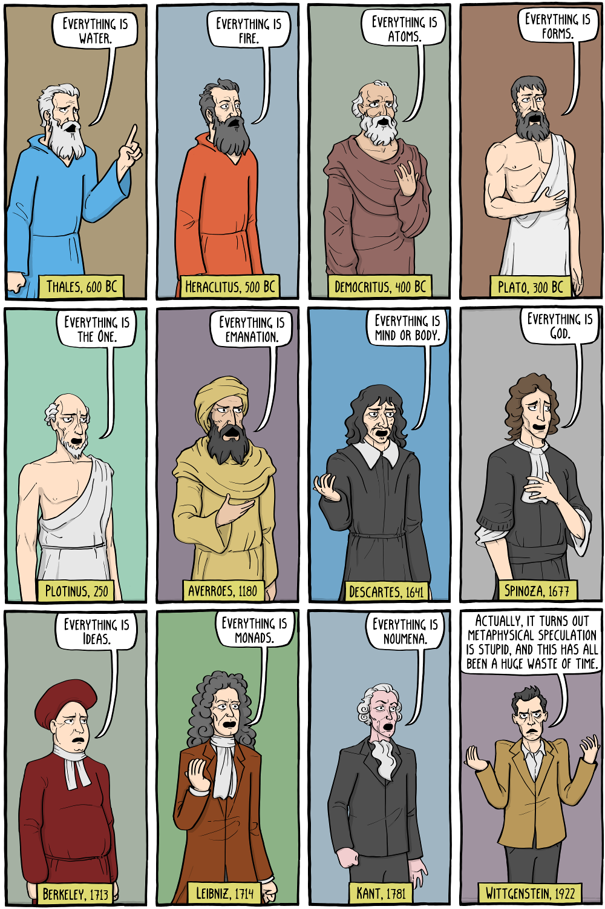](https://existentialcomics.com/comic/250)

In an essay that is constantly using a cartoons of Wittgenstein as frequent comic relief, it would be remiss to fail to respond to this comic by mentioning Hugh Everett, one of the truly great metaphysical philosophers of the 20th century. He first formulated the many-worlds interpretation of a quantum multiverse as a possible alternative to the Copenhagen interpretation.

Understanding the linearity of quantum mechanics is key to gaining insight into these alternatives: if quantum mechanics is perfectly linear, then no experiment will ever distinguish between the multiverse and the Copenhagen interpretation.  Hugh Everett will forever remain a remarkable metaphysical philosopher, a legend for asking a very remarkable question that would unfortunately be totally unanswerable from our perspective in this universe.

On the other hand, if there does in fact exist a non-linear quantum effect, and if we learn how to observe it, then someday we might be able to empirically distinguish between the quantum multiverse and the Copenhagen interpretation.

In the case that the quantum multiverse has an observable reality to it, then theory seems to require a corresponding non-linear quantum effect that we can observe.  If someday we develop the ability to experimentally demonstrate such an effect, Hugh Everett could turn out to be much more than a notable metaphysical philosopher, Hugh Everett would have laid the foundation for a rather remarkable scientific theory with uncanny explanatory value on par with Einstein's Relativity.

Of course, relatively plausible conceptions of a quantum multiverse looks nothing like most depictions of multiverses in science fiction. Jorge Luis Borges' short story "The Garden of Forking Paths" is a popular one that does reasonably well in this regard, but doesn't explicitly use the word "multiverse".  William James first coined the word, though James' used "multiverse" for an unrelated philosophical concept, not as a possible description of the physical universe.  The DC Multiverse, Sliders, Rick and Morty, Fringe, and Philip K Dick's novel "The Man in the High Castle" are all examples of highly implausible pop-culture depictions of a quantum multiverse.

In a many-worlds interpretation, every timeline would be constantly branching and spawning countless sub-timelines, with limited (if any) ability for parallel timelines to interact with each other at macroscopic scales. The nature of the possible interactions would be determined by the precise nature of our hypothetical non-linear quantum effect. If there is an empirical reality to this idea, it seems implausible (and likely unproductive!) to assume that arbitrary interactions are possible. For example, we probably couldn't travel to a parallel timeline, though perhaps we could build a metaphorical telephone to "communicate" with some of them.

If we can interact with parallel timelines, then it seems wise to start by assuming that we can only interact with timelines that are somehow "near" to us, and not those that are "far". Our current best guess suggests we would be able to empirically interact only with those timelines that are decohering away from the experiment. In this scenario, managing to open a communications channel to a parallel timeline wouldn't seem to be overly useful for exploring alternative histories the way many science fiction writers would like to do.  Whomever you are communicating with should have perceived the exact same timeline, up until the moment the experiment started.  

However, even this is probably too much, our "interaction" with the multiverse might only be able to be detected as a strange statstical anomaly largely confined to the nanoscopic world of quantum phenomenon. Still... detecting that would be a truly remarkable accomplishment.

[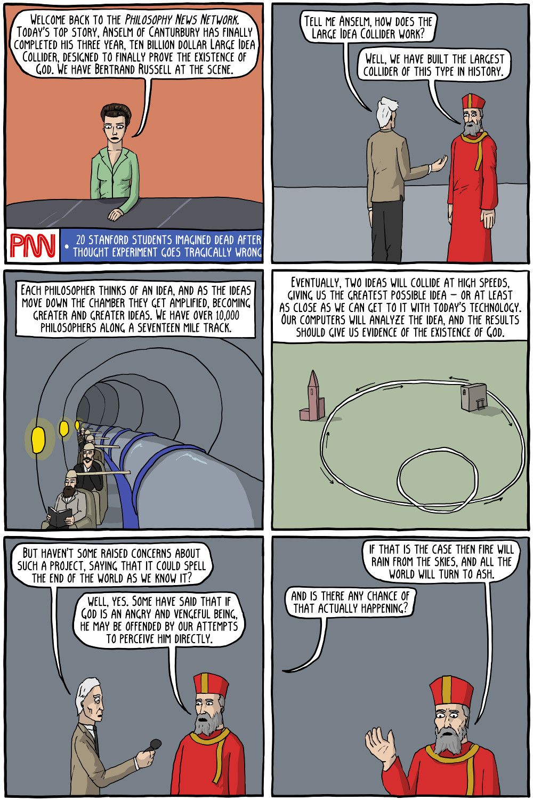](https://existentialcomics.com/comic/83)
[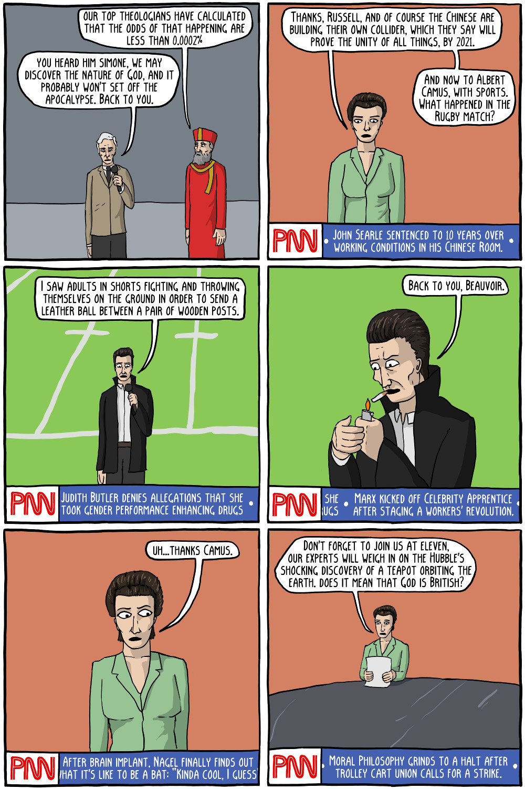](https://existentialcomics.com/comic/83)

Alternatively, if the observed non-linear quantum phenomenon supports a theory closer to the Copenhagen interpretation, then warp drives and time travel might be legitimate possibilities. So yes, it certainly seems possible that we could actually be living in a Star Trek universe. Keep in mind that possible does not imply practical, let alone sufficiently practical to enable economies based on the interstellar trade of material goods. Honestly that fantasy commonly found in science fiction does seem rather implausible to me.

Among the theoretical possibilities in this category is a idea known as Objective Collapse Theory. But I am an armchair cosmologist, and not a real physicist, though I just missed earning a physics minor at Case Western. I'm simply summarizing what I've gleaned largely from Matt O'Dowd and PBS Space Time. I suggest paying attention to him, as he takes a far more consistent interest in these issues. Not to mention that on these mattters, he is already far more knowledgable than I.

So, could any or all of these theories contain elements of whatever it is that is ontologically real?  Each individual theory seems implausible, but stranger things have happened.

> When I was young my father said to me: "Knowledge is Power... Francis Bacon"
>
> I understood it as "Knowledge is power, France is Bacon".
>
> For more than a decade I wondered over the meaning of the second part and what was the surreal linkage between the two? If I said the quote to someone, "Knowledge is power, France is Bacon" they nodded knowingly. Or someone might say, "Knowledge is power" and I'd finish the quote "France is Bacon" and they wouldn't look at me like I'd said something very odd but thoughtfully agree. I did ask a teacher what did "Knowledge is power, France is bacon" mean and got a full 10 minute explanation of the Knowledge is power bit but nothing on "France is bacon". When I prompted further explanation by saying "France is Bacon?" in a questioning tone I just got a "yes". At 12 I didn't have the confidence to press it further. I just accepted it as something I'd never understand.
>
> It wasn't until years later I saw it written down that the penny dropped.
>
> [Lard_Baron](https://franceisbacon.com)

[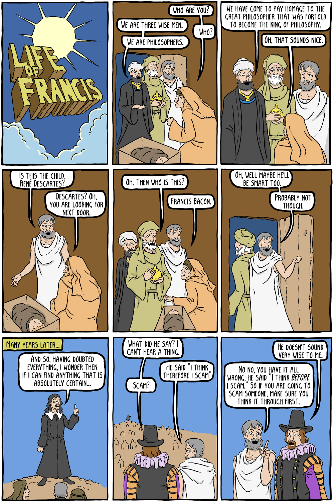](https://existentialcomics.com/comic/183)
[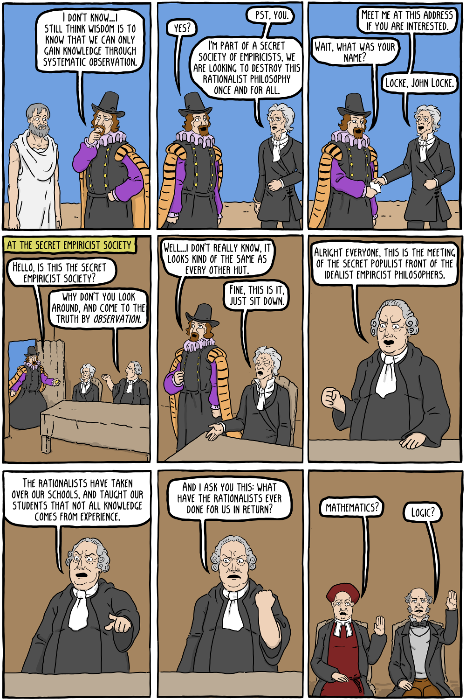](https://existentialcomics.com/comic/183)
[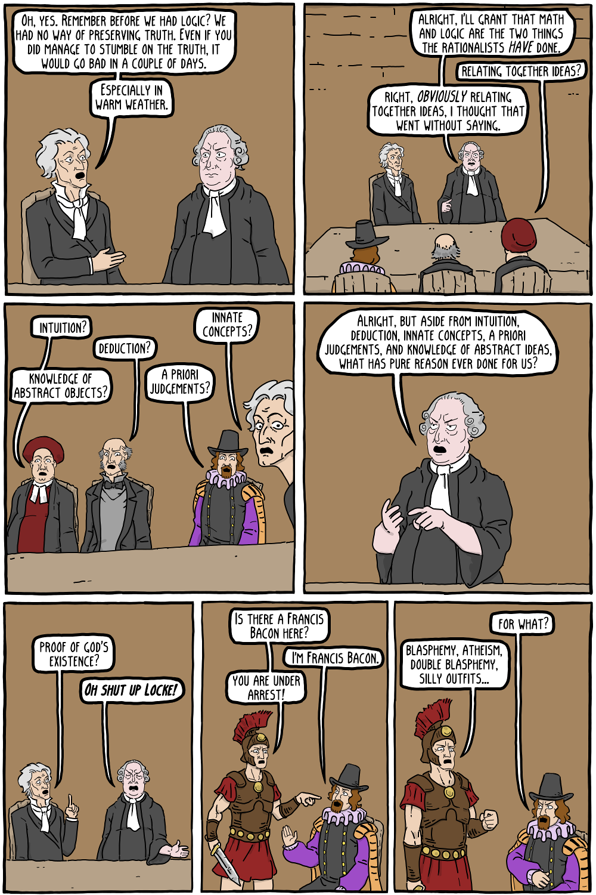](https://existentialcomics.com/comic/183)
[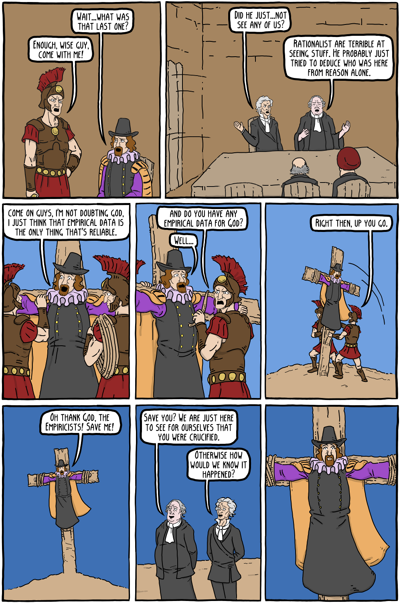](https://existentialcomics.com/comic/183)

This joke is based on the fact that "France is bacon" is a homophone of "Francis Bacon". When audibly verbalized in English, it's easy to confuse one phrase for the other, especially if spoken quickly. Of course, the usual interpretations of "Francis Bacon" and "France is bacon" are sufficiently far apart in English that most people with any awareness that Francis Bacon was a man will automatically choose the correct interpretation based on context, and will often do so unconsciously.

The auditory pun is analogous to the type of low-level miscommunications studied by Claude Shannon and Warren Weaver in "The Mathematical Theory of Communication". Shannon's theory doesn't deal with the semantic issues of whether or not the message sent is syntactically correct, and whether or not the message recieved has the intended effect or not. These higher-level issues as applied to natural language are Wittgenstein's "Philosophical Investigations", and in terms of computer protocols, are critically relevant to any holistic philosophy of communications system design.  But Shannon wasn't aiming to solve these issues, but rather to build a foundation on which these issues can be solved.

Shannon's Theory of Communcation seeks to understand the issues and design space surrounding the transmission and reception of abstract symbols.  These symbols could be a string of bits, or an analog audio signal, or a sequence of words such as an English sentence. After the symbol is modulated, the transmission process adds noise to the signal, and then the demodulation process reconstructs some approximation of the original signal for the receiver of the message.  Shannon's work is a classic look at the fundamental limitations this overall modulation-transmission-demodulation process, and is relevant to the study and engineering of modems, radios, TV and more.

One primary use case for Shannon's theory is to investigate the probability of a message being received correctly as the intended symbol.  The "France is bacon" homophone can naturally be modelled as a failure of the type that modern communication engineers should seek to avoid at nearly any cost.  We shold want to engineer these kinds of homophones out of our communication system entirely.  Of course, these can always creep back in despite our best efforts:  for example, if you are video conferencing with a friend on the other side of the world, and they say "Francis Bacon", the computer isn't going to stop you from interpreting that as "France is bacon", in fact the compter is very likely going to be oblivious to that nuance of communication.

A communications channel is sort of like a noisy room. If you are having difficulty being understood, you can talk louder, increasing the power and amplitude of the signal, and possibly raising the noise level experienced other conversations in the room. Or you can move to a quiter room, decreasing the power and amplitude of the noise.  Both these steps improve the signal-to-noise ratio of the communications channel, and improve the likelihood of communicating successfully.

A third option is to use an error correcting code (ECC), which encode redundancy into the message. This increases the probability of the successful communication of an abstract symbol or idea, or at least increases the possibility of detecting when miscommunication is likely to have occurred.  This increases the effective signal-to-noise ratio of the overall communications system without increasing the amplitude of the signal, or reducing the noise of the channel. And in doing so, it also constructs a foundation on which Wittgenstein's higher-level issues as they apply to computer communications protocols can be addressed.

I find it very interesting that natural languages, have evolved highly imperfect error-correcting codes through grammatical redundancy. It is far from perfect, and from the perspective of ECC codes used in the physical layers of communications, storage, and QR codes, these natural-language error correcting schemes are positively unworkable. Yet these natural-language solutions are surprisingly effective, most of the time, and I suspect this was unappreciated and overlooked by James Cooke Brown when he invented Loglan, which attempted to engineer a natural language. Conversely, attempting to model the very high-level semantic error correcting schemes that occurs in natural-language communications is far more difficult and tricky to formally model than the computer-to-computer error correcting codes.

When communicating a string of bits between two computers, a modern communication system that employs error-correcting codes can all but eliminate the "France is Bacon" type of low-level miscommuncation due to random noise. Random noise can most certainly prevent communication from occurring. However, if the communication protocol uses a good strong error correcting scheme, random channel noise cannot plausibly cause a low-level miscommunication.

You can protect the channel from malicious noise by adding a message authentication code or cryptographic signature at the cost of about 16-32 bytes per message. Then, with many supporting assumptions and further analysis, we might be able to plausibly hope that even an intelligent attacker adding noise to the communications channel will be unable to cause a miscommunication, even if we decline to obscure the plaintext of our messages.

It's very important to notice that I'm not talking about encryption here, I'm talking about authentication. They are orthogonal concepts. You can have one, the other, both, or none. In fact, operating with authentication but specifically without encryption is one of the key enabling ideas behind blockchains. In the next few paragraphs, I will provide a quick conceptual overview of cryptographic signatures.

When you, as a computer user, get started with digital signatures, the first thing the computer (or hardware token) will do for you is pick a private key. From the perspectivev of mathematical correctness of the digital signature algorithm, the private key can be anything. From the perspective of operational security, the private key really needs to be chosen securely using cryptographically secure (pseudo-)random methods. That's why the computer does it for you.

The public key is then derived from the private key. The public key can then be shared with whomever you like, even if you wouldn't trust that person with your private key.  You should not ever share private keys with anyone or anything without first thinking very carefully about an answer to one of the two questions: "Why not two seperate private keys?", or "By publishing this private key, do I want to wreck the ability of the corresponding public key to authenticate the provenance of any of its signatures, even those signatures that have already been created?"

Or, you can keep your public key to yourself, and then only you can verify any signatures you produce with your private key. You need the public key to verify a signature, but you need the private key to create a signature.  Do not forget that a message with a valid signature does not inherently mean the message is "more authentic"! Rather, a valid signature connects the provenance of the message to the public key, nothing more, and nothing less.  Anybody who wants to understand the provenance of a properly signed message must investigate and understand the provenance of the corresponding public key.

In th realm of blockchain,  when you "send" cryptocurrency to another person, you are metaphorically signing a check and then publishing it to the entire world.  The recipient line of the check is another public key, which is then recognized by others as being authorized to sign another check for the same amount to other public keys.

Sometimes the sharing of a public key is totally under the control of software. For example, if you are using a FIDO U2F token, then the public key is automatically shared with the authentication server you are enrolling the token in. This does seem a perfectly natural fit to the intended purpose, but sometimes users do need to be able to manage these details themselves, and sometimes software makes that very difficult to accomplish.

However, solving these two particular low-level problems, while both amazing foundational bits of technology in and of themselves, is not a holistic foundation for a communications system.  For that we also need to delve into the semantics and effectiveness of the application-layer communication protocols.

These high-level breakdowns in the overall communications protocol can most certainly have safety engineering implications.  A relevant case study is the Clayton Tunnel rail crash of 1861, where an unusual and anomalous situation involving concurrency and the state of the tunnel lead to an inability for the watchmen and signal operators to communicate effectively via an early needle telegraph. This in turn lead to the unsafe operation of the tunnel, which was a contributing factor in a fatal train crash.

Alhough modern error correcting codes are capable of all but eliminating homophones in the physical communication layer, both design and implementation bugs can reintroduce homophones into the overall system. This can happen at any and all levels of the overall system, from the physical layer, to the application layer, to the users themselves.

For example, if you are video chatting with your friend and they say "Francis Bacon", the computer can't stop you from interpreting that in your mind as "France is bacon". In fact, the computer probably won't ever know, let alone care. On the other hand, there exist homophones that computers hear and that humans don't, and these very often lead _injection vulnerabilities_, which are sometimes also known as a _shellcode vulnerabilities_.

For example, consider a network server written in C. Undefined behaviors latent in the C code often lead to buffer overflows. Buffer overflows often create highly non-obvious homophones. Those homophones often enable an attacker to inject their own machine code into the server's process memory. This machine code can corrupt the server, and convince the server to take an action it has the privileges to perform, but the attacker does not. This escalation of privilege is the classic scenario of the confused deputy problem.

I assure you that today, the exact day that you personally are reading this sentence, the world will discover many untold thousands of latent buffer overflows, and perhaps we will create twice as many more.  C might well be the Stern-Brocot tree of buffer overflows!  Some will invite an engineering response and receive a fix. A select few make international news, if the vulnerabilities uncovered are severe enough, and the vulnerable code is popular enough.

Many, however, are very likely to simply be ignored, especially because that is actually not an entirely irrational course of action in certain types of larger, highly dysfunctional IT situations that themselves are depressingly altogether too common.

Notice that even though this is a injection of machine code, neither the machine code itself nor the design of the assembly language can possibly be directly responsible for introducting the homophone. Rather these homophones are caused by undefined behavior in C. At this point, I know that many will then sneer, "well then, don't do undefined behaviors in C", well, I do very much try hard not to, believe me! At the very least, undefined behavior is itself one of the primary causal factors, if not the singular primary causal factor, of this particular kind of homophone.

On the other hand, the design of the assembly language does exert causal effects on the resulting vulnerability. Thus it is a causal factor of the injection vulnerability, even if it cannot possibly be the sole primary causal factor of the homophone that enables the injection.  Not only is this true of the design of the assembly language, it is also true the implementation of the CPU that interprets the resulting machine code, the design of the C programming language,

Any one or all of these factors can dramaticatically change the severity of the vulnerability for the better or worse, and this intricacy is why the result of undefined behavior is practically impossible for most humans to predict.  All of these factors are relevant to the nature of the vulnerability, even if only a few of them are relevant to the existence of a vulnerability.

Thus, nearly anything can be implicated in an injection vulnerability, even if there must exist another causal factor. A recent high profile Minecraft security vulnerability was caused by an injection in Log4J's formatting function. Log formatting injections are uncommon, but far from unknown, and have created security bugs in more than one Intrusion Detection System.

XKCD's "Little Bobby Tables" references SQL injection, though I disagree with the recommended solution. "Sanatizing inputs" suggests to me that you should examine the data to determine if it would be a homophone before you send it to the database, which is silly. Properly quoting data values to ensure they are correctly interpreted in their entirety and don't spill over into something else is a far better solution. It's far more robust to always properly quote values to avoid homophones, whether the quoting is achieved by substituting special characters with escape sequences as necessary, or by passing the data as a length-delimited string of bytes, or via other means.  Any reasonable database access library supports this exact use case, and should make it the natural and easy and obvious thing to do.

Then there are JavaScript injections, CSS injections, HTML injections, HTTP injections, and much much more.  Historically, phone phreaking relied a great deal on control tone injections. All of these vulnerabilities have a highly relevant homophone somewhere in the causal factors. And yet we've barely scratched security vulnerabilities, not all of which are injections. Yet there are plenty of ways that a communications system can break down, even outside the realm of security vulnerabilities.

There are many engineers working on or with application-layer communications protocols, who aren't even aware that these concerns are very much entailed by their job responsibilities, tasks, and goals. Most of these engineers need to know little, if anything about Shannon's theory. They might need to understand how to use the modem correctly, they don't need to know exactly how it works. However, all abstractions are leaky, and it's pretty much always true that understanding certain things about the implementation often allows you to make use of it far more effectively than you could otherwise, even while staying within the confines of the abstraction.

For example, a really good application engineer might need to know about how their usage of network communications impacts the modem's power consumption, so they can implement their application in such a way that extends battery life. A really good systems-level communications engineer definitely needs to understand if the modem uses any error-correcting codes, and if so, how effective they are in catching data corruption and how those conditions are signalled. And let's be honest, a bit of additional sanity-checking built into the application layer adds a great deal of resilience to the overall system, even if your modem has excellent error detection and correction.

A really good communications engineer should probably understand a high-level overview of the _queueing discipline_ that a modem uses to send and receive data.  Ethernet has a more complicated queuing discipline than say, RS-232 serial communications. WSPR is an example of an amateur radio protocol that imposes a highly unusual queueing discipline. It provides an ultra-low power, ultra-long range, many-to-one/one-to-many unidirectional beacons.

There's a WSPR timeslot every two minutes, synced to UTC. During each timeslot you can either transmit or listen. If you spend the slot listening, you are likely to hear a lot of other people who are transmitting. If you spend it transmitting, you are likely to be heard by a lot of other people who are listening. You shouldn't be transmit more than a few beacons per hour.  Although sending a beacon requires constantly transmitting a very low-power signal for nearly the full two minutes, the beacon itself contains only 50 bits for data, with no room in the message for arbitrary data. It is primarily intended to test and monitor the constantly changing propagation characteristics of the Earth's atmosphere.

WSPR includes a large proportion of redundant error-correcting bits to make this work. Assuming that there are no bugs in your receiver, you can be extremely confident that nothing your WSPR modem reports has been corrupted by random noise.  When a WSPR beacon is heard by a computer, the computer then sends a report to a server on the internet. The report includes the content of the WSPR beacon, along with when and where the beacon was heard, and how strong the received signal was.

The designer of WSPR, Joe Taylor, is rather famous for WSJT.  This fascinating suite of radio protocols are all specifically optimized for esoteric propogation modes.  For example, FT65 is well suited to Moonbounce EME communication, where two radio operators exchange greetings with each other by bouncing a radio signal off the surface of the moon.

The WSJT protocols are all superbly designed by modern standards of holistic communications systems design.  Two radio operators using these protocols can greet each other on the air in such a way that both operators can be left confident that a greeting has been exchanged without being corrupted by noise or partial failure. The exact nature of the consensus provided by FT65 is very weak, but it happens to fit the use case perfectly: it should be highly likely that both operators agree that an exchange has (or has not) taken place.   It should be unlikely that one operator believes that an exchange has taken place, and the other does not.

Solving the Two Generals Problem builds a stronger form of consensus: here, two cooperating parties need to come to an agreement whether or not a specific message in the conversation has been successfully communicated. The difference is subtle but profound, and represents a substantial step up in engineering difficulty.

Dealing with the Two Generals Problem is one of most common practical challenges of constructing a high-quality system involving concurrency and state. The Two Generals Problem also arises in fault-tolerant systems that attempt to be resilient in the face of partial failures, where one or more components of the system fails, but other parts keep going. This problem is way more subtle than many professional engineers realize.

In fact, it's technically impossible to solve the Two Generals Problem in any deterministic, guaranteed way. Only probabilistic solutions are possible. This much is well known, even if it also deserves to be more widely known. The part that is exquisitely subtle, more subtle than commonly appreciated, is the actual process of constructing an application that can reliably rebuild consensus once communications resume.

With annoying regularity, practical systems get stuck in states in which human intervention is required in order to restore consensus. Oftentimes recovering from these scenarios is just a reboot or two away, but the frequent failure of engineers to appreciate the subtleties of the Two Generals Problem is a causal factor in many of these scenarios. Sometimes these problems persist across reboots, requiring deeper human intervention.  Sometimes these problems result in data loss, and untold (possibly company-ending) difficulties.

Design mistakes can make the Two Generals Problem difficult or impossible to address. Design bugs can be prohibitively expensive to fix. In certain respects, there certainly are fates worse than implementation bugs making it to production.

To make things more complicated, maybe you'd prefer to arrive at consensus quickly, or you'd prefer to minimize any loss of data, and/or any number of additional other practical concerns. Barring miraculous insight, each additional concern can have a non-linear effect on the difficulty of the problem and thus the cost of a solution. Discerning these non-linear effects on cost beforehand is an unsolved problem, and one that seems to me to be rather intractable.

Dealing with the Two Generals Problem in reasonably robust ways is often quite manageable and relatively affordable, at least if you have a few good engineers who have a basic awareness of the issue. At the cheaper end of things is trying to do better by improving engineering awareness. Ignorance of the issues is a bottleneck in many organizations.  When this is the case, simply raising awareness is likely to eliminate a huge number of faults over time, even if the final result is still likely to have a number of minor flaws lurking.

Things escalate quickly once you try to step beyond the Two Generals Problem and get into more sophisticated distributed systems. For examples, see the [Jepsen Project](https://jepsen.io/), or most any blockchain. Blockchains attempt to solve the Byzatine Generals Problem, where three or more participants in a conversation attempt to come to a consensus, and some of the participants might be actively trying to subvert the consensus. Of course, solving the Byzantine Generals Problem can be very complicated and expensive and often not at all necessary, either, so it takes wisdom and time to understand how the Byzantine Generals Problem may or may not be relevant to any specific concern.

APRS is another amateur radio protocol pioneered by Bob Bruninga, WB4APR. I find the concept of APRS as a sort of distributed, local bulletin board to be a compelling one, not least of all in disaster relief scenarios. Yet, in my opinion, by modern standards of holistic communications system design, APRS leaves a great deal of potential left on the table.

A next-gen APRS should automate consensus-building suitable for task.  The Two Generals Problem is highly relevant, however I doubt we need to worry about Byzantine Generals. A conflict-free replicated data type (CRDT) seems like a technique likely to lead to a good result, provided one takes the design process behind this specialized technique seriously, and arrive at a carefully considered design of the application-layer protocol.  Designing, implementing, and verifying a CRDT can be a rather resource-intensive process.

I do believe that a solution should incorporate cryptographic authentication.  Done correctly, this adds a great deal of robustness to the application layer protocol and limits the abuse the service. However, as this protocol should be dedicated to amateur radio and _perhaps_ aspire to be used on the Multi-Use Radio Service (MURS) and Family Radio Service, encryption should be left out entirely.

Because of the dedication to amateur radio, the transport protocol should include call signs on every packet, even when the application layer protocol is sending and receiving arbitrary data.  Given the need for call signs, and the differences in queuing discipline that this communications topology implies, I strongly suspect there is significant opporunity for meaningful innovation in the process of deconstructing existing transport-layer protocols and reconstructing them to fit this specific context.

Although "The Mathematical Theory of Communication" punts on these higher-level concerns, Shannon's work provides a fundamental theoretical framework for the understanding the physical layer. This includes modems, analog modulation schemes, error correcting codes, Bayesian decoding, and much more. These in turn provide an indispensible foundation on which these higher-level concerns can be efficiently and robustly addressed.

As the physical layer of APRS is a 1200 baud modem signal that is transmitted via FM radio, there is huge room for improvement.  The FCC limits the data rates available on-air on the radio wavelength bands most likely to be used, so let's get to FCC-max data rates. With any margin, perhaps we could devote to error-correcting codes, lowering power consumption, and improving battery life.

I believe that APRS should inspire a next-generation amateur radio protocol and software stack aimed at a more ambitious vision of a distributed, local bulletin board. With significant effort, we could build a next-generation APRS that builds upon Bob Bruninga's vision, one that's more reliable, easier to use, and all-arond more compelling.

[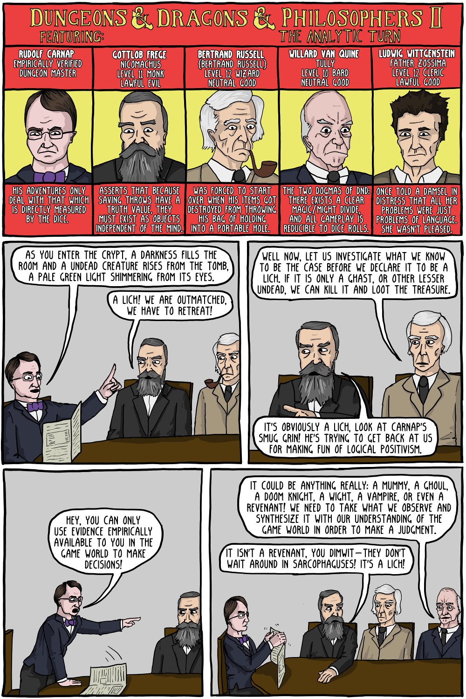](https://existentialcomics.com/comic/28)
[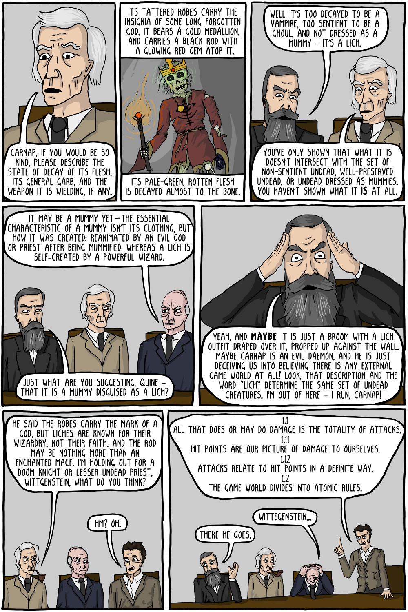](https://existentialcomics.com/comic/28)
[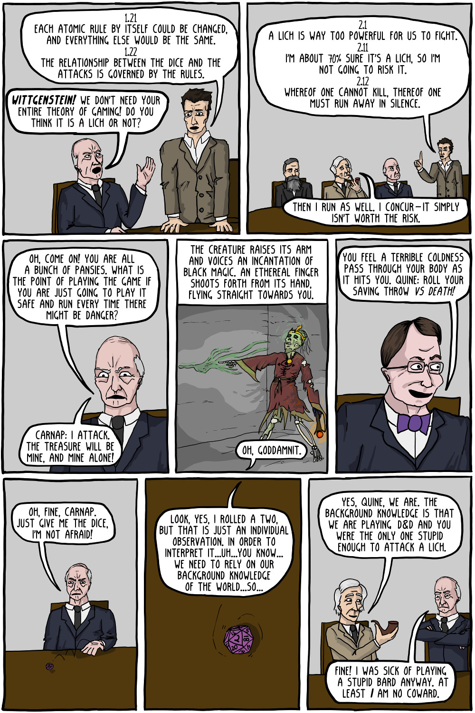](https://existentialcomics.com/comic/28)

## A statement on the 2022 California Math Curriculum reform controversy

In celebration of Rational Approximation Day, 02022-07-22, I would like to offer "Tools of Math Construction: an Aggregate Theory of Concrete Mathematics" to the State of California as a means for building up the foundation of the elementary math curriculum.

It is an apology for the Indiana Pi Bill, and an Apology for Science, Faith, Reason, and Humanity. It includes the script "Kevin Bacon and the Stern-Brocot Tree: a Sermon on Rational Approximation". It introduces a new game to play: the Six Degrees of the Tree, the Triangle, and the Square. The Stern-Brocot Tree is like a Museum of Fractions. Pascal's Triangle is like a Maze of Counting. The Symmetry Group of the Square is like an entire Book of Algebra!

These core concepts are carefully curated to be very simple, yet also very powerful. If you can count to four and add two plus two, then I have tried to find simple explanations of these core concepts that I hope you find relatively easy to understand.  At the same time, all of the core concepts have suprising, highly non-obvious implications and generalizations that you could spend an entire mathematical career studying, if you so choose. My hope is that these core concepts can ease your path to a personal understanding of advanced mathematics.

For example, did you know you can use the Stern-Brocot tree to round 3.14 to 22/7? Well, now you have referential knowledge of it! Let's recognize March 14 as Pi Day, and July 22 as Rational Approximation Day. Taking the first steps towards making that knowledge more directly your own is just a few suprisingly short and easy lessons away. Taking a free tour of the Stern-Brocot Museum of Fractions offers a new and exciting way to reduce fractions that even many college math professors don't yet know about! You can learn to contradict Euclid, all while learning to use the Euclidean Algorithm to navigate the Museum of Fractions!

The Tools of Math Construction are specifically designed to provoke vigorous growth in knowledge, intellect, wisdom, kindness, and courage. It aspires to efficiently and enjoyably prepare students for as wide a swath of advanced math classes as I could muster, including plausible educational paths to Bayesian networks, non-Euclidean geometry, and elliptic curve cryptography.

In _an Aggregate Theory of Concrete Mathematics_, computer programming is like Portland cement. The _Six Degrees of the Tree, the Triangle, and the Square_ provide the aggregates much like sand, gravel, and crushed stone. Heuristics is like water in this metaphor. Time spent practicing how to solve problems, often by writing short computer programs, is like mixing this recipe together and pouring a hydrated mixture of concrete math into your brain.

Let the result set up and harden for a while, and come back and polish your new understandings smooth with review and connect them together with synthesis. Learn to pour your own concrete mathematics, and you'll soon be left with a solid foundation to support deep explorations into science, technology, advanced mathematics, and much more.

The Symmetry Group of the Square leads very naturally to cartesian coordinates, computer graphics, and linear algebra. Pascal's Triangle leads very naturally to counting, probability, and statistics. The Stern-Brocot Tree is like a Rosetta Stone, translating between computer science, arithmetic, algebra, geometry, calculus and beyond, taking us into the unknown.

An Aggregate Theory of Concrete Mathematics is an introduction to constructive symmetry, computer programming, rational approximation, communications, signals, semantics, consensus, blockchain, radios, robots, relays, and induction.

I can already hear you asking "but what shall we cut?!!" I would cut fractions, of course! Or rather, fractions are still very much right there, in the Museum of Fractions. Our current approach to teaching fractions is very much analogous to Roman numerals.

From a modern perspective, the way we currently teach how to add and reduce fractions wastes many years of supremely valuable elementary math lessons. I enthusiastically endorse Dennis DeTurck's most excellent thesis, "Down With Fractions!", with my main rebuttal being the Stern-Brocot Museum of Fractions.

Fractions have been reconstructed into a new and much more potent form. We shouldn't practice fractions by hand every day.  Instead, we practice fractions by hand, and then we practice teaching the computer how to do fractions for us, rinse and repeat.  But we only do this once in a while, perhaps once a week, or whatever.

If you look more closely, nothing relevant has been removed. I'm just clearing up some time to play with computer programming to do... whatever the student wants, really. I'm not too picky. Unstructured and semistructured play times are very important, especially in computer programming!

Let's ensure that every child gets the best practical start in life that we can plausibly manage. We can do a lot better! I am personally inviting you to be better. I am inviting all of us to be better, together.

The State of California really can have its cake and eat it too on the topic of the currently ongoing controversy. I endorse the Brown University Bootstrap Project, and I endorse ["Calculus isn’t the only option. Let’s broaden and update the current math curriculum" by Jesús A. De Loera and Francis Su](https://www.sacbee.com/opinion/op-ed/article260529232.html).

This letter is also an acknowledgement of the social issues raised not only by the reform attempt, but also by Michael Render in the song "Walking in the Snow".  Math tests and scores are frequently used to deny people education and jobs in ways that often are of no relevance.

A cousin of mine wanted to be an elementary school art teacher. She had great results during her student teaching. In one of the tragedies of life, she was denied certification due to an inability to pass a math test. Once, she came within one question of passing. I can't help but wonder how many students she would have touched, but now will not, because of this unnecessary and irrelevant means of exclusion.

At the same time, there will always be students that outpace the rest. Everybody should be allowed and encouraged to take on a more challenging math if they are interested, and everybody should be allowed to take easier math classes if they are not! Therefore, I am far from certain exactly how to approach the issue, but we really must find a more inclusive approach.

I myself was first introduced to Algebra I as a freshman at Triton High School. Thanks to the Indiana Academy for Science, Mathematics, and the Humanities, I graduated high school having successfully completed AP Calculus BC, Multivariable Calculus, Differential Equations, Discrete Mathematics, Linear Algebra, and Probability.

This was a life-changing experience for me. I had a lot of fun travelling to Ames City, Iowa with other top math students from across the state of Indiana, many of whom were smarter, and most of whom were far better prepared than I. We represented Indiana in the 1997 and 1998 American Regional Mathematics League contests. I was introduced to the writings of Karl Popper on the philosophy of science, an unexpectedly remarkable surprise. And I met a worthy and longstanding rival, my very dear friend Yuri Goldfeld.

Yuri brought the current controversy to my attention last year, and helped provoke this reponse. In response to Yuri, and in the name of Reason, Rationality, and a Reënlightenment, I offer everybody my love letters from this pandemic.

In the Aggregate Theory, fractions have been reconstructed into a new and more potent form. This form can plausibly be introduced at an even earlier age with the same or better chance of success. Learning how to reduce and add fractions becomes fundamentally easier and more interesting, when you have the Stern-Brocot Museum of Fractions and it's guidebook, the Euclidean Algorithm, to work from.  Furthermore, we can use the Stern-Brocot and Calkin-Wilf trees, and the Euclidean Algorithm, to playfully motivate introductions to integer multiplication, integer division, run-length encoding, and so very much more.

We shouldn't be spending more than a few days a month practicing how to add and reduce fractions by hand. I very much do encourage hand computation, you can certainly learn a lot that way. I know I did, and I still do. But there absolutely no reason to spend every day on that. That's boring and unproductive.

It's much more exciting to learn how to teach a computer to add and reduce fractions for you. Creating those computer programs are not much harder than playing chopsticks on the piano; it'll be hard at first, and you can always get better at it, but neither failure nor the fear of failure should stop you from trying and trying again, _especially_ with the tree, the square, and the triangle.

With the free time we've opened up, we have time to play with other ideas. We can pick up a topic, play with it for a day or two, and then go do something else.  Because we keep coming back to similar ideas over and over again, we build in spaced repetition into the curriculum. Even the ancient Greeks and Romans appreciated spaced repetition as a heuristic for improving the formation, retention, and recall of long-term memories.

And, as a bonus, you'll probably remember how to do fractions way easier and better than you ever did before! Your memory of doing it by hand, and your memory of teaching it to a computer, those two memories together reinforce each other in surprising ways. Learning to play these understandings off of each other is a catalyst for learning, allowing you to learn more with less effort, effectively making you more intelligent.

In the longer run, informal understandings, formal understandings, and philosophies of wise application are the all-important legs of the three-legged stool of science, technology, and mathematics: missing any one of these legs can create significant impediments and difficulties in teaching, learning, and using STEM ideas in ways that are reliable, constructive, and beneficial to humanity.

Learning how to teach a mindless, exquisitely precise robot how to calculate something for you, is an extraordinary, new, and profound opportunity for active learning. You get to be the teacher now. Your student is totally oblivious to everything you don't tell them about. Your student is unable to take initiative themselves. Though mindless, your student also has superhero powers. Your student can answer many of the questions you ask instantaneously, and your student almost never makes a mistake.

Well, mistakes are made, all the time. It's just that the mistake is very probably with your teaching, not your student's calculations. This is a great playground for exercising the inductive attitude by exploring cause-and-effect relationships and counterfactual reasoning.

In this epistemic frame, there's far less room for you to hide behind your own knowledge illusion. In this epistemic frame, it far more difficult to fool yourself into believing you understand something, when in fact you are either quite wrong, or your knowledge is only a few inches deep.

Besides, let's talk a moment about about the computer's superpowers really are for a second. Even if you are Arthur Benjamin and whiz at mental arithmetic, in the single blink of an eye, the biggest supercomputers can perform more mindless arithmetic than you yourself could possibly hope to accomplish over the course of billions of billions of lifetimes.

Comparing a marathon runner to the speed of light is a far more reasonable! If you ran a 42 kilometer marathon per day, every day, it would only take you 20 years to run a single light second, that is, the distance travelled by light in one second. That almost seems doable!

Although the smaller computers that you will start out with are nowhere nearly as capable as a supercomputer, it's still true that in the blink of an eye, they can perform more mindless arithmetic than you could possibly hope to accomplish over many lifetimes of mindless pencil-and-paper calculations. The marathon runner versus the speed of light is still a more reasonable matchup.

And yet, somehow, there is something peculiar and important about human intelligence and human self-awareness that we have not come anywhere close to replicating on a machine. Although today's machines are fairly mindless, and can certainly be engineered to be totally oblivious, a human marathon thinker is inherently self-aware, and can often compete with a supercomputer in terms of overall reasoning.

A human thinker will invent and adopt many practices that save time and energy. Instead of metaphorically running a light second around the world a couple of times, the human thinker can quite often find a shorter, more efficient path to the answer.  Sometimes the human thinker can teach the computer about this shorter path. The wise human thinker also realizes that they have much to learn from the computer.  There are many useful forms of reasoning that humans perform effortlessly, that we have yet to figure out how to teach to the computer.

Personally, I am not overly interested in the questions of whether any particular fantasy of artificial intelligence is plausible or not. Though I will say I do find the concept of the Singularity to be highly implausible. Also, I think that belief in the Singularity has rather negative consequences for our epistemic responsibilities, so there is that.

Instead, I am supremely interested in figuring out how to best use the strengths of both machine intelligence and human intelligence together in harmony to accomplish whatever we ultimately decide is worth doing together, as a community of wise individual human beings.  Humans and machines both have our own peculiar superpowers that the other cannot match. Let's learn how to work together in the most effective ways possible, to gain the best possible benefit of both, and for the greatest possible benefit of all humanity.

Significant reforms to the elementary mathematical curriculum do pose numerous practical difficulties, and we should expect significant teething problems. Not least of these is an initial reactive resistance to new ideas that aren't commonly known or understood in the general population. These reactions frequently cause parents to transmit negative attitudes and teach outright misconceptions about new math to their children, which can make the teacher's job way more difficult. In many cases, this can shut down the conversation, making the teacher's job practically impossible. Moreover, finding teachers who can teach the new material itself poses a natural chicken-and-egg problem.

This chicken-and-egg problem has been severely complicated in the US by the fact that mathematics has historically been taught by generalist elementary teachers. As a practical matter, enacting deep reform for the entire state of California would almost certainly require hiring tens of thousands of teachers specializing in early childhood math education, and trained to the new curriculum.

Ideally, every elementary student would be in math class taught by a specialist two or three days a week. Perhaps some of this time could be given back to the homeroom teacher for other purposes, but the homeroom teacher must be regularly included in the classes taught by the specialist. For starters, this presents an opportunity for the homeroom teacher to get comfortable with the new curriculum. This way, the homeroom teacher can learn how to better supervise the time allocated to mathematical practice and play on the other days of the week.

This also presents an opportunity for homeroom teachers to demonstrate to their students how to maintain a good attitude and show respect for the material that is being taught, even if that material is causing you great discomfort for whatever reason. New mathematical ideas can be extremely difficult to learn for the first time, that's ok and to be expected. Sometimes you just have to keep pressing on, until it suddenly starts to get easier. By reducing the inductance of the concepts, I hope to reduce that initial resistance for everybody.

And of course, specialist math teachers should have a semi-private forum for discussing any issues that the specialist themselves can't quite answer. Sometimes the specialist will need help to constructively address a particularly unusual and possibly insightful question and/or answer from a student. For example, this would be useful in cases when a student stumbles upon a "proof" that cannot possibly be entirely correct, and yet it isn't obvious what the problem really is.

My mother Eloise was an teacher at Triton Elementary School, where I was a student. Even though she has never learned how to teach a computer to do things, she was a highly effective facilitator in helping me to learn how to teach the computer to do things. To me, she was at all times an excellent rolemodel for the scout mentality and the inductive attitude.

As a student at Triton Elementary School, I was aware my teachers knew things about math than I did not know, and I eagerly learned any tiny nugget of information at any opportunity. But I was also aware that what I did understand about math, I understood more deeply than nearly all of my elementary school teachers.

This could cause friction in a multitude of ways. Especially in the earliest days, I would often be the last done with math worksheets, and not by a little bit. It would often take me multiple times longer than any other classmate who zipped through the homework. But I made very few mistakes.  And I could take some small nugget of whatever I had just learned in class, and use it to answer questions well beyond the scope of what was being taught.

I remember a conflict with a teacher over the question "Given the sum and difference of two numbers, what are those numbers?"  I had never considered questions of this type before that day in class. The teacher insisted that "Guess and Check" was the only way this problem could be solved.  But within about fifteen seconds I knew exactly how to solve this problem, no guesswork required.

Teachers can be bullies. While that has long been obvious to me, it took me a long time to build up the courage to stand up to them, and to figure out how to stand up to them without becoming a bully myself. As an occasional teacher, I learned how supremely difficult it can be to teach an idea that people aren't at all familiar with, even referentially.

When my mother Eloise was taking algebra as a student at Triton High School, her teacher refused to answer her questions, or explain anything. He said that only the smartest boys needed to know anything about algebra, and then they did not need to understand the formulas, they only needed to memorize them, so that they could attend Purdue and become engineers. He refused to help anybody else. I do know that if I had been his supervisor, I would have fired that man on the spot.

Of course, today I would have the backing of Title IX, thanks in large part to Indiana's own Birch Bayh, which prohibits excluding women from the class like this. I can only imagine how much more difficult that might have been, had I actually been my mother's school principal. But I want to emphasize that this teacher was also doing a profound disservice to the students he was nominally including, by teaching a piss-poor attitude towards the subject itself. Math is so much more than learning how to perform arithmetic by hand, and memorizing formulae.

Excluding women has been a profound disservice to the subsequent generation: my mother Eloise subsequently became a teacher at Triton Elementary School, andhistorically elementary education in the United States has been a job dominated by women. Even as a child I was aware that my elementary school teachers weren't really the math teachers I wanted and needed. Only after working on this essay did I put two and two together and realize that my elementary teachers were often prevented from becoming the math teachers I needed.

Not every elementary school teacher needs to be an expert in the new curriculum. My mother Eloise was an excellent facilitator for me learning math, even if she didn't always understand what I was learning. Yet every student should have have regular opportunities to learn from and talk to a specialist who has that expertise.

My father Byron Smith taught computer science at Manchester University. He earned a Masters Degree in Computer Science from Purdue. My great aunt Evelyn Rettinger was a Trustee of Purdue University, where she as a student met my great uncle Herman. Purdue is also where my great aunts Annabel and Esther Rupel managed 4-H and taught home economics.

My uncle Hugh Rettinger was the high school guidance counselor. Together, we supervise the counting of money, and help supervise elections. My cousin Wes Rettinger is a former math teacher, and is currently on the school board of Triton School Corporation. My grandfather Donald Rettinger was a longtime member of the Triton school board.

You could say education runs in the family.

The question "Algebra I. Grade eight or nine?" is a trifling concern, and one with deadly serious social consequences. If the State of California were to seriously fund practical interventions into enriching the mathematical curriculum, we can soon be looking backwards and be wondering why that question seemed relevant to anybody.

My assessment of the situation is that we are primarily lacking the human capital, the payroll, and the will to make it so.

Let us raise up a generation of capable engineers who build the very best robotic golems, and let the primary and ultimate purpose of those robotic golems be to meet the needs of ourselves and other living beings, without being destructive or extravagant. Grant our engineers the wisdom to judge how well these criteria are being met. Grant our engineers the will to help supervise their creations, the will to improve their creations, and the will to dismantle their creations. Grant out engineers the will to intervene, and grant them the wisdom to do so effectively.

Grant those engineers the wisdom of statistical rethinking and causal inference. Let a new generation of wise and prudent engineers build the very best ovens that bake empirical observations about what we see and what we do into tasty doughnuts. These treats should provide plausible, relevant, and actionable estimates of the mysterious world we find ourselves in.  Let these estimates be shared widely, for the benefit of all humankind. We want doughnuts, not excrement!

In celebration of Rational Approximation Day 2022, Friday, July 22, 02022-07-22, I personally invite you, no matter who you are, to start learning how to find your way around inside this Museum of Fractions, and to start learning how to play the Six Degrees of the Triangle, the Square, and the Tree.

To celebrate, I suggest cutting a pie into sevenths and sharing it with a circle of six other friends, both new and old.

I do sincerely hope the State of California takes me up on my invitation.

With Love and Respect,

Leon P Smith

Iterative Systems, Bourbon, Indiana  (02022-07-22)

## Sharing Pie with a Circle of Friends

[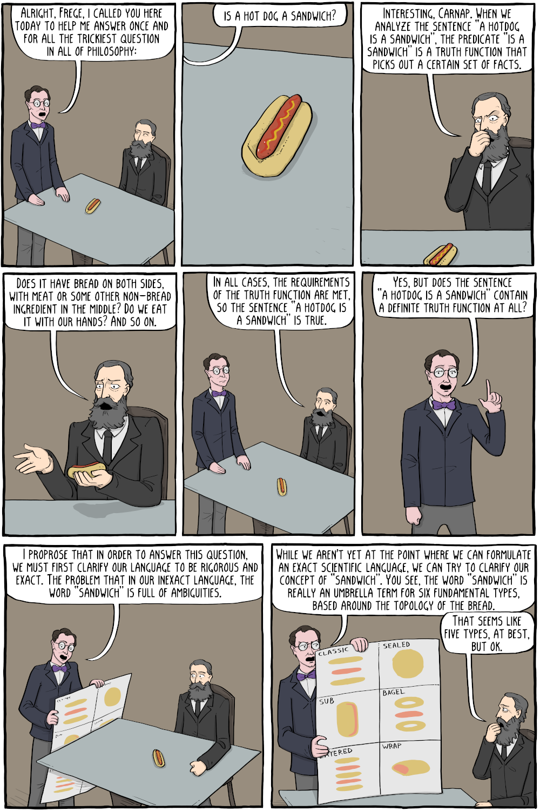](https://existentialcomics.com/comic/268)
[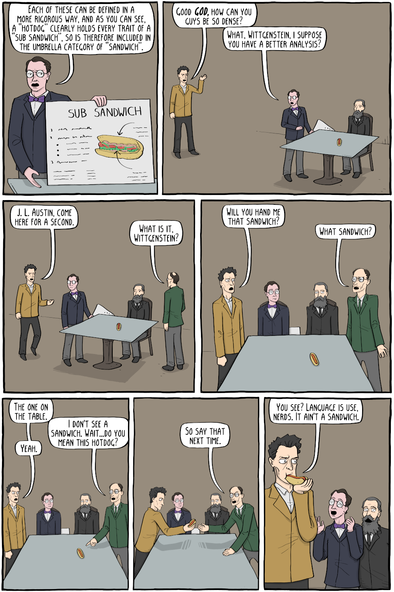](https://existentialcomics.com/comic/268)

On the topic of sevenths of a circular pie, assuming the pie is like a cake and wants a bit of sawing motion to get a clean cut, and assuming you care about trying to make seven nearly-identical wedge pieces... then I think you'd be best off by puncturing a circular hole in the center of the pie, topologically transforming the pie into a donut. That donut can then be neatly sliced into seven wedges, which you could share with a circle of six other friends.

Other kinds of pie will at least afford and possibly require radically different pie-cutting solutions! What about a pizza pie, which tends to cut better with a rolling slice? What about asymmetric cuts? What about fair division? What about social choice? The possibilities for new and interesting questions are endless!

The symmetric group of permutations of six elements, is a finite group with 6! = 720 permutations. This group, S_6, is exceptional because is the only finite symmetric group that has an outer automorphism! See John Baez's post ["Some Thoughts on the Number 6"](https://math.ucr.edu/home/baez/six.html) if you would like to try to understand what that even means.

In any case, remember to share pie with a circle of friends, both new and old. May all y'all have a blessed Rational Approximation Week, and a wonderful Rational Approximation Day!

## Author Bio

[Philosophy Infomercial](https://existentialcomics.com/comic/196)

[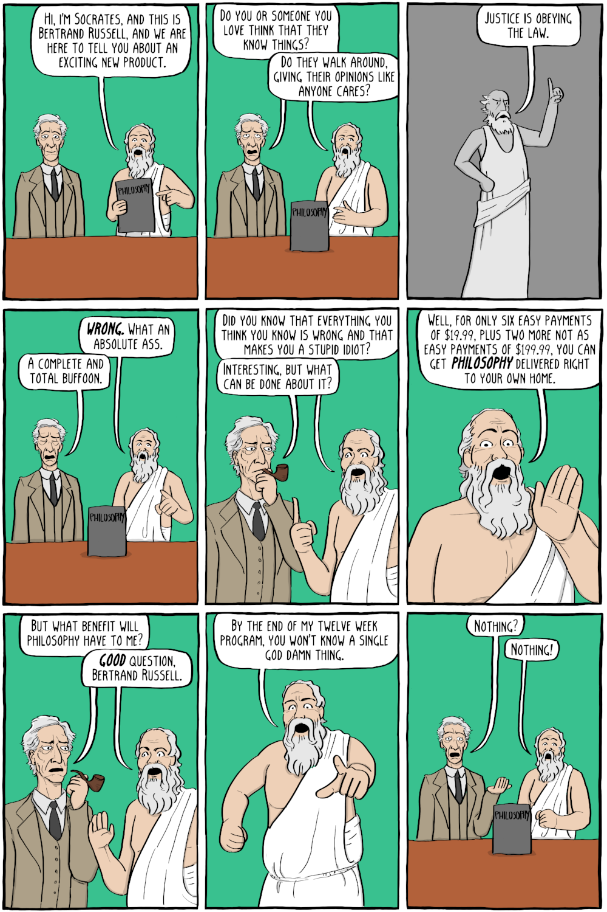](https://existentialcomics.com/comic/196)
[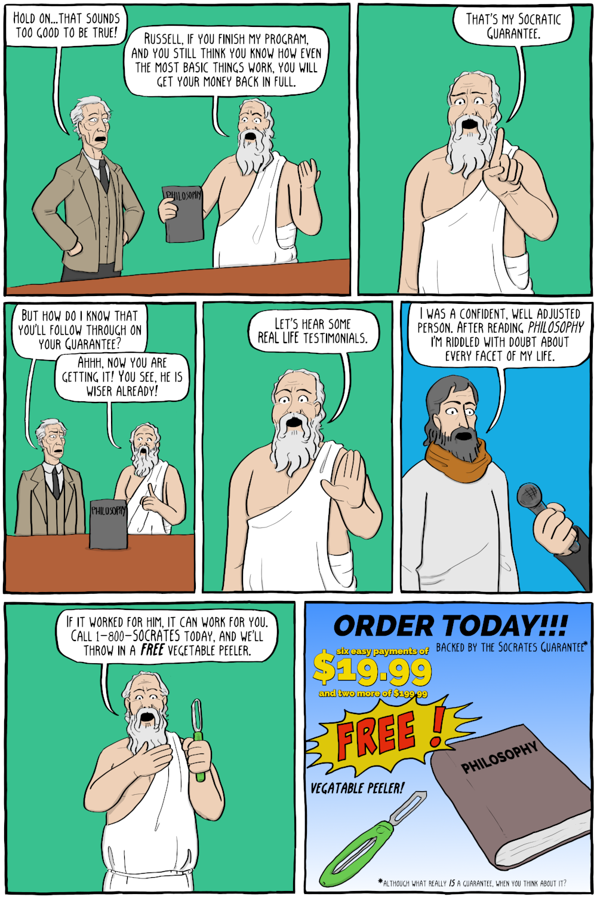](https://existentialcomics.com/comic/196)

Leon P Smith is a longtime enthusiast of computer science, programming languages and math education, especially concurrency, communication, semantics, queuing, Haskell, discrete mathematics, abstract algebra, and (semi-)formal methods. He is also an armchair cosmologist, a professional calendar nerd, and an aspiring time nut. As a software engineer, he is best known for postgresql-simple, which was part of a software system that assisted dispatchers in the process of answering and responding to emergency 911 calls in Parke County, Indiana. As a result of being a popular open source library, it is currently in use in countless publically unknown contexts all over the world.

At Obsidian Systems, Leon lead a team that provided the Avalanche blockchain community with their first integration with Ledger hardware wallets. Leon has also been a campaign staffer for Joe Donnelly, a former Senator who is currently United States Ambassador to the Holy See. Leon is also an alumnus of Beta Nu of Theta Chi fraternity at Case Western Reserve University, and was sleeping less than ten meters from original composite photographs that included Donald Knuth when the towers fell.

He is also a graduate of the Indiana Academy for Science, Mathematics, and the Humanities at Ball State University. Later as a graduate student at Indiana University in Bloomington, Leon participated on a robotic golf cart team lead by professor Steven D. Johnson, where he developed a deep interest in industrial accidents and safety engineering. He aspires to become an epistemic frame engineer, and always a better philosopher of design.

### Epilogue

If you'd like to understand a bit more about me, here's a review of books that have had a particularly notable impact on me, or at least that I deeply appreciate:

Oh! Pascal! (3rd Ed.) by Doug Cooper
  * Junior High through High School, occasionally (but rarely) referenced this book as an undergraduate.
  * Exceptional for a number of reasons, but especially the attention to detail and creativity of the examples
  * Write down the story of senior year research colloquium final project and Dr. Fakhruddin
  * Book made the trip to undergrad and back.
  * If you are a student learning to program, this book probably isn't terribly relevant due to Turbo Pascal 6.0
  * If you are considering writing an introductory book on computer programming, well worth drawing inspiration from
  * Had some simpler fractals, reminscent of "Indra's Pearls: the Vision of Felix Klein".  The mathematical explanations are far deeper and more refined in Indra's Pearls, though.  "Oh! Pascal!" wasn't really enough to "sell" me on the study of fractals.

Programming Language Concepts (2nd Ed.) by Carlo Ghezzi and Mehdi Jazayeri
  * First read it over the course of a few days my freshman year of high school
  * I so very clearly remember the (Wulf 77) quote and the name "UTOPIA 84" from p 19 and 20; that really was a highlight of the book to me. Those criteria, and that hope, framed my thinking about a better programming language, which I immediately started searching for once I reached the Indiana Academy and had the internet and a university library at my disposal.
  * Good overview of what a runtime basically looks like for Pascal or C, which was a huge help for me as an imperative programmer.
  * Built my first intuitions for the non-linear tradeoffs inherent in programming language design, and how those tradeoffs correspond to features of a language's runtime environment
  * Deeply informed my philosophy of mathematics:  from early childhood I have identified computer programming with mathematics, and vice-versa. This book, along with my math classes in school, helped me revise and extend that analogy.
  * Had a section on functional programming which I clearly remember reading with great interest, but I had no language implementation to play with. It created a reference in my mind, but not one that I understood, nor was this book quite enough to "sell" me on functional programming.

Programming with Standard ML by Colin Myers, Chris Clack, and Ellen Poon
  * While I was a student at the Indiana Academy, I spent quite a bit of time conducting a fairly exhaustive literature search through the programming-language related books in the Computer Science stacks at Bracken Library.
  * I thought I was gathering raw data to make my own programming language.  Little did I know I was actually searching for this book.
  * I found this book the fall of my senior year of high school. It was certainly one of the momentous moments of my life.
  * Checked it out and read it cover to cover within the next 36 hours or so, was immediately sold on functional programming
  * It took a year and a half and considerable effort to start to actually get good at FP.
  * at first, I was learning SML and Haskell in parallel, alongside the "Gentle Introduction to Haskell"

Introduction to Functional Programming using Haskell (2nd Ed.) by Richard Bird
  * Spent a fair bit of time with this book fall of my freshman year of college
  * Taught me structural induction, which was a huge and immediate eye-opener
  * Induction schema for Regular Languages

Purely Functional Data Structures, by Chris Okasaki
  * Was reading this the same time as Bird's book.
  * Chapter 2 was especially helpful in getting better at functional programming, in much the same way that Ghezzi and Jazayeri was helpful when I was getting better at imperative programming.

Vicious Circles, by Jon Barwise and Lawrence Moss
  * spent quite a bit of time with this book towards the end of my undergraduate education
  * When I described the axiom of foundation and hypersets to David Singer,  he thought that was an incredibly bizzare and esoteric idea. Dr. Singer's obvious skill as a mathematician and lack of knowledge of axiomatic set theory was a data point that injected skepticism into my thinking, which helped me to start to differentiate the philosophy of mathematics from programming language theory in my mind, and later helped establish my belief in the Weak Paraconsistent Conjecture.
  * later met Dr Moss and attended a number of lectures
  * This esoteric interest helped me notice that the Stern-Brocot tree is a particularly fertile example
  * This book inspired "[Lloyd Allison's Corecursive Queues](https://hackage.haskell.org/package/control-monad-queue)" and "Fun with the Lazy State Monad"

Essentials of Programming Languages (2nd Ed.), by Daniel Friedman, Mitchell Wand, and Chris Haynes
  * also spent a fair bit of time with this book as an undergraduate
  * inspired a toy stepping debugger for a toy FP language
  * later took classes from Daniel Friedman

Limits of Software: People, Projects, and Perspectives, by Robert N. Britcher
  * Do you care deeply about design?  It's very challenging to do well.
  * All in all, I appreciate Chapter 4 quite a bit.
  * Unfortunately, Chapter 4 does also plainly libel Alan Turing.
  * Alan Turing has since been pardoned and has received a formal apology from the British government.
  * The final chapter contains a grim outlook on the future of software.
  * That vision has certainly arrived.

## Words of Gratitude

[Hypatia of Alexandria and the Seven Presocratics](https://existentialcomics.com/comic/95)

[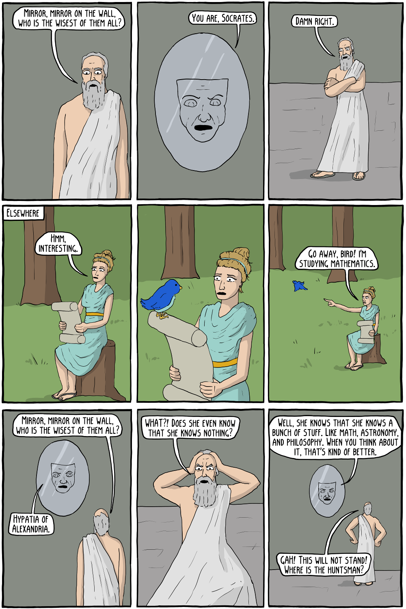](https://existentialcomics.com/comic/95)
[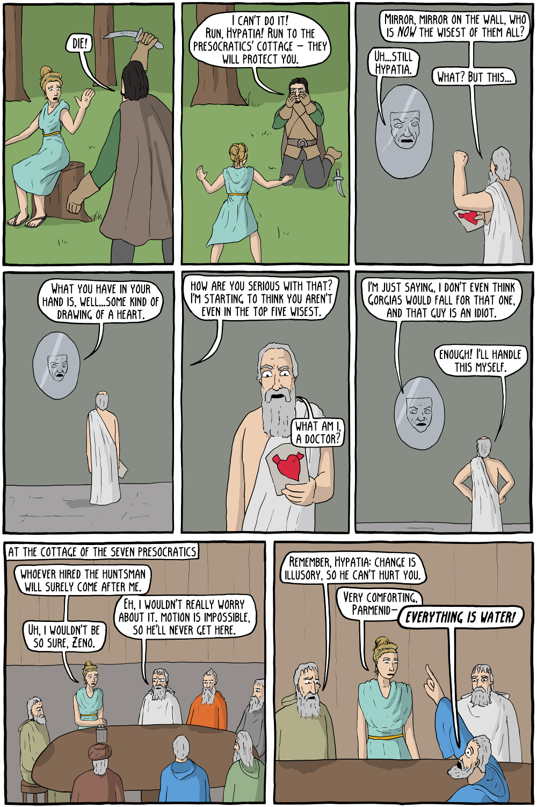](https://existentialcomics.com/comic/95)

To Imre Lakatos and Ayn Rand, two very different yet both deeply flawed human beings, of the type that should make you turn your head and go "Holy Shit!"

They both lived experiences that no one should ever be subjected to. Every human being deserves the love and support of others. Every human being deserves encouragement and assistance to become the best that they can be. Every human being deserves to have doors open to them. Every human being deserves to have doors opened for them. Even if sometimes you mess up really big.

In the end, one took important stands against the dishonesty of men, and the other is Ayn Rand.

To Paul Feyerabend, Jon Michael Dunn, and Vladimir Kara-Murza, also for taking their own stands against the dishonesty of men.

To Judea Pearl, Doron Zeilberger, and Yuri Goldfeld, three dear friends of mine. Two by word, one by flesh. One new, and two old. Thank you all so very much for kindly provoking me into becoming better. Here's to the inductive attitude, heuristics, casual analysis, and counterfactual reasoning!

To Ozgun Ataman, for being a friend, for providing profound contributions to postgresql-simple, and for recommending Statistical Rethinking by Richard McIlreath to me.

To Donald Knuth, Haskell Brooks Curry, Gerald Sussman, Guy Steele, Daniel Friedman, Kent Dybvig, David Wise, Simon Peyton-Jones, Simon Marlow, Jon Barwise and so many countless others, for making my work on UTOPIA 84 even possible.

To my father Byron Smith, Carlo Ghezzi, and Mehdi Jazayeri for inspiring this quest. To William Wulf and George Lakoff for framing the goals for me. To Colin Myers, Chris Clack, and Ellen Poon for opening the first very remarkable door for me.

To Richard Bird and Chris Okasaki for dereferencing my understanding of functional programming. To Jeremy Gibbons, Richard Bird, and David Lester for giving me the frontispiece to my answer.

To Julian Gevirtz, Kimberly Foltz, John Racja, and Franklin Shobe, teachers of mine at the Indiana Academy, for teaching me Mathematics, and shaping and broadening the goals of this quest.

To Case Western Reserve University and the Indiana Academy, for deepening my appreciation for Science and the Humanities.

To William Deal, Timothy Beal, Marty Grundy, and the Cleveland Meeting of the Religious Society of Friends, for helping me to clarify my thoughts and for helping me to find my writing voice.

To Erin Clair, for recommending "There is No Case for the Humanities". To David J Eshelman, Louis Campbell, Ben Sigg, G. Alex Janevski, Tim Sentgeorge, Eric Kugler, Michael St. Clair, and so very many other brothers of Theta Chi Fraternity.

To some I very much owe an apology. I am sorry. I shall address proper apologies privately.

To Guo-Qiang Zhang, who introduced me to non-classical logics and kindly dissuaded me of Ronald A Fisher's bromide against Bayes, even if sadly that didn't kindle a deeper interest in statistics and it's connections to logic at the time.

To David Singer, for introducing me to epistemic framing via RSA cryptography. To David Doiron, for introducing me to signals and the erasure of Arabic science via optics. To Jim Al-Khalili, for teaching me how to pronounce al-Khwarizmi, and introducing me to al-Haytham.

To my dear friends Roshan James, Pooja Malpani, and Madhava of Sangamagrama, all of whom I first met while I was a student at Indiana University.

To George Voutsadakis for introducing me to Combinatorics and the Theory of Computation. To Dong-Hoon Lee and Ta-Sun Wu for introducing me to Abstract Algebra and enhancing the joy that I find in symbol-pushing proofs and induction. To Lee White, whose Data Structures class sent me down a rabbit-hole that resulted in me more deeply appreciating integer-valued polynomials, and whose graduate-level software engineering class was for me the easiest A at CWRU ever.

To the memory of Elizabeth Meckes and all the unknown, largely unappreciated scholastic summoners toiling away on the almost entirely thankless task of reforming the elementary math curriculum. Thank you, Paul Steury, and Paul for All 2022, for caring.

To Edward Kmett, an elemental wizard of heuristics, level unknown. Edward is plausibly the smartest and most knowledgable man I've ever met. Thank you for giving me an appreciation for iterative deepening depth first search, the seed that helped crystallize my answer.

To Doron Zeilberger and Ryan Trinkle, also for helping me achieve a much deeper practical appreciation for heuristics.

To Lee White and Steven D. Johnson, two first-rate philosophers of design. Thank you for sharing your deep insights into software, hardware, and safety engineering with me.

To Daniel Friedman and Kent Dybvig, for sharing your deep insights into the philosophy of education and design with me.

To Guo-Qiang Zhang, Larry Moss, Amr Sabry, Will Byrd, Jon Michael Dunn, Katalin Bimbó, and Cale Gibbard, eight superlative logicians whom I have been blessed by knowing.

To Obsidian Systems, by far the best software company I've ever seen.

To Ryan Trinkle, Ali Abrar, Morgan Tilleman, Jordan J Szymialis, Andrew B Jones, Maggie Marinocha, and the law firm of Stuart and Branigin LLP, for having a competent and ethical sense of the law.

To my parents and grandparents, as well as Jill Hassel, Karen Cox, Sam Davis, George Irvin, Michael Goldfeld, Kelley Fallon, Tom Adams, Hasan Fakhruddin, Joe Donnelly, and Lois Clark for helping me to more carefully observe how certain very specific parts of the world works, and for believing in me.

To Kenneth Arrow, Rob Richie, Chris Butler, Ka-Ping Yee, Warren Smith, William Poundstone, and Jameson Quinn for introducing me to Social Choice Theory. To Birch Bayh, Rob Ritchie, John Anderson, Jameson Quinn, Aaron Hamlin and the Center for Election Science for working to bring practical interventions to fruition. To Herbert Simon, Amarya Sen, Daniel Kahneman, and Elinor Ostrom, for all of their many wise contributions.

To Elizabeth Werner and my amused and dismayed teachers of Analysis, who helped me become referentially aware that informal mathematics exists. To Joel Langer, for introducing me to Visual Complex Analysis, which I found so supremely difficult yet utterly fascinating. To Warren Smith, for definitively slaying the illusion of the non-existence of informal mathematics in my mind. To Imre Lakatos, for getting me to laugh about it and helping me to heal. I missed a dental appointment laughing at "Proofs and Refutations", only to notice the text saying it had been cancelled two weeks later! Such has been my pandemic life.

To Norm Waggy. This essay was originally entitled "How To Be Reasonable: a Study Guide". With your profound assistance, that changed into "Tools of Math Construction: an Aggregate Theory of Concrete Mathematics", a vast improvement. Neither of us could have possibly been aware of what had actually happened at the time of the conversation, and that is wonderful!

To Benjamin Franklin and Karl Popper. I feel their motives for serving as Ambassador to France, and writing "The Open Society".

To Birch Bayh and Richard Lugar, for advocating for Title IX and for nutritional assistance, among many other worthy and noble endeavors.

To Christopher Clavius for his work on reforming the mathematical curriculum, and for serving as a wise referee for the Gregorian calendar reform. To Giovanni Girolamo Saccheri, for his outstanding investigations into geometry. To Pope Francis, for inspiring millions of disillusioned Catholics all over the world.

To Emin Gün Sirer, David Singer, George Lakoff, Existential Comics, Corey Mohler, Obsidian Systems, Elliot Cameron, Divam Narula, and every author recommended in this study guide, for their respective contributions to the construction of an epistemic frame. As my grandfather Donald enjoyed saying, here's to you, waggle your wings and fly level!

A very big thank you to everybody else, both known and unknown, who have also assisted in the construction of an epistemic frame.

A very big thank you to everybody, both known and unknown, who have assisted and facilitated my work on the philosophy of math education. Not least of all, many current and former colleagues, students, teachers, coworkers, supervisors, and other people of all kinds I have interacted with in many different contexts.

Love mercy, do justice, and walk humbly in faith and community with your fellow human beings.

Be honest with yourself and others.

Make an effort to include others.

Be generous to living beings.

Be kind to each other.

Intend to do good.

Think about causal factors.

Intervene wisely.

Have the moral courage and a will to intervene as necessary for your role.

Give people the confidence to say no, and respect their choices.

Have people around you that can tell you no.

Talk to one another, if at all possible.

Take a break, if necessary.

Apologize carefully.

If you choose to believe in some version of a multiverse, demonstrate epistemic responsibility to, and respect for, the timeline you are in.

If you choose to believe in God, demonstrate epistemic responsibility to, and respect for, the humanity around you.

If you choose to explore the unknown, respect the things that you find along the way.

The words you choose shape your destiny.

The things you do shape your legacy.

Thank you, Rabbi Joseph Teluskin, for your kind words, enriching us all.

Thank you, Emily Miller, for bringing both the Oven of Akhnai and the song "Twenty two (22) letters" by Victoria Hanna about the Sefer Yetzira to my attention!

To my grandfather, Donald Rettinger, for teaching me so much about shit, not least of all the smell of it from far, far away.

To Lois Clark, for having a heart and tongue of gold, and for caring deeply about all children.  In Lois's world, children were first and primary among so many other supremely important concerns.

Bless all parents and caregivers with patience, warmth, caring, and encouragement.  Bless them with wisdom, kind words, and just deeds, with material resources to share, and with time to spend with their children and beneficiaries.

To Camp Alexander Mack, the Prince of Peace Church, and the Indiana Academy, for their many profound legacies.

May everybody have a blessed Rational Approximation Week, and a wonderful Rational Approximation Day.

Peace out.

[The Ultimate Secret of Philosophy](https://existentialcomics.com/comic/437)

[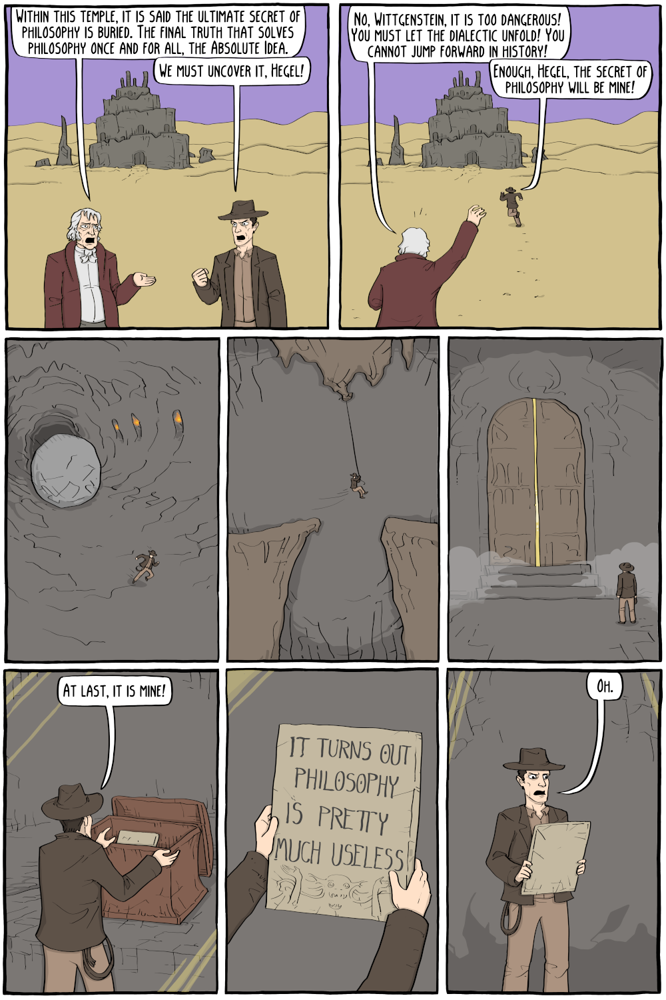](https://existentialcomics.com/comic/437)

## (currently woefully incomplete) Bibiliography:

1. The Scout Mindset: Why Some People See Things Clearly and Others Don't, by Julia Galef
2. Benjamin Franklin: A Film by Ken Burns
    * https://www.pbs.org/kenburns/benjamin-franklin/
    * Don't Label Me: An Incredible Conversation for Divided Times, by Irshad Manji
    * The Good Place
3. The Knowledge Illusion: Why We Never Think Alone, by Steven Sloman and Philip Fernbach
    * https://www.youtube.com/watch?v=LC6O_2vDDwc
    * Gödel, Escher, Bach: an Eternal Golden Braid, by Douglas R. Hofstadter
4. The Book of Why: The New Science of Cause and Effect, by Judea Pearl and Dana Mackenzie

5. The Ethics of Belief, by William Kingdon Clifford
    * The Will to Believe, by William James
    * [Anti-Vaxxers, Conspiracy Theories, & Epistemic Responsibility: Crash Course Philosophy #14](https://www.youtube.com/watch?v=AYkhlXronNk)
    * The Illustrated Guide to Law, by Nathan Burney:  https://lawcomic.net
6. Weapons of Math Destruction: How Big Data Increases Inequality and Threatens Democracy, by Cathy O'Neil
    * Algorithms of Oppression: How Search Engines Reinforce Racism by Safiya Umoja Noble
    * Automating Inequality: How High-Tech Tools Profile, Police, and Punish the Poor by Virginia Eubanks
    * The Loop: How Technology is Creating a World Without Choices and How to Fight Back by Jacob Ward
    * The Mismeasure of Man, by Stephen Jay Gould
    * The Limits of Software: People, Projects, and Perspectives, by Robert N Britcher
7. When Time Is Short: Finding Our Way in the Anthropocene, by Timothy Beal
    * Do The Math:  https://dothemath.ucsd.edu/
    * Energy and Human Ambitions on a Finite Planet: Assessing and Adapting to Planetary Limits, by Tom Murphy
    * Guns, Germs, and Steel: The Fates of Human Societies, by Jared Diamond
    * Collapse: How Societies Choose to Fail or Succeed, by Jared Diamond
    * Doughnut Economics: 7 Ways to Think Like a 21st Century Economist, by Kate Raworth
8. Proofs and Refutations: The Logic of Mathematical Discovery, by Imre Lakatos
    * "Conjectures and Refutations" and "The Logic of Scientific Discovery" by Karl Popper
    * "How to Solve It" and "Mathematics and Plausible Reasoning" by George Pólya
9. Language, Proof and Logic (2nd Ed.), by Dave Barker-Plummer, Jon Barwise, and John Etchemendy
    * "How to Prove It" by Daniel Velleman.
    * Gödel, Escher, Bach: an Eternal Golden Braid, by Douglas R. Hofstadter
    * "Beginning Mathematical Logic: A Study Guide" by Peter Smith
10. Statistical Rethinking: A Bayesian Course with Examples in R and Stan (2nd Ed.), by Richard McElreath
    * "The Logical Syntax of Language" by Rudolph Carnaph
    * "Conjectures and Refutations" by Karl Popper
    * "The Logic of Scientific Discovery" by Karl Popper
    * "The Structure of Scientific Revolutions" by Thomas Kuhn
    * "The methodology of scientific research programmes" by Imre Lakatos
    * "Against Method" by Paul Feyerabend
    * "For and Against Method", by Imre Lakatos, Paul Feyerabend, and Matteo Moterrelini

[^formalizinginformalmath]: Completing the analogy, can informal mathematics be formalized?  Despite being an apparent contradiction in terms, this idea certainly does not seem immediately implausible to me, though I don't know how this idea might be plausible either. I'm not even sure how one might try to proceed if one were to try to write the book on formal informal math. Perhaps it would help if we had more "Proofs and Refutations" style rational reconstructions of the historical development of important mathematical concepts?  That seems potentially quite useful it it's own right, at least. I'm under no illusion that formalizing informal mathematics would eliminate informality: to some degree or another informal mathmatics is unavoidable! Rather, perhaps such an effort would shift the informalities used in practice in useful ways into roles that are hopefully more satisfying and pleasing to the participants involved. Even if such an effort is unworkable, at the very least, informal mathematics and formal mathematics do need to remain well-informed of developments in the each other's fields.

[^auxiliary-topics-for-deductive-logic]: Thus, we should have a banquet of options for learning deductive logic, whether that's the very traditional geometry, or the somewhat more modern logic puzzles, or the relatively recent discrete math, to suit many tastes and interests. There are almost certainly large numbers of alternative auxiliary topics for teaching deductive logic that are worth exploring and developing.

[^proofsandrefutations_logic]: Ever notice the intuitionalistic logic joke on page 47 of "Proofs and Refutations", near where footnote 60 is cited in the section "proof analysis and global counterexample"?

[^iep-paraconsistent]: see for example, the Internet Encyclopedia of Philosophy's article https://iep.utm.edu/para-log/, for a discussion of weak paraconsistency. Every part of this conjecture seems to be reasonably widespread in the mathematical and computer science communities; but I'm not specifically aware of anybody else who has rolled these parts up into a singular name, which I feel is overdue. My interactions with J. Michael Dunn, along with Larry Moss, Guo-Qiang Zhang, David Singer, Amr Sabry, and Steven D. Johnson informed my current view of this niche topic.

[^proofsandrefutations_gas]: footnote 35, page 31, "Proofs and Refutations". Note however that in context of something like the Principia Mathematica, where numbers are defined in terms of logic, Russell's proof might well have more content that is welcome than I currently appreciate.

[^computer_bugs]: I have no real difficulty imagining that there is a software behavior that can accurately be described as "morally, we assumed/implied 1=2 and because of that, our software conflated the identites of two distinct individuals without further evidence". However, this sounds like a software bug, not a feature of sound reasoning!  At the very least, it would seem a rather atypical feature of a useful method of formal reasoning, even if it could be sound reasoning in some unknown, possibly exotic context.

[^againstmethod_paraconsistent]: footnote 1, chapter 1, page 8, "Against Method"

[^hamkins]:  see e.g. Chapter 1 p 18 in "Lectures on the Philosophy of Mathematics" by Joel David Hamkins

[^graphicallinearalgebra]:
    I suggest reading the post [Makélélé and Linear Algebra](https://graphicallinearalgebra.net/2015/04/23/makelele-and-linear-algebra/), which states things quite nicely. See also "How Not to Be Wrong", by Jordan Ellenberg. I also really appreciated [Why string diagrams?](https://graphicallinearalgebra.net/2017/04/24/why-string-diagrams/), which I found to contain a nice acknowledgement of the difference between _pedagogical_ versus _motivating_ examples.

    For example, the Stern-Brocot tree is an excellent _pedagogical example_ for the study of coalegbra and coinduction, in the sense that if a student is interested in these topics, I wouldn't hesitate to recommend the Stern-Brocot tree, as it's a relatively simple and hopefully illuminating example for learning about coalgeba. Perhaps it provides enough intellectual texture to break syntactic illusions and more easily discover what makes coalgebra interesting, but at the very least I hope it provides a bit of gas to stimulate the imagination.

    I am far from certain that the Stern-Brocot tree is a _motivating example_ for the study of coalgebra, in the sense that if a student is specifically interested in the Stern-Brocot tree, I'm currently unlikely to suggest coalgebra for further study without another reason or two to make that specific recommendation. Of course, it would almost certainly be an interesting thing indeed, if somebody would make a convincing argument that the Stern-Brocot tree in fact motivates the study of coalgebra.

[^nandnor]: I also considered binary operators that were commutative, but not associative. I came up with such a binary operator inspired by "who wins rock-paper-scissors?", but more symmetric. On the other hand, I have yet to find a natural pedagogical motivation for such a thing. In the process of writing "Kevin Bacon and the Stern-Brocot Tree", I realized that NAND and NOR gates are commutative but not associative, which are easily motivated in the context of boolean algebra and digital logic design. See for example, "Computer Engineering for Babies" by Chase Roberts.

[^alternatives]: D_3, the symmetry group of the triangle, and Q_4, the quaternion group, are the only finite non-abelian groups that are less than or equal to D_4 in size. While these are both extremely interesting in their own right, neither seem to fit my criteria nearly as well. Similarly, the finite symmetric groups S_n of permutations are also very important, but it seems more concrete to use D_4 to introduce and motivate S_4 than vice-versa.

[^sbt-undergraduate-retrospective]: In retrospect, I quite sure multiple people at Case, including Dr. Singer and Dr. Zhang, encouraged me to understand continued fractions, but I never did quite catch on. On the other hand, the Stern-Brocot tree is such a fertile idea that I can also easily imagine suggestions that in retrospect suggest it's connection to the Euclidean Algorithm, when there was no such intention behind the suggestion.

[^barwiselakoff]:
    Which is funny, because in Barwise and Moss's 1991 article on "Hypersets", Jon Barwise starts out by analogizing a hyperset with the continued fraction of the golden ratio. Amazingly, Lakoff and Núñez's "Where Mathematics Comes From" is a direct reason why I made this connection at all. I didn't review this book until I was deep into writing this study guide, and the bit about hypersets and continued fractions was the first page I accidentally turned to. Glancing at that, I immediately looked at the bibiliography and citations, followed the reference back, and reviewed Barwise and Moss's article for the first time.

    It's really satisfying when ideas come back around full circle.  When I was struggling to get started with "Kevin Bacon and the Stern-Brocot tree", it wasn't until I really started thinking about George Lakoff's concepts of framing that I could find my voice.  I'm only referentially familiar with Lakoff's work on this matter, perhaps someday I'll get around to actually reading "Don't Think of an Elephant!"

[^deductive-logic-and-the-aggregate-theory]:
    From a certain very strict notion of relevance that I have often worked from while writing this essay but can't quite explain, the six degrees of the primary aggregates (i.e. the tree, the triangle, and the square) doesn't seem to connect to formal logic until you get to graduate-level model theory and algebraic semantics.

    Even then, the connections still seem secondary and indirect, using the aggregates as pedagogical devices to introduce algebra, partial orders, and topology. I'm still not aware that the aggregates are directly relevant to a goal of learning graduate-level model theory, though I am certainly interested in having my mind changed on this topic.

    But from the point of view of motivating deductive logic in a K-12 curriculum redesign, this observation seems to be of no immediate interest. I certainly believe the primary aggregates help set an engaging stage for learning about deductive logic.  In the larger theory, the secondary aggregates are heuristics, computer programming, and problem solving. The Six Degrees of these Secondary Aggregates provides plenty of natural motivation to study deductive logic, at varying points along the formal/informal spectrum.

    I do sincerely hope that in a hundred years time, algebra, partial orders, and topology will be somewhat common and not considered nearly so highminded. These conditions should help make model theory far more approachable, if one is so inclined to study it. However, it seems highly implausible to me that an approach through graduate-level model theory will someday directly compete with the Six Degrees of the Secondary Aggregates. Computer programming, problem solving, and heuristics seem to provide far more natural and elementary routes into deductive logic.