[Back to Part 1: Global Suggestions](./An_Aggregate_Theory_of_Concrete_Mathematics.md#navigation). Up next, Part 2:

# Deconstructing Bertrand Russell

[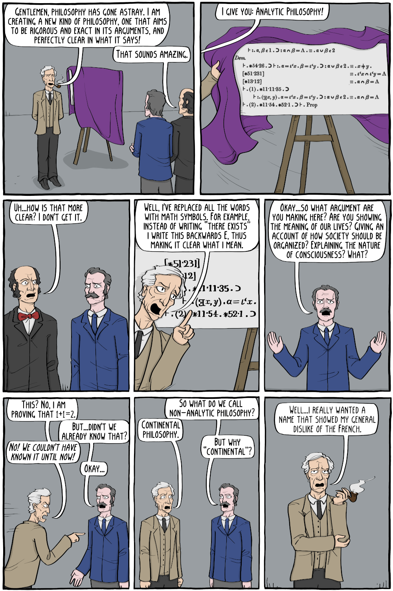](https://existentialcomics.com/comic/342)

> Language is the vehicle by which we express our thoughts, and the relation between those thoughts and our language is a subtle and involuted one. The nature of language actually shapes and models the way we think. [...]
>
> A language design should *at least* provide facilities which allow the comprehensible expression of algorithms: *at best* a language suggests better forms of expression. But language is *not* a panacea. A language cannot, for example, prevent the creation of obscure programs: the ingenious programmer can always find an infinite number of paths to obfuscation.
>
> - William Wulf (1977), via "Programming Language Concepts, 2/E" by Ghezzi and Jazayeri

> In the best of worlds, an architecture emerges. Architects dig into the whys and wherefores and weigh the "what must be" against "what cannot be" until landscapes, or machinescapes, become evident, as with jigsaw puzzles. Then forms simply become obvious, the by-product of intent. A baseball is a near-perfect marriage of purpose and form. Its form suggests its use. A toddler finding a ball in his way will try and throw it. A cat will swat it.
>
> - Designing, in "The Limits of Software" by Robert Britcher

> Caught in the middle are the ranks of humanities scholars who simply want to do good work in their fields; to read things, and think about what they mean; to tease out conclusions about the past and present through a careful analysis of evidence; to delve deeply into language, number, art, artifact, culture, and nature. This is what the arts have always been and done. This is what the university was established to do. [...]
>
> The confusion over the purpose of the humanities has nothing to do with their relevance. The humanities are no more or less relevant now than they ever were. It is not the humanities that we have lost faith in, but the economic, political, and social order that they have been made to serve. Perhaps we only demand a case for the humanities because we cannot fathom having to make a case for anything else.
>
> - Justin Stover, "There Is No Case for the Humanities"

In this interlude I deconstruct an apocryphal proof of Bertrand Russell. I argue that even if an "argument from absurdity" is a formally correct material implication, the resulting theorem is itself often absurd in the dadaist non-sequitor sense of the word. Bertrand Russell is deservedly much more famous for _Russell's Paradox_, which revealed an inconsistency hidden inside Gottlob Frege's attempt at understanding mathematics in terms of a formal logic. Thus in a strict technical sense, Frege's first attempt at formal logic imploded into triviality, because Russell's Paradox provided the absurdity needed to prove every statement true, provided that it is syntactically correct.

Two answers to Russell's paradox emerged: Russell's type theory, and Zermelo-Frankel (ZFC) set theory, though other variant logics have also been studied. Among those are a family of variants known as paraconsistent logics; such ideas can be found in Paul Feyerabend's book "Against Method". Among paraconsistent logics there is a subfamily of variants known as relevance logics, a topic that J. Michael Dunn was particularly interested in. His Ph.D. dissertation "The Algebra of Intensional Logics" provided relevance logic with an algebraic semantics, which is a type of formal model of logic.

Kurt Gödel proved that it is impossible to definitively rule out the possibility of another black swan philosophical event like Russell's Paradox from occurring again in the future in most mathematical formalisms of interest, not least in ZFC set theory. Of course, such a black swan event may in fact be impossible, but we cannot ever know that for certain. As the language of naïve set theory is popular and used widely in modern mathematics, this leads some people, including my former self, to ask whether latent inconsistencies of the Russell-Gödelian type could cause modern mathematics to implode. However, my experience has lead me to embrace the Weak Paraconsistent Conjecture, which states that these concerns are implausible even if one assumes the existence of a latent inconsistency in ZFC set theory. So keep calm and carry on!

> The story goes that Bertrand Russell, in a lecture on logic, mentioned that in the sense of material implication, a false proposition implies any proposition.
>
> A student raised his hand and said "In that case, given that 1 = 0, prove that you are the Pope."
>
> Russell immediately replied, "Add 1 to both sides of the equation: then we have 2 = 1. The set containing just me and the Pope has 2 members. But 2 = 1, so it has only 1 member; therefore, I am the Pope."
>
> - Taken from [Andy Long's resources for learning MAT 385: Discrete Math at Northern Kentucky University](http://ceadserv1.nku.edu/longa/classes/mat385_resources/docs/russellpope.html)

> And I think that Russell was right, but that's irrelevant, friend.
>
> - Dessa, on the track "Low Light Low Life", on the album "Never Better" by P.O.S.

If you want another take on the "what's the worst that can happen" joke, Tucker & Dale vs. Evil is a comedy horror film that you might enjoy.

Of course, here the comic depicts John Rawls using an _original position_ type thought experiment in an attempt to justify society's need to teach mathematics.  John Rawls is addressing his argument to a less-than-enthusiastic math student, whereas Justin Stover's quote is in the context of school and government administrators among others demanding a justification for the existence of humanities scholars.

Once in a great while, when I understand certain common weaknesses in communities and contexts, I enjoy trolling. I do try my utmost for my trolling to be playful and creative. The last thing I want to be, is your boorish garden-variety gnome. Paraconsistency is certainly one of those topics that has a tremendous potential to provoke, whether one seeks to be provocative or not. So those who desire to discuss paraconsistency are frequently perceived as trolls and/or gnomes, whatever their desire is in actuality.

It is common weakness among many people, including mathematicians, scientists, certain philosophers, and certainly H.L. Mencken, to assume that if you don't personally understand some idea, that it is therefore nonsense. I myself was a bit overly dismissive of informal mathematics, once upon a time. And I believe that there are people not unlike myself, perhaps attracted to formalist research programs exemplified by the likes of Bertrand Russell, Alonzo Church, and Haskell Brooks Curry, who remain overly dismissive of informal mathematics.

It is a fact that legitimate ideas get dismissed as nonsense. It may be true that a majority of dismissed ideas are in fact nonsense, but it's certainly true that some legitimate ideas do consistently get dismissed as nonsense. What would you think, and how would you feel, if you were one of these ideas, consistently labelled as nonsense and thus removed from further consideration?   Therein lies the problem. We can all stand for a little more honesty, and a little more grace, in how we treat other people and ideas.

For some destructive historical examples, consider the experience of Galileo, the Catholic Church, and the Reformation and Counter-Reformation, and how that influenced mathematical debate and the early development of Calculus in Renaissance Europe. This era was highly creative, but it also unnecessarily destroyed human ideas, and human lives. These topics are discussed in depth in "Infinitesimal: How a Dangerous Mathematical Theory Shaped the Modern World" by Amir Alexander. I particularly recommend this book as Galileo's experience is a canonical example in the philosophy of science and mathematics, and the greater historical context deserves to be better appreciated. Thank you, Doron Zeilberger, for recommending it!

Kronecker v Cantor was a rather unsuccessful attempt to suppress and destroy ideas. While Leopold Kronecker's boorish, personally aggressive attacks on George Cantor over an academic dispute wasn't very effective, it did lead to significant negative outcomes for Cantor personally.  After his experiences with Kronecker, Cantor had an an acute attack of anxiety that lingered for the rest of his life.

Pearson v Wright successfully suppressed Sewall Wright's work on path analysis outside the realm of animal breeding and some evolutionary theorists for decades, and arrested further mathematical development of Wright's work until the 1980s. See for example, "The Book of Why" by Pearl and Mackenzie. Even today, it can be difficult to acknowledge that as a practical matter, causality exists, causality can be mathematically modelled in useful ways, causality does have empirical content, and that correlation cannot correctly model causality, let alone infer it. The anti-patterns of behavior established by Karl Pearson and Ronald A Fisher are still very much with us.

Fisher v Bayes needlessly discouraged a large number of mathematicians from even considering non-frequentist interpretations of probability and statistics, impacting the reception of fuzzy logic, as documented in Bart Kosko's "Fuzzy Thinking."  I myself fell into this category for a few years. This is one of the examples I was specifically alluding to in "Kevin Bacon and the Stern-Brocot Tree" of an example of where I as a student reacted poorly to a topic by dismissing it outright. Even today it can occasionally be difficult to talk about alternative interpretations, though Bayesian statistics is pretty non-controversial among an increasingly broad spectrum of professionals these days.

For a humorous and decidedly more hopeful look at the way mathematics could be practiced, Imre Lakatos's "Proofs and Refutations" is indispensible. Jim Al-Khalili's "House of Wisdom" tells stories of intellectual creation during the golden age of Arabic scholarship that are often happier than the stories of the Renaissance. For a modern and ongoing controversy, consider paraconsistent logic and the philosophical writings of Paul Feyerabend in "Against Method".

That is part of the joke of my selection of the "Derrida Arrested!" cartoon to introduce analytical philosophy in the previous section.  Willard Van Orman Quine is a high-profile analytical philosopher who argued against "deviant logics" and Carnap's Principle of Tolerance. In this context, "deviant logic" is referring to non-classical logics,  variant systems of logic that differ from the classical logic commonly used by nearly all mathematicians today. Rudolph Carnap was deeply curious about these non-classical logics, and how they might be useful in various contexts. Quine was curious too, though he argued against deviant logics on largely pragmatic grounds, arguing that the costs that they necessarily impose had yet to be justified by a clearly demonstrated benefit to reasoning within a context.

I am not specifically aware that Quine himself ever exhibited the vulgar reactions found in the comic, let alone anything even vaguely in the category of the vulgarities that my words hope to address. However, there is a diverse abundance of vulgar interpretatations of Derrida, Feyerabend, "post-modernism", and much more, all readily available. Richard Feynman was at times among the high-profile vulgarians of his day.

And then there are common vulgar interpretations of analytical philosophy that invoke Russell or Carnap or Quine name or by idea, and these vulgarities are rather bellicose in many senses of the word. This seems fundamentally at odds with Bertrand Russell, Rudolph Carnap, and Willard Quine in particular, and much of the history of analytical philosophy in general.

Meanwhile, Quine's writings have inspired significant research and work on the deviant logics he disapproved of. Several of these logics have seen use in industry, such as modal and temporal logics in the design and verification of hardware and software systems. However, the current trend in interest seems to be away from non-classical logics towards classical logic as realized in SMT solvers, proof assistants, and extended static checking. For a non-classical example whose practical usage is currently prospering, linear logic deeply informed the affine type system of the Rust programming language.

Many variants are of well-established academic interest, including Leopold Kronecker's intuitionalistic logic,[^proofsandrefutations_logic] Bertrand Russell's type theory, Alonzo Church's lambda calculus, Henk Barendregt's lambda cube, and the research program Robert Harper calls _computational trinitarianism_. The Curry-Howard-Lambek correspondence is the most high-profile result of this program, braiding together computation, logic, and algebraic topology into one grand isomorphism. These results have already provided fundamental insights into the design space for programming languages, type systems, proof assistants, computer algebra systems, and more.

Relevance logic is a subfamily of the paraconsistent logics, and an area for which Jon Michael Dunn is known for working in. I am not personally aware of a well-established domain of application for paraconsistent logic. One idea I have is to explicate what I call the "Weak Paraconsistent Conjecture".[^iep-paraconsistent]  Kurt Gödel proved that we can never quite definitively rule out the possibility of another black swan philosophical event like Russell's Paradox. In light of Russell's "proof" that "1 = 2 implies that I am the Pope", one might come to believe that latent inconsistencies of the Russell-Gödelian type could have catastrophic consequences for all of mathematics!

I certainly entertained such thoughts, at one point in time. However, my experiences as student, a mathematician, and an engineer have lead me to embrace the Weak Paraconsistent Conjecture. The Weak Paraconsistent Conjecture states that these concerns are implausible, even if you assume the existence of a latent inconsistency. Any latent inconsistency in a formalism is unlikely to be terribly relevant beyond that formalism: the fallout from that inconsistency is likely to be mostly contained. More concretely, in the event that an inconsistency is found in formal ZFC set theory, it is likely to have little to no impact on any other mathematical subject, even though the language of naive set theory is widely used throughout those subjects. It will, however, be a wonderful day to be a set theorist!

After all, a philosophical black swan event approximately as worrying as an eruption from a science fair volcano. A  philosophical event cannot possibly be relevant to daily life, at least at first. Sure, someday there may be problems exposed with our current conception of the foundations of mathematics, but it's not like we are Wiley E Coyote, who falls to the ground only after he looks down and realizes he isn't standing on anything at all.

The observed behaviors of WIFI modems aren't going to suddenly change behavior if somebody someday realizes that there a previously unknown but very real philosophical problem baked into set theory, or calculus, or Bayesian statistics.  The latter two are particularly important to WIFI modems.

In some strange way, science, technology, and engineering verifies mathematics. Maybe they don't verify mathematics in exactly the way we currently believe it does.  Yet our unprecidented abilities to use mathematics to control the physical world around us means that we have verified _something_, even if that something is somewhat different than what we currently think it is.

In this hypothetical scenario, "large" differences seem implausible, even if "small" differences are taken as a given. Science and technology often give mathematicians good reason to believe that what we think we know is correct, more or less.

A deeper proof analysis suggests that Russell's proof consists largely of what Littlewood and Hardy called "gas", that is, "rhetorical flourishes designed to affect psychology, pictures on the board in the lecture, devices to stimulate the imaginations of pupils"[^proofsandrefutations_gas].

Firstly, there is a diverse abundance of non-trivial domains of discourse where, morally speaking, 1 = 2. If you jump out of the logical formalism, this observation feels like a global counterexample.

Secondly, even if you assume that 1 = 2 is in fact an outright contradiction, what practical domain of discourse allows somebody to translate a contradiction about numbers into a statement conflating the identities of two different people?[^computer_bugs]

Even if the first observation is not applicable to the domain of discourse, the second observation feels like an attempt to explain why this reasoning still feels like an absurd, irrelevant, dadaist non-sequitor.

In the opening chapter of "Against Method", Paul Feyerabend calls attention to the rhetorical elements sometimes found in a supposedly mathematical proof, and provides a clear statement of a paraconsistent thesis:  "Considerations such as these are usually criticized by the childish remark that a contradiction 'entails' everything. But contradictions do not 'entail' anything unless people use them in certain ways. And people will only accept them as entailing everything only if they accept some rather simple-minded rules of derivation."[^againstmethod_paraconsistent]

I first heard a ever so slightly stronger (or at least, more concretely instantiated) version of this argument in lectures of Jon Michael Dunn. He argued that in practice, entailment is not used in this way by working mathematicians except as a joke, which certainly comports to my own experience.

This proof analysis reveals that Russell's proof, by itself, is far less interesting than Russell's Paradox, which Bertrand Russell is better known for, and deservedly so. The actual content of the proof is simply a formally correct _material implication_, and contains little to no further content. Material implication an inherent consequence of classical formal deductive logic, yet, if taken literally, and used with impunity, material implication seems to lead to absurd, dadaist reasoning.

From a paraconsistent perspective, these absurdist uses of material implication are dubbed "explosive", and thus "material implication" is dubbed "the principle of explosion". The Weak Paraconsistent Conjecture amounts to the observation that all observed uses of material implication by working mathematicians are non-explosive in context, in large part because explosions seem to destroy something fundamental about what makes a proof interesting.

Whichever synonym you choose, the _principle of explosion_ is an indelible part of classical formal deductive logic, and many non-classical variants as well. If we acknowledge these issues and replace rhetoric with content,  Russell's proof turns into something far more interesting.

As Peter Smith explains in his excellent study guide, the _principle of explosion_ is a consequence of insisting on the principles _disjunctive syllogism is valid_, and _entailment is transitive_. In stark contrast to explosive uses of material implication, working mathematicians appeal to these two properties all the time! That's quite a riddle!

Perhaps there are non-obvious restriction(s) on the ways we apply _disjunctive syllogism is valid_ and/or _entailment is transitive_ in practice? This give some clues of how we might proceed, if we wish to develop deeper insight into this phenomenon that seems to be already present (in possibly differing forms) in human reasoning.

Why might somebody want to formalize this aspect of reasoning?  To me, the result of this proof analysis is reminscient of the "junk theorems" that naturally arise when we model mathematical phenomena in a formal language, such as modelling the natural numbers in set theory.[^hamkins]

Analogously, "junk behaviors" arise all the time in software. This is unavoidable to some degree, and it is important to remember that not all junk behaviors are created equal. Some are quite benign, while others can be far more pernicious. Every combination and shade thereof is certainly possible, and wisely judging whether a junk behavior is benign or pernicious can be rather non-obvious and context-dependent.

For example, C and C++ are absolutely riddled with _undefined behavior_, a particularly pernicious form of junk behavior in any context. Surprisingly many professional C and C++ programmers are completely unaware of this situation, let alone how these issues endlessly create frustratingly obscure security vulnerabilities and other bugs, which endlessly suck up time and resources, all for shockingly little long-term benefit in most cases.

There are many ways to tell me you don't know C, without telling me you don't know C. Examples include 1. "K&R is sufficient to write C competently",  2. "if you don't know how some part of C works, you can figure it out by experimentation",  3. "const doesn't matter: the most it gives you is a warning, which you don't need to worry about anyway",  4. "coding is just a tool, don't learn any more than you have to".

Honestly, the fact that modern software even vaguely works at all, when so many of its creators don't even know basic fundamental facts about the _public interfaces_ of the tools they use and so often mindlessly defend, seems to me to be compelling evidence for the plausibility of the Weak Paraconsistent Conjecture.

Debunking the first example, Kernighan and Ritchie's "The C Programming Language" doesn't mention undefined behavior, so reading John Regehr's "A Guide to Undefined Behavior in C and C++, Part 1" would be essential supplementary reading for getting up to speed with C.  There's nothing wrong with suggesting K&R, but it should also be understood that K&R alone is insufficient.

Debunking the second example, unconditionally adopting this attitude will lead you astray. It often a great idea to perform experiments in order to develop understandings of a C codebase. But it is important to be aware of the limitations of experimentation, especially when it comes to the C language itself.

Some familiarity with and the ability to read and carefully interpret Harbison and Steele's "C: A Reference Manual", as well as relevant language standards and compiler documentation, is an absolutely necessary skill needed to use C competently.  You should always know the limits of your tools. In this case, you need to know the limits of learning C (and C++ and Fortran) by experiment.

Most other programming languages can much more readily be used via understandings obtained via experimentation. The C and C++ languages are notably exceptional in this respect, due to the existence of undefined behavior. Fortran makes a different assumption with similar implications. Fortran assumes that memory aliasing doesn't exist, and no two pointers reference the same block of memory.

This assumption allows the Fortran compiler to make more aggressive and predictable optimizations of kinds often useful for high-performance numerical code, but it can lead to similarly subtle and unpredictable bugs when aliasing does in fact occur. The difficulty arises because the overall correctness of some of those optimizations depend on executions of the source code being alias-free.

If Fortran's assumption is violated in the execution of an actual program, the precise result can be extremely difficult to predict, due to extremely intricate interactions with the optimizations applied by a particular version of a particular Fortran compiler with particular option flags set. On the other hand, my impression has been that Fortran still leads the pack regarding automatic vectorization of computer code, and I can believe that this Faustian bargain is a causal factor.

If you dereference these examples and learn about them yourself, it should become obvious that ignoring undefined behavior in C or pointer aliasing in Fortran will almost certainly turn out to be an eternal wellspring of bugs and security vulnerabilities. For the time being, it's suprisingly easy to find examples of experienced, professional programmers who aren't overly aware of these facts, even though they personally use these tools all the time at work!

Moreover, the resulting bugs can be so incredibly subtle and frustratingly obscure that those who aren't aware of these issues are highly unlikely to ever fully diagnose the resulting bug correctly via experimentation alone.  In these cases, there is no substitute for knowing the fundamentals of your tools.

Debunking the third example, this towards `const` is particularly ill-advised, for three reasons. Firstly, writing `const`-correct code brings a number of benefits: it helps document the operational semantics of a subroutine, which can sanity check both design and implementation.  It encourages coders to write saner code, and it helps compilers generate better machine code.

Secondly, updating something labelled "const" is undefined behavior. If undefined behavior actually does happen in an execution, the compiler is at that point under no obligation to have generated code that does any particular thing, even if it impacts something that happened "before" the undefined behavior occurred. At that point, anything goes. The compiler can still legitimately say it's compliant with the relevant language standards.

Warnings in C are the equivalent of brown M&Ms. Warnings are a signpost marking the start of a trail that leads to hostile inputs invoking undefined behaviors latent in the C code, possibly resulting in a security vulnerability.

Warnings in code you write should always be investigated and eliminated, or at least documented.  Warnings in other codebases should be investigated, especially if that codebase is of unknown quality.

However, keep in mind that if you keep the codebase exactly the same, and change compilers, you can see a different list of warnings. Also, time and care must be taken to understand the foreign codebase before making changes, which includes understanding any relevant domains of discourse.

For example, there was a rather famous Debian blacklist bug, where somebody unfamiliar with the foibles of cryptographic code, accidentally eliminated the entropy for a cryptographic random number generator in the name of getting rid of a warning. Documenting the warning would have likely prevented this accident.

I have frequently observed the fourth attitude in the electrical engineering and embedded programming communities.  Often, I hear "coding is just a tool", often to discourage delving deeper into the art of computer programming.  Nothing could be further from the truth!

Is the act of painting just a tool?  I agree that a paintbrush is "just" a tool, as is a computer, but using a paintbrush to paint or a computer to calculate can demonstrate great creativity, artistry, and/or mastery of a body of knowledge.

The attitude that a creative processes are "just a tool" seems an incredibly reductive and dehumanizing attitude to adopt. A compiler is just a tool, but learning to use a particular compiler really effectively often takes years of practice and scrupulous attention to detail, even if you already know how to code!

Coding is a creative act, not a tool, even if the resulting software artifact is indeed "just a tool".  I admit that the resulting software artifact is often "just a tool"!

The problem is, directing this attitude at the act of creation itself, sells human creativity short.  I believe that if you sell creativity short, then it's easier to sell humanity short.  If you sell humanity short, then it's easier to sell individual humans very short indeed.

Creating software inherently and unavoidably involves a design process. This is true regardless whether resulting artifact is intended to be "just a tool" or aspires to be something more. This is true regardless whether the design was ever really thought about, let alone written down.

Trust me, the attitude that "coding is just a tool, don't learn more than you have to" really does shine through in the resulting quality and usability of a lot of open-source embedded software.

For better results, I encourage software developers to be more curious in general, and in particular to pay closer attention to the fundamentals of the tools they use.

I also recommend developing an appreciation for good design and some of the practical challenges that this poses.  Even judging the strengths and weaknesses of a design can be a fundamentally difficult problem, let alone arriving at a good design.

And lastly, while certain elements of coding are fundamentally difficult, coding should not typically be difficult in the ways imposed by C and C++'s undefined behaviors. In fact, this sentiment is a major motivating factor driving interest in the Rust programming language today.

The long-term benefit to eliminating or reducing the relevance of "junk behaviors" exhibited by widely-used software artifacts can be substantial, even transformative. That's especially true when that artifact is a widely-used programming language, communications protocol, operating system, database engine, computer algebra system, library, framework, or subroutine. Understanding this is a fundmental part of good design philosophy.

Often, this philosophy seems to be practiced reasonably well in many of the programming language theory (PLT) communities, notably including but not limited to Scheme, Haskell, and Rust.  However, this design philosophy seems widely neglected outside PLT: the Axiom computer algebra system, the PostgreSQL relational database system, and a handful of (mostly embedded) operating systems are a few notable examples that do quite well in this regard, relatively speaking.

However, the fact is is that in any widely used software artifact, very few of those "junk" behaviors are entirely junk: eventually some other software developer starts relying on that specific behavior for the correct functioning of their own program. This can also be true of a "bug", which suggests a behavior deemed flatly incorrect, in contrast to "junk", which suggests a behavior deemed unintential. Then "fixing" or "eliminating" a bug or a junk behavior, can involve updating multiple downstream software artifacts, which in turn frequently involves stakeholders crossing many political and even temporal boundaries.

In most cases, a geniune bug fix has fewer and smaller downstream impacts on clients. XKCD's comic uses a highly implausible scenario as an dadaist element of humor, but it hits upon a fundamental truth. I've received requests to mitigate a change that seemed outlandish to me. I'm sure I've made such requests that seemed outlandish to those receiving them. I strongly prefer to make decisions that avoid creating either kind of situation in the future.  For example I wouldn't want to end up depending on the rise of CPU temperature to do anything that is irrelevant to that specific situation, for the simple reason that I prefer not to be that guy, that longtime user depicted in the comic once the CPU temperature issue is fixed or improved.

Cleaning up junk, on the other hand, tends to involve renegotiating an interface's (often unwritten and poorly understood) contract with its clients, which exhibits a reliable tendancy to have far more substantial (and time consuming and expensive!) downstream impacts on those clients. The work-creation multiplier of such changes can be incomprehensibly humongous, barring access to the entire codebase and heavy use of sophisticated automated refactoring tools.

Only the largest software companies, notably Google, have thus far been overly successful at making a go at this latter approach. The difficulty of the approach and extreme cost overheads it imposes has thus far made it economically impractical in small companies. Even then, Google has incurred other less-obvious costs imposed by the "clean it up" culture this enables.  Furthermore, I'm not aware of an open-source effort along these lines, where a community might share an economy of scale. Any adoption of this methodology would require an understanding of, and answer for, the practical implications of the political borders within the community. This problem seems far more difficult in an open-source community in comparison to a relatively monolithic corporation.

These political borders mean that some software artifacts never get updated. This is especially true when people and companies that created a software artifact move on, creating a temporal boundary between the client of an interface and the provider. Sometimes this creates intense motivation to build "bugwardly" compatible re-implementations of a software artifact that is widely depended upon.

In these scenarios, specifications are secondary. Instead, duplicating the undocumented behaviors of another implementation is paramount, regardless of whether the specifications are written well, written poorly, or even exist at all. This often requires time to carefully reverse-engineer the implementation, hopefully resulting in a revised specification that clarifies the original and carefully documents the junk behaviors required.  A second approach is to run the two implementations in parallel for an extended period of time, with the reimplementation acting as a mock understudy, carefully noting any differences in behavior. These approaches aren't mutually exclusive, and in fact complement each other very nicely.

Reimplementing these junk behaviors can substantially reduce the degrees of freedom that a re-implementation effort has available to it. Sometimes this loss of freedom makes it very difficult or even impossible for the reimplementation to achieve its goals. This is rarely a pleasant state of affairs.

For example, consider Postel's Law. This "Robustness Principle" is a maxim about computer communication protocols to be strict in what you send and tolerant in what you receive. The cost this design philosophy often imposes, is that under certain common conditions, it induces demand for bugwardly compatible reimplementations while simultaneously making the exuberant creation and proliferation of junk behaviors practically inevitable. This is especially true when the initially popular implementation lacked good design discipline up front, as was the case with HTML and JavaScript, and is often the case elsewhere. These costs are becoming more widely appreciated, see for example the recent IETF draft "The Harmful Consequences of the Robustness Principle".

It's important to remember that these labels involve judgement calls, and people can legitimately disagree whether or not a behavior is a bug, is pernicious junk, is benign junk, or is in fact a desirable behavior. There's a stereotype that the Haskell and OCaml communities are inclined to try to prohibit junk,  whereas the Lisp and Scheme communities are inclined to try to spin junk into gold. Neither is a complete answer in and of itself, but it is deeply satisfying to take behavior commonly deemed "junk", and find changes in perspectives and/or implementations that make that behavior desirable.

While the benefits of eliminating or transmuting junk behaviors are often vastly underestimated or even plainly ignored, occasionally software programmers will instead vastly underestimate the costs of change, which leads to sagas like Perl 6 (now Raku), Python 3, Haskell, and more than a few SQL migration projects.  Moreover, these path dependent costs of change has made deep investigations into alternative operating systems designs often impossible in practice, outside a handful of heroic efforts like Plan 9, academic attempts such as SPIN, and a few special contexts such as embedded programming and Tock OS.

By analogy, maybe it also makes sense to reduce and eliminate junk theorems contained within our mathematical formalisms? The wisdom of that research program seems less clear to me. I suspect an answer will slowly be revealed, as we build a culture around how to use proof assistants effectively to build proof artifacts, as we develop the judgement needed to informally interpret those proof artifacts wisely.

Proof assistants provide additional automated perspectives into mathematical epistemology, which is far from a panacea, but still potentially use cases.  Furthermore, additional use cases for formal proof artifacts are already being explored and some have already been found, such as program derivation.

If the effort is put forth, it seems inevitable that someone working in this research program will eventually find motivations and use cases for various deviant logics.  Another fertile ground for this kind of insight seems to be artificial intelligence, machine learning, statistics, and causal inference.

Even a shallow referential awareness of issues like these create mental associations. Those mental associations can turn into clues when you are trying to solve a problem. Then you might discover that you have a natural motivation to follow the reference and start making that knowledge more deeply your own, with the hope of finding a useful tool that fits your situation. If you care deeply about design, it certainly doesn't hurt to at least be aware of issues like these. They can help some unexpected day in some unexpectedly huge way.

Even if a mathematical topic isn't immediately useful, that doesn't make it inherently uninteresting. Carl Fredrich Gauss and other early number theorists took great pride in the fact that number theory was an entirely useless branch of mathematics with no practical application. Cryptographers have and should take great pride in demonstrating that label of being "useless" couldn't be more wrong.

Personally, I take great pride in arguing that there's another dimension to how useless that label really is. I enjoy arguing that carefully selected, concrete examples from number theory and abstract algebra are in fact an _important_ part of elementary math education. I hope that I can someday take great pride that some aggregate theory of concrete mathematics has had a widespread practical impact on early childhood math education, thanks to the introduction of computer programming and rational approximation.

For the time being, I'm not aware of an obviously practical application of paraconsistent logic. If you can come up with high-quality examples for a paraconsistent logic, whether pedagogical and/or motivating in nature, it's very likely going to contain original creative thought! It might also be the best way to boost the field at this point. Could relevance logic be used to improve computer error messages? I don't know! How do any of the existing variants dubbed a "relevance logic" actually relate to informal notions of what is relevant and what is not? Good question!

Causal inference raises largely similar philosophical objections to material implication.[^carnap_intro] Modern causal inference has explicated and formalized a notion of relevance.[^pearl_causality]  It seems like a fertile exercise to carefully compare and contrast these notions of relevance: the notions found in relevance logic, versus the notion found in causal inference.

Does the semantic web and non-monotonic logic have a germ of an idea that might possibly help lead humanity out of our current epistemic crisis? Well, that's a very complicated question Guo-Qiang Zhang was interested in when I was an undergraduate; I guess I am still deeply skeptical, but I have come to keely appreciate the relevance of such a research program. We could all undoubtly benefit from some high quality design efforts put into practical epistemic engineering right about now.

Paraconsistent logic can undoubtly be a difficult subject. Some years ago, I was at a conference chatting with Reid Barton over dinner, and the topic of relevance logic came up. Dr. Barton admitted he had looked at it, and couldn't make the slightest bit of sense out of it. I admitted I had looked at it more, and couldn't make much sense of it either, but I did at least very much understand (and am largely sympathetic with) some of the underlying motives and goals. And, I remember talking about a log anomaly I had recently investigated and documented, during which paraconsistent logic almost started making sense to me.

I myself certainly do not understand paraconsistent logic in any formal sense. Peter Smith's opinion is that mathematical logicians can cheerfully skip it. That seems perfectly reasonable to me, but also in the spirit of J. Michael Dunn and Paul Feyerabend, I do believe that a steady trickle of students need to keep taking up this banner. If you might be one of those students, be aware that paraconsistent logic does seem like a rabbit hole, and you almost certainly want to spend plenty of time working on other things too. In any case, whatever choices you make, I hope you enjoy yourself and have fun!

> The humanities and the university do need defenders, and the arts have had advocates as long as they have existed. The way to defend the arts is to practice them. Vast expanses of humanistic inquiry are still in need of scholars and scholarship. Whole fields remain untilled. We do not need to spend our time trying to come up with reasons. All we need to do is put our hand to the plow. Scholarship has built institutions before, and will do so again. Universities have declined, and com e to flourish once more. The humanities, which predate the university and may well survive it, will endure—even if there is no case to defend them.

> The conclusion of "There Is No Case for the Humanities", by Justin Stover

In any case, I do highly recommend reading the entirety of Justin Stover's excellent essay!  Thank you, Erin Clair, for recommending it!

[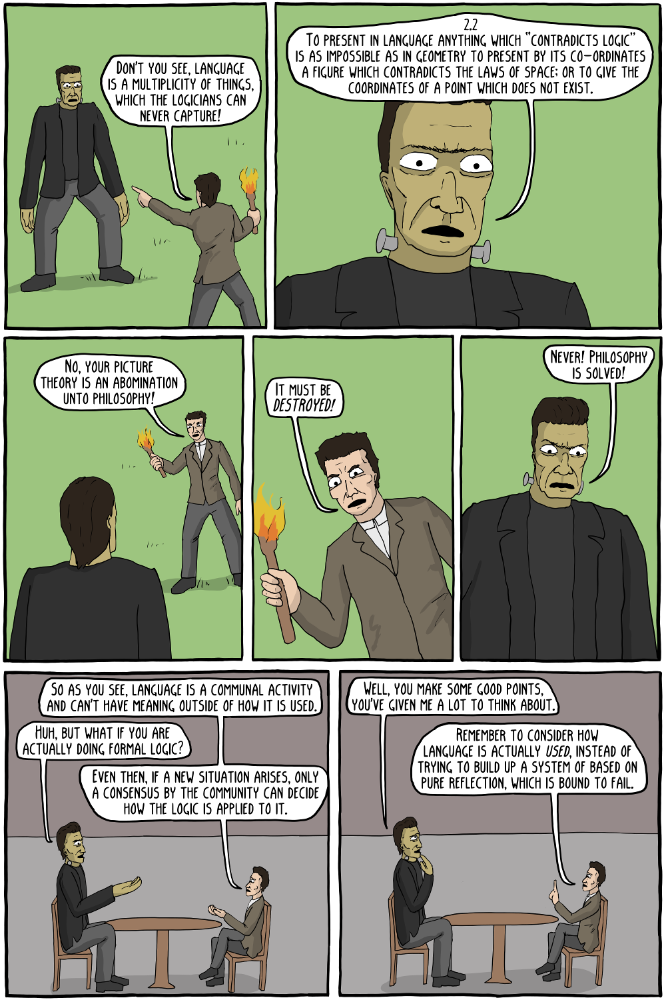](https://existentialcomics.com/comic/117)

Of course, the classic novel "Frankenstein" was written by Mary Shelley, who was Mary Wollstonecraft's daughter. Ludwig Wittgenstein is famous for writing the "Tractatus Logico-Philosophicus". In his later lectures, Wittgenstein came to disagree with his past work. His rebuttal can be found in "Philosophical Investigations", which was translated to English by G.E.M. Anscombe and first published after Wittgenstein's death.

"The Hegel Myths and Legends" by Jon Stewart et al, contains essential supplemental readings for those who have read or plan to read Bertrand Russell's "A History of Western Philosophy" or Karl Popper's "The Open Society and Its Enemies", among many other English-language discussions of Georg Wilhelm Friedrich Hegel.  Debunking the myths and legends that surround the Anglo-Saxon interpretations of Hegel can make for some interesting reading otherwise, if one is so inclined.

For an alternative to Russell's history, I recommend "The Great Conversation: A Historical Introduction to Philosophy" by Melchert and Morrow.  While Karl Popper's writing is essential reading in the philosophy of science, sometimes there is an attitude that Popper "solved" the philosophy of science, which I could not disagree more with.

[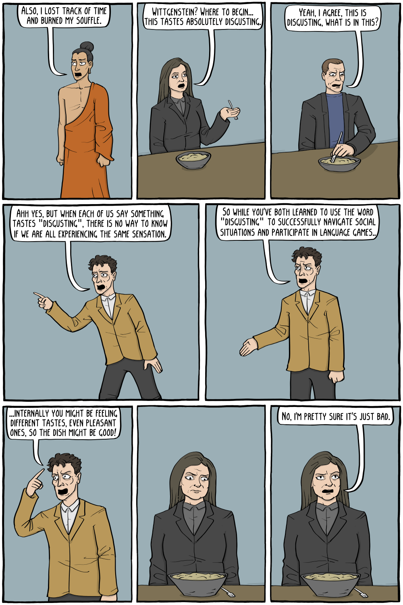](https://existentialcomics.com/comic/405)

The joke's on Existential Comics, I want types and dimensional analysis early and often in elementary math education!  Specifically, I want simple, concrete examples of types, such whole numbers, fractions, Cartesian coordinates, and units of measurement. I want simple, concrete examples of dimensional analysis, such as length, position, area, volume, ratios, and rates of change. I want demonstrations and discussions of how these ideas inform problem solving heuristics. I also want some of that analytical philosophy as well... later.

## Suggestions for studies in Religion and Moral Philosophy:

[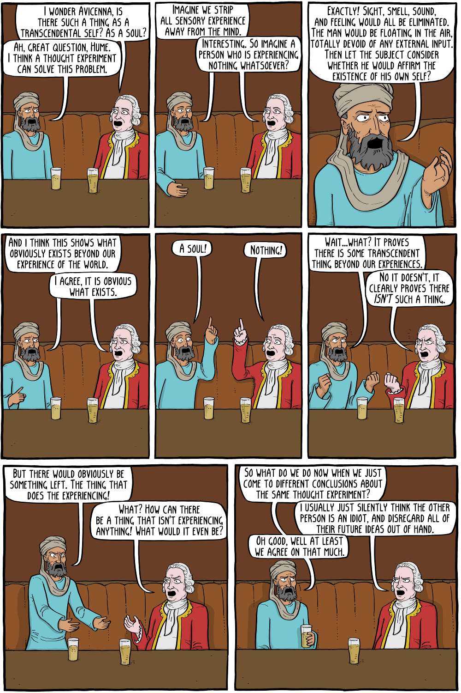](https://existentialcomics.com/comic/267)

I'm pretty sure Leibniz's answer is "monads".

> Never forget in the story of Jesus, the hero was killed by the state
>
> - Dick Gregory, via Killer Mike, in "Walking in the Snow", on "Run The Jewels 4"

I believe in the profoundly creative potential of taking two or more things that may initially seem to be contradictory, and instead of dismissing the combination outright, lean in to the contradiction and treat it like a riddle. You may come to believe that these two things aren't actually contradictory. Once in a while, you may even discover that these apparent contradictions are actually two sides of the same coin, and that there is insight to be gained by more deeply understanding their nuance and their interaction.

Numerous variations on this idea have existed and recurred in many human societies throughout history: examples include the Yin and Yang of ancient Chinese philosophy, Heraclitus's principle of opposites in ancient Greek philosophy, Janus, the Roman two-faced god of endings and beginnnings, the illuminated poetry of the English artist William Blake, and the philosophies of Fredrich Hegel, Nels Bohr, Bertrand Russell, and Paul Feyerabend among many others.

I believe that moral philosophy has an analog of Imre Lakatos's mathematical philosophy of "Proofs and Refutations".
I believe that there exist analogous notions for "evidence", "proof", "refutation", "counterexample", "inconsistency", and "truth" in morality. I believe it's self-evident that judging the plausibility of a moral argument can be (and often is!) quite different from judging the plausibility of an informal mathematical proof. I believe it's similiarly self-evident that interpreting the practical consequences of a moral argument can be quite different from interpreting the practical consequences of a mathematical argument. Yet, I still believe this analogy is useful, and often deeply insightful.

I hope that you will grow to appreciate some of the many contradictions that can be found from browsing the materials I reference, both inside and outside the category of "religion and moral philosophy".

[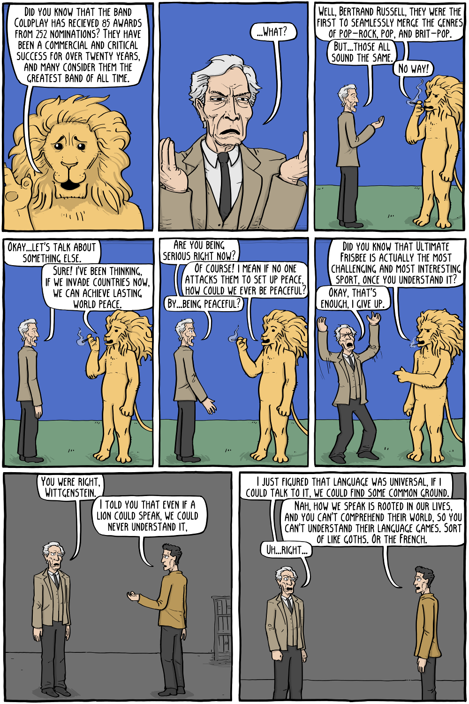](https://existentialcomics.com/comic/245)

1. The Good Place, created by Michael Schur

   I was raised in the Church of the Brethren, which claims Alexander Mack as a founder and early leader. From what I understand of Mack's worldview and theology, I believe that he would be delighted by "The Good Place".
   * We need more optimistic, non-dystopian fiction, like the original Star Trek.
   * See "Ted Lasso", compare to Monty Python's "Philosophers' Football Match"
   * See "Manifest"
   * https://www.jacobinmag.com/2022/04/parks-and-recreation-good-place-how-to-be-perfect-michael-schur-book-review

[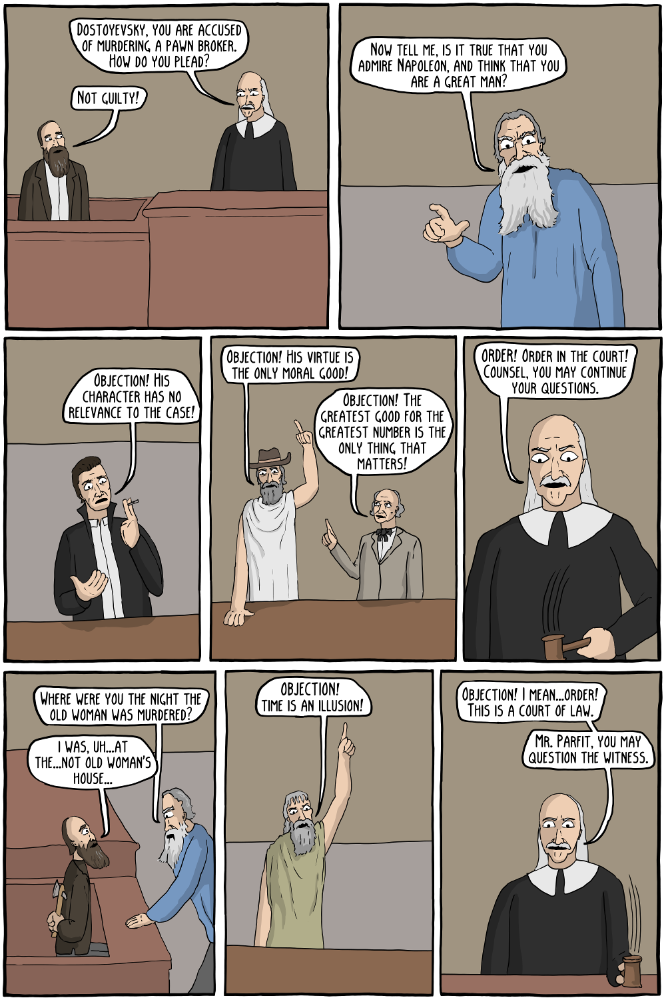](https://existentialcomics.com/comic/107)
[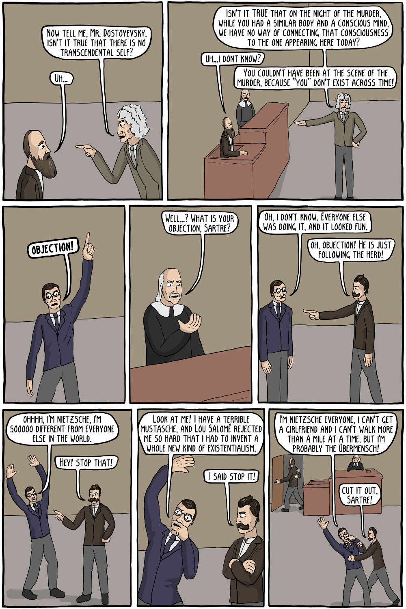](https://existentialcomics.com/comic/107)

2. Царство Божие внутри вас (Лев Николаевич Толстой) ([epub](external-assets/Leo_Tolstoy/RU/%D0%A6%D0%B0%D1%80%D1%81%D1%82%D0%B2%D0%BE_%D0%91%D0%BE%D0%B6%D0%B8%D0%B5_%D0%B2%D0%BD%D1%83%D1%82%D1%80%D0%B8_%D0%B2%D0%B0%D1%81_(%D0%A2%D0%BE%D0%BB%D1%81%D1%82%D0%BE%D0%B9).epub), [wikisource](https://ru.wikisource.org/wiki/%D0%A6%D0%B0%D1%80%D1%81%D1%82%D0%B2%D0%BE_%D0%91%D0%BE%D0%B6%D0%B8%D0%B5_%D0%B2%D0%BD%D1%83%D1%82%D1%80%D0%B8_%D0%B2%D0%B0%D1%81_(%D0%A2%D0%BE%D0%BB%D1%81%D1%82%D0%BE%D0%B9)))

   The Kingdom of God is Within You, by Leo Tolstoy ([epub](external-assets/Leo_Tolstoy/EN/The_Kingdom_of_God_is_Within_You.epub), [txt](external-assets/Leo_Tolstoy/EN/The_Kingdom_of_God_is_Within_You.txt.gz), [wiki](https://en.wikipedia.org/wiki/The_Kingdom_of_God_Is_Within_You))

   I have been deeply exposed to the philosophies mentioned and advocated in this book, and for that I am profoundly grateful. This is a difficult and challenging book, and that is a signficant part of the reason I suggest it.
   * See also: [MCC and National Socialism](https://mcc.org/media/resources/10441)

[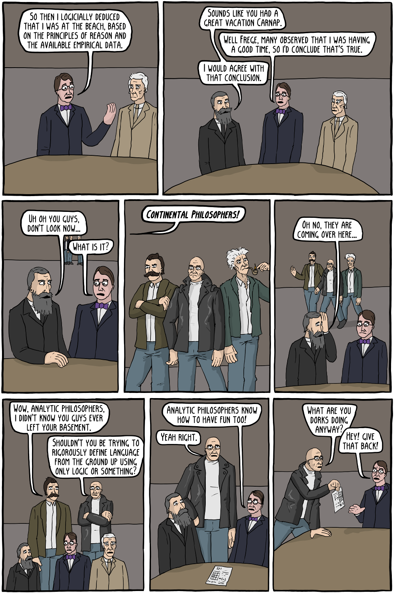](https://existentialcomics.com/comic/146)

3. [Tolerance is Not a Moral Precept, by Yonatan Zunger](https://extranewsfeed.com/tolerance-is-not-a-moral-precept-1af7007d6376)

   Best counterpoint I know of to "The Kingdom of God is Within You", I like to re-read this short, thoughtful and informative essay every few years.

4. The Universal Christ, by Richard Rohr

5. Faith Unraveled: How a Girl Who Knew All the Answers Learned to Ask Questions, by Rachel Held Evans

6. Don't Label Me: An Incredible Conversation for Divided Times, by Irshad Manji

7. Sojourner Truth: A Life, A Symbol, by Nell Irvin Painter

8. Martin Luther King, Jr. on Leadership, by Donald T. Phillips

9. A Sin By Any Other Name, by Robert W. Lee
   Bernice King calls this book a love letter to the church and to the South. I am honored to make Robert W. Lee's important testimony part of this study guide, which I intend as a pandemic love letter to Science, Faith, Reason, and Humanity.

10. The Third Reconstruction, by The Reverend Dr. William J Barber II

11. The Uncommon Knowledge of Elinor Ostrom, by Erik Nordman

12. Dorothy Day: The World Will Be Saved by Beauty, by Kate Hennessy

13. Accidental Saints: Finding God in All the Wrong People, by Nadia Bolz-Weber

14. Anarchy Evolution: Faith, Science, and Bad Religion in a World Without God, by Greg Graffin and Steve Olson

    Greg Graffin is a scientist, philosopher, and lead vocalist of the punk rock band "Bad Religion". He is also a faithful athiest, and is very respectful of belief. Chapter titles include "The False Idol of Natural Selection", and "The False Idol of Atheism". Perhaps someday I'll try to write a personal take on "The False Idol of Belief in God".

    Greg Graffin certainly has been a minister to this Marginal Mennonite over the years. I have long appreciated his punny lyrics, intelligent wordplay, and humanistic outlook. I wasn't aware of this book until after I had largely finished my sermon on rational approximation, yet it is easy to find many instances of convergent "evolution" of thought and thesis. I was occasionally bored with Graffin's experiences as a rock star, but then I found the perspective on the death of Dan Bradbury and the album "Into the Unknown" to be very interesting, so thank you, Dr. Graffin, for your honesty.

15. Why I am an Athiest Who Believes in God, by Frank Schaeffer

16. The Better Angels of Our Nature: Why Violence Has Declined, by Steven Pinker

17. Words that Hurt, Words that Heal: How the Words You Choose Shape Your Destiny, by Joseph Telushkin

    I attended a lecture of Rabbi Teluskin's many years ago, and several of his lessons from his lecture and from his books have carved a way into my heart. For that I am both a better person and profoundly grateful.

18. Why Won't You Apologize?: Healing Big Betrayals and Everyday Hurts, by Harriet Lerner Ph.D.

19. How to Have an Enemy: Righteous Anger and the Work of Peace, by Melissa Florer-Bixler

20. Confronting Christofascism, by Carolyn Baker

21. Jesus and John Wayne, by Kristen Kobes Du Mez

22. Pipestone: My Life in an Indian Boarding School, by Adam Fortunate Eagle

23. Education for Extinction: American Indians and the Boarding School Experience, 1875-1928, by David Wallace Adams

24. An Indigeneous Peoples' History of the United States, by Roxanne Dunbar-Ortiz

25. A Theory of Justice, by John Rawls

26. What We Owe to Each Other, by T.M. Scanlon

27. Love is the Way: Holding on to Hope in Troubling Times, by Bishop Michael Curry

28. Persuade, Don't Preach, by Karen Tibballs

29. A Call to Friends: Faithful Living in Desperate Times, by Marty Grundy

30. Theory for Religious Studies, by William Deal and Timothy Beal

   I found both a degree of solace and a writing voice in both William Deal's and Timothy Beal's classes on religion and comparative ethics at Case Western Reserve University, in which I occasionally trialled arguments that informed my sermon on rational approximation and this study guide. I bought this book as I was broadening my literature search, and it turned out to be unexpectly very useful. I had considered using the word "simulacrum", but when researching the cultural context surrounding this word, decided against it, in part to my difficulty understanding the basics of Jean Baudrillard. This book was invaluable to the reversal of that decision.

[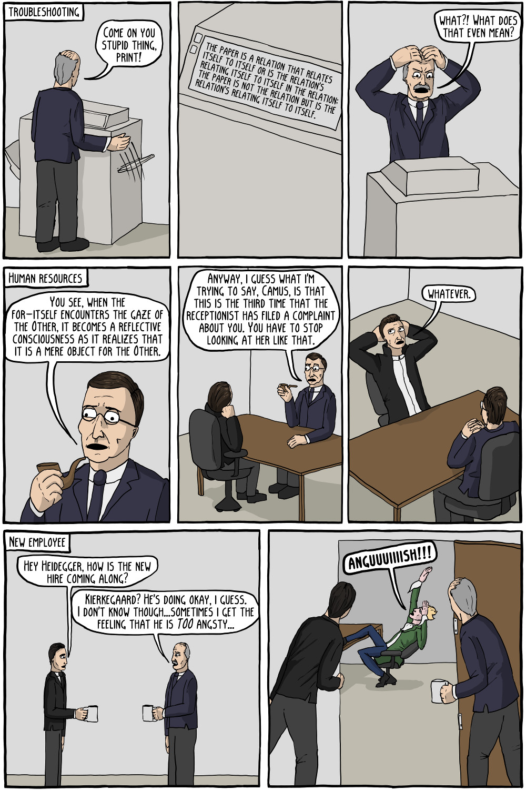](https://existentialcomics.com/comic/79)
[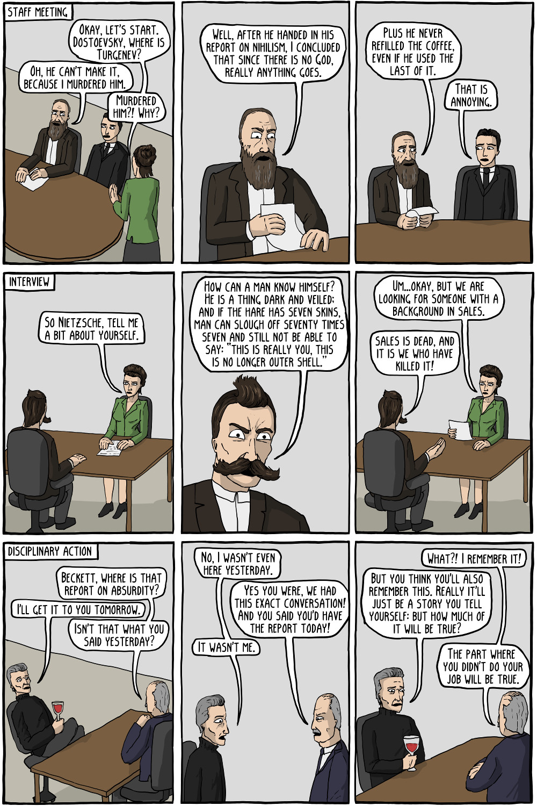](https://existentialcomics.com/comic/79)
[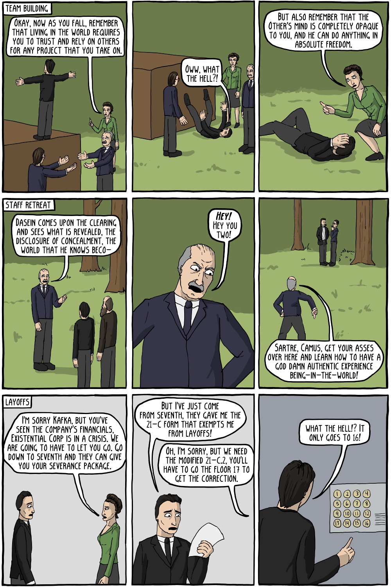](https://existentialcomics.com/comic/79)

Mathematicians are a flock of odd birds. Does that make existential philosophers a herd of cats?

[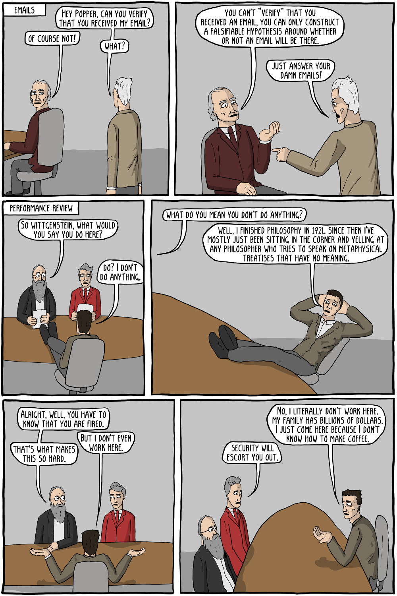](https://existentialcomics.com/comic/89)

# Navigation

[Part 3: an Aggregate Theory of Concrete Mathematics](./Part03_Aggregate_Theory.md#suggestions-for-further-study)

[Part 4: Physics and Metaphones](./Part04_Physics_and_Metaphones.md#physics-and-metaphones)

[Part 5: an Invitation to the State of California](./Part05_an_Invitation_to_the_State_of_California.md#an-invitation-to-the-state-of-california)

[Author Bio](./Part05_an_Invitation_to_the_State_of_California.md#author-bio)

[Bibliography](./Bibliography.md)

[Part 1: Global Suggestions](./An_Aggregate_Theory_of_Concrete_Mathematics.md#tools-of-math-construction)

[Part 2: Deconstructing Bertrand Russell](./Part02_Deconstructing_Bertrand_Russell.md#deconstructing-bertrand-russell)

[^proofsandrefutations_logic]: Ever notice the intuitionalistic logic joke on page 47 of "Proofs and Refutations", near where footnote 60 is cited in the section "proof analysis and global counterexample"?

[^iep-paraconsistent]: see for example, the Internet Encyclopedia of Philosophy's article https://iep.utm.edu/para-log/, for a discussion of weak paraconsistency. Every part of this conjecture seems to be reasonably widespread in the mathematical and computer science communities; but I'm not specifically aware of anybody else who has rolled these parts up into a singular name, which I feel is overdue. My interactions with J. Michael Dunn, along with Larry Moss, Guo-Qiang Zhang, David Singer, Amr Sabry, and Steven D. Johnson informed my current view of this niche topic.

[^proofsandrefutations_gas]: footnote 35, page 31, "Proofs and Refutations". Note however that in context of something like the Principia Mathematica, where numbers are defined in terms of logic, Russell's proof might well have more content that is welcome than I currently appreciate.

[^computer_bugs]: I have no real difficulty imagining that there is a software behavior that can accurately be described as "morally, we assumed/implied 1=2 and because of that, our software conflated the identites of two distinct individuals without further evidence". However, this sounds like a software bug, not a feature of sound reasoning!  At the very least, it would seem a rather atypical feature of a useful method of formal reasoning, even if it could be sound reasoning in some unknown, possibly exotic context.

[^againstmethod_paraconsistent]: footnote 1, chapter 1, page 8, "Against Method"

[^hamkins]:  see e.g. Chapter 1 p 18 in "Lectures on the Philosophy of Mathematics" by Joel David Hamkins

[^carnap_intro]: See e.g. part 4 "Causality and Determinism" of "An Introduction to the Philosophy of Science" by Rudolph Carnap

[^pearl_causality]: See e.g. "Causality: Models, Reasoning, and Inference" by Judea Pearl

