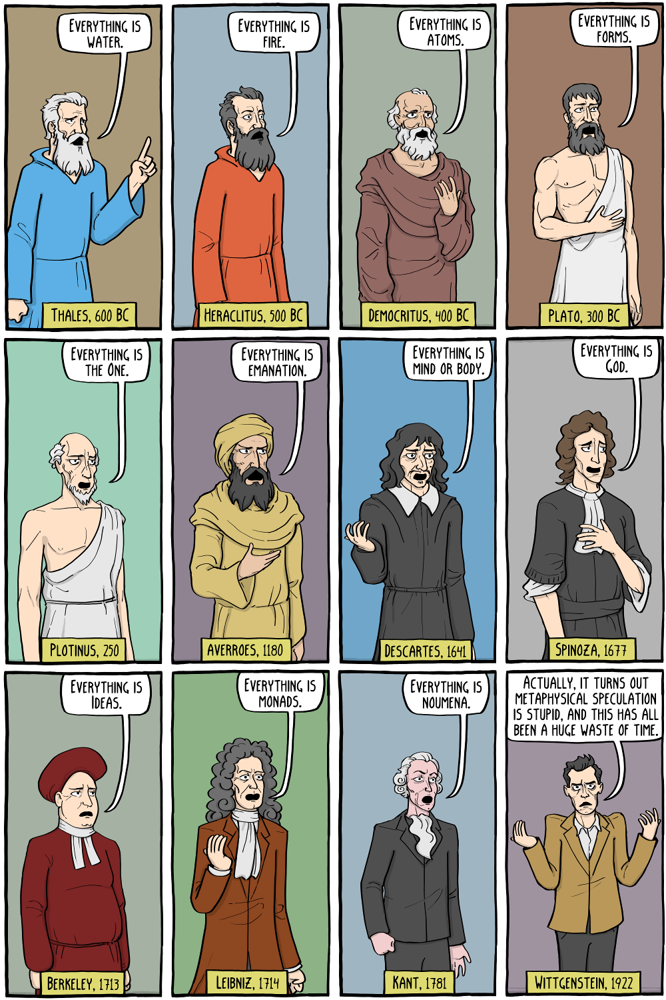
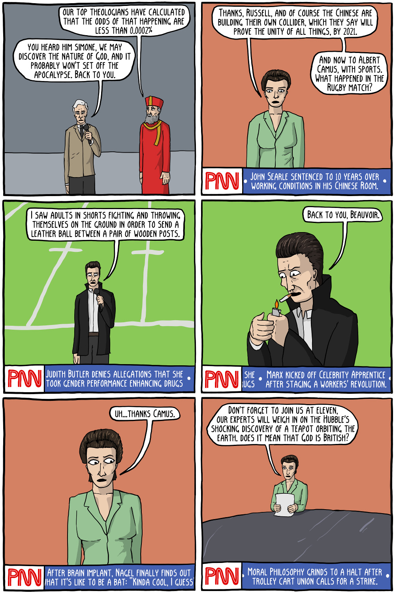
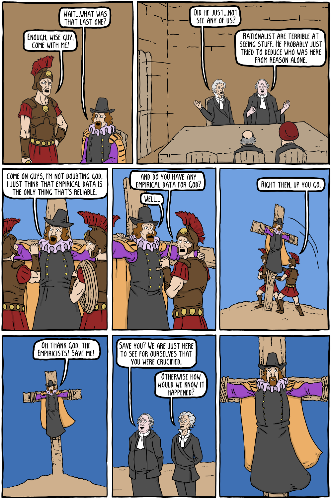
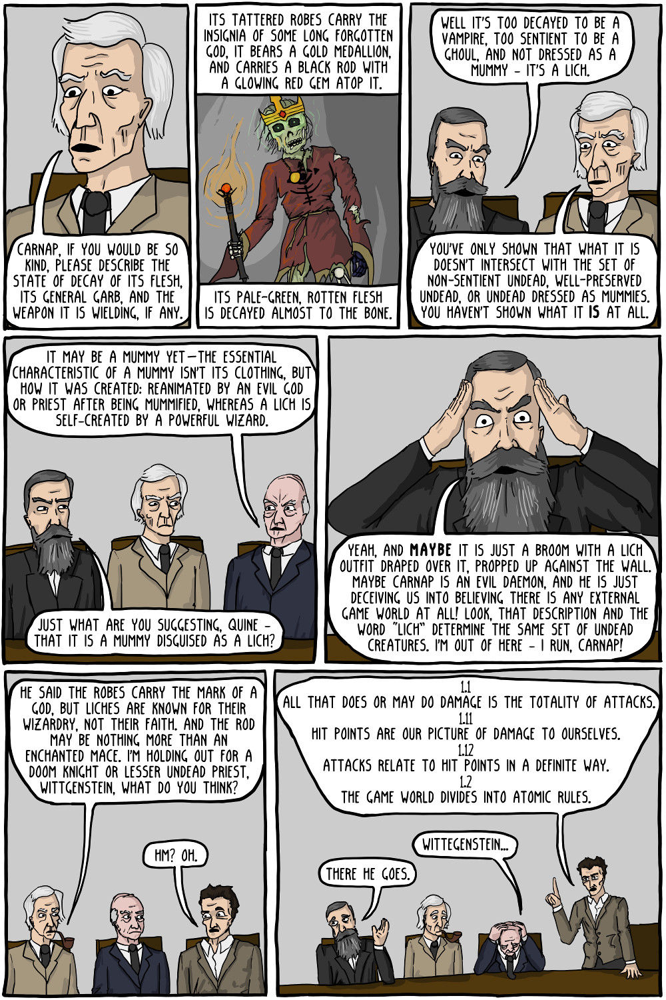
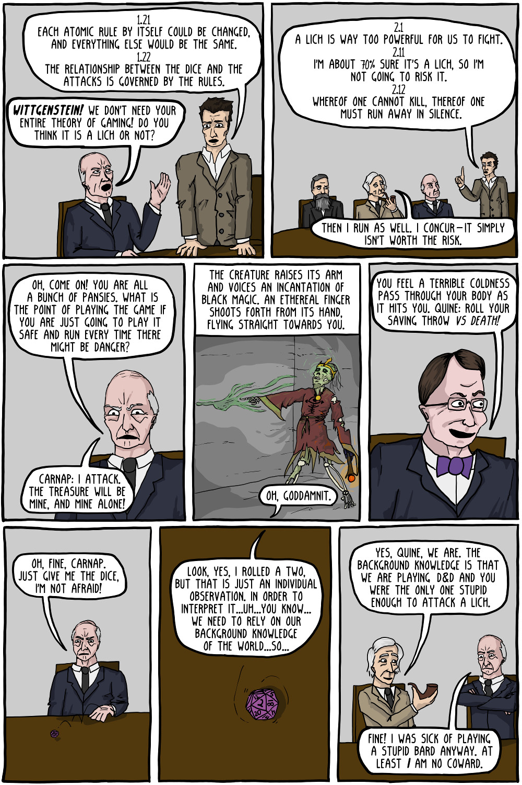

## Physics and Metaphones

In an essay that is constantly using a cartoons of Wittgenstein as frequent comic relief, it would be remiss to fail to respond to this comic by mentioning Hugh Everett, one of the truly great metaphysical philosophers of the 20th century. He first formulated the many-worlds interpretation of a quantum multiverse as a possible alternative to the Copenhagen interpretation.

Understanding the linearity of quantum mechanics is key to gaining insight into these alternatives: if quantum mechanics is perfectly linear, then no experiment will ever distinguish between the multiverse and the Copenhagen interpretation.  Hugh Everett will forever remain a remarkable metaphysical philosopher, a legend for asking a very remarkable question that would unfortunately be totally unanswerable from our perspective in this universe.

On the other hand, if there does in fact exist a non-linear quantum effect, and if we learn how to observe it, then someday we might be able to empirically distinguish between the quantum multiverse and the Copenhagen interpretation.

In the case that the quantum multiverse has an observable reality to it, then theory seems to require a corresponding non-linear quantum effect that we can observe.  If someday we develop the ability to experimentally demonstrate such an effect, Hugh Everett could turn out to be much more than a notable metaphysical philosopher, Hugh Everett would have laid the foundation for a rather remarkable scientific theory with uncanny explanatory value on par with Einstein's Relativity.

Of course, relatively plausible conceptions of a quantum multiverse looks nothing like most depictions of multiverses in science fiction. Jorge Luis Borges' short story "The Garden of Forking Paths" is a popular one that does reasonably well in this regard, but doesn't explicitly use the word "multiverse".  William James first coined the word, though James' used "multiverse" for an unrelated philosophical concept, not as a possible description of the physical universe.  The DC Multiverse, Sliders, Rick and Morty, Fringe, and Philip K Dick's novel "The Man in the High Castle" are all examples of highly implausible pop-culture depictions of a quantum multiverse.

In a many-worlds interpretation, every timeline would be constantly branching and spawning countless sub-timelines, with limited (if any) ability for parallel timelines to interact with each other at macroscopic scales. The nature of the possible interactions would be determined by the precise nature of our hypothetical non-linear quantum effect. If there is an empirical reality to this idea, it seems implausible (and likely unproductive!) to assume that arbitrary interactions are possible. For example, we probably couldn't travel to a parallel timeline, though perhaps we could build a metaphorical telephone to "communicate" with some of them.

If we can interact with parallel timelines, then it seems wise to start by assuming that we can only interact with timelines that are somehow "near" to us, and not those that are "far". Our current best guess suggests we would be able to empirically interact only with those timelines that are decohering away from the experiment. In this scenario, managing to open a communications channel to a parallel timeline wouldn't seem to be overly useful for exploring alternative histories the way many science fiction writers would like to do.  Whomever you are communicating with should have perceived the exact same timeline, up until the moment the experiment started.

However, even this is probably too much, our "interaction" with the multiverse might only be able to be detected as a strange statstical anomaly largely confined to the nanoscopic world of quantum phenomenon. Still... detecting that would be a truly remarkable accomplishment.

Alternatively, if the observed non-linear quantum phenomenon supports a theory closer to the Copenhagen interpretation, then warp drives and time travel might be legitimate possibilities. So yes, it certainly seems possible that we could actually be living in a Star Trek universe. Keep in mind that possible does not imply practical, let alone sufficiently practical to enable economies based on the interstellar trade of material goods. Honestly that fantasy commonly found in science fiction does seem rather implausible to me.

Among the theoretical possibilities in this category is a idea known as Objective Collapse Theory. But I am an armchair cosmologist, and not a real physicist, though I just missed earning a physics minor at Case Western. I'm simply summarizing what I've gleaned largely from Matt O'Dowd and PBS Space Time. I suggest paying attention to him, as he takes a far more consistent interest in these issues. Not to mention that on these mattters, he is already far more knowledgable than I.

So, could any or all of these theories contain elements of whatever it is that is ontologically real?  Each individual theory seems implausible, but stranger things have happened.

> When I was young my father said to me: "Knowledge is Power... Francis Bacon"
>
> I understood it as "Knowledge is power, France is Bacon".
>
> For more than a decade I wondered over the meaning of the second part and what was the surreal linkage between the two? If I said the quote to someone, "Knowledge is power, France is Bacon" they nodded knowingly. Or someone might say, "Knowledge is power" and I'd finish the quote "France is Bacon" and they wouldn't look at me like I'd said something very odd but thoughtfully agree. I did ask a teacher what did "Knowledge is power, France is bacon" mean and got a full 10 minute explanation of the Knowledge is power bit but nothing on "France is bacon". When I prompted further explanation by saying "France is Bacon?" in a questioning tone I just got a "yes". At 12 I didn't have the confidence to press it further. I just accepted it as something I'd never understand.
>
> It wasn't until years later I saw it written down that the penny dropped.
>
> [Lard_Baron](https://franceisbacon.com)

This joke is based on the fact that "France is bacon" is a homophone of "Francis Bacon". When audibly verbalized in English, it's easy to confuse one phrase for the other, especially if spoken quickly. Of course, the usual interpretations of "Francis Bacon" and "France is bacon" are sufficiently far apart in English that most people with any awareness that Francis Bacon was a man will automatically choose the correct interpretation based on context, and will often do so unconsciously.

The auditory pun is analogous to the type of low-level miscommunications studied by Claude Shannon and Warren Weaver in "The Mathematical Theory of Communication". Shannon's theory doesn't deal with the semantic issues of whether or not the message sent is syntactically correct, and whether or not the message recieved has the intended effect or not. These higher-level issues as applied to natural language are Wittgenstein's "Philosophical Investigations", and in terms of computer protocols, are critically relevant to any holistic philosophy of communications system design.  But Shannon wasn't aiming to solve these issues, but rather to build a foundation on which these issues can be solved.

Shannon's Theory of Communcation seeks to understand the issues and design space surrounding the transmission and reception of abstract symbols.  These symbols could be a string of bits, or an analog audio signal, or a sequence of words such as an English sentence. After the symbol is modulated, the transmission process adds noise to the signal, and then the demodulation process reconstructs some approximation of the original signal for the receiver of the message.  Shannon's work is a classic look at the fundamental limitations this overall modulation-transmission-demodulation process, and is relevant to the study and engineering of modems, radios, TV and more.

One primary use case for Shannon's theory is to investigate the probability of a message being received correctly as the intended symbol.  The "France is bacon" homophone can naturally be modelled as a failure of the type that modern communication engineers should seek to avoid at nearly any cost.  We shold want to engineer these kinds of homophones out of our communication system entirely.  Of course, these can always creep back in despite our best efforts:  for example, if you are video conferencing with a friend on the other side of the world, and they say "Francis Bacon", the computer isn't going to stop you from interpreting that as "France is bacon", in fact the compter is very likely going to be oblivious to that nuance of communication.

A communications channel is sort of like a noisy room. If you are having difficulty being understood, you can talk louder, increasing the power and amplitude of the signal, and possibly raising the noise level experienced other conversations in the room. Or you can move to a quiter room, decreasing the power and amplitude of the noise.  Both these steps improve the signal-to-noise ratio of the communications channel, and improve the likelihood of communicating successfully.

A third option is to use an error correcting code (ECC), which encode redundancy into the message. This increases the probability of the successful communication of an abstract symbol or idea, or at least increases the possibility of detecting when miscommunication is likely to have occurred.  This increases the effective signal-to-noise ratio of the overall communications system without increasing the amplitude of the signal, or reducing the noise of the channel. And in doing so, it also constructs a foundation on which Wittgenstein's higher-level issues as they apply to computer communications protocols can be addressed.

I find it very interesting that natural languages, have evolved highly imperfect error-correcting codes through grammatical redundancy. It is far from perfect, and from the perspective of ECC codes used in the physical layers of communications, storage, and QR codes, these natural-language error correcting schemes are positively unworkable. Yet these natural-language solutions are surprisingly effective, most of the time, and I suspect this was unappreciated and overlooked by James Cooke Brown when he invented Loglan, which attempted to engineer a natural language. Conversely, attempting to model the very high-level semantic error correcting schemes that occurs in natural-language communications is far more difficult and tricky to formally model than the computer-to-computer error correcting codes.

When communicating a string of bits between two computers, a modern communication system that employs error-correcting codes can all but eliminate the "France is Bacon" type of low-level miscommuncation due to random noise. Random noise can most certainly prevent communication from occurring. However, if the communication protocol uses a good strong error correcting scheme, random channel noise cannot plausibly cause a low-level miscommunication.

You can protect the channel from malicious noise by adding a message authentication code or cryptographic signature at the cost of about 16-32 bytes per message. Then, with many supporting assumptions and further analysis, we might be able to plausibly hope that even an intelligent attacker adding noise to the communications channel will be unable to cause a miscommunication, even if we decline to obscure the plaintext of our messages.

It's very important to notice that I'm not talking about encryption here, I'm talking about authentication. They are orthogonal concepts. You can have one, the other, both, or none. In fact, operating with authentication but specifically without encryption is one of the key enabling ideas behind blockchains. In the next few paragraphs, I will provide a quick conceptual overview of cryptographic signatures.

When you, as a computer user, get started with digital signatures, the first thing the computer (or hardware token) will do for you is pick a private key. From the perspective of mathematical correctness of the digital signature algorithm, the private key can be anything. From the perspective of operational security, the private key really needs to be chosen securely using cryptographically secure (pseudo-)random methods. That's why the computer does it for you.

The public key is then derived from the private key. The public key can then be shared with whomever you like, even if you wouldn't trust that person with your private key.  You should not ever share private keys with anyone or anything without first thinking very carefully about an answer to one of the two questions: "Why not two seperate private keys?", or "By publishing this private key, do I want to wreck the ability of the corresponding public key to authenticate the provenance of any of its signatures, even those signatures that have already been created?"

Or, you can keep your public key to yourself, and then only you can verify any signatures you produce with your private key. You need the public key to verify a signature, but you need the private key to create a signature.  Do not forget that a message with a valid signature does not inherently mean the message is "more authentic"! Rather, a valid signature connects the provenance of the message to the public key, nothing more, and nothing less.  Anybody who wants to understand the provenance of a properly signed message must investigate and understand the provenance of the corresponding public key.

In th realm of blockchain,  when you "send" cryptocurrency to another person, you are metaphorically signing a check and then publishing it to the entire world.  The recipient line of the check is another public key, which is then recognized by others as being authorized to sign another check for the same amount to other public keys.

Sometimes the sharing of a public key is totally under the control of software. For example, if you are using a FIDO U2F token, then the public key is automatically shared with the authentication server you are enrolling the token in. This does seem a perfectly natural fit to the intended purpose, but sometimes users do need to be able to manage these details themselves, and sometimes software makes that very difficult to accomplish.

However, solving these two particular low-level problems, while both amazing foundational bits of technology in and of themselves, is not a holistic foundation for a communications system.  For that we also need to delve into the semantics and effectiveness of the application-layer communication protocols.

These high-level breakdowns in the overall communications protocol can most certainly have safety engineering implications.  A relevant case study is the Clayton Tunnel rail crash of 1861, where an unusual and anomalous situation involving concurrency and the state of the tunnel lead to an inability for the watchmen and signal operators to communicate effectively via an early needle telegraph. This in turn lead to the unsafe operation of the tunnel, which was a contributing factor in a fatal train crash.

Alhough modern error correcting codes are capable of all but eliminating homophones in the physical communication layer, both design and implementation bugs can reintroduce homophones into the overall system. This can happen at any and all levels of the overall system, from the physical layer, to the application layer, to the users themselves.

For example, if you are video chatting with your friend and they say "Francis Bacon", the computer can't stop you from interpreting that in your mind as "France is bacon". In fact, the computer probably won't ever know, let alone care. On the other hand, there exist homophones that computers hear and that humans don't, and these very often lead _injection vulnerabilities_, which are sometimes also known as a _shellcode vulnerabilities_.

For example, consider a network server written in C. Undefined behaviors latent in the C code often lead to buffer overflows. Buffer overflows often create highly non-obvious homophones. Those homophones often enable an attacker to inject their own machine code into the server's process memory. This machine code can corrupt the server, and convince the server to take an action it has the privileges to perform, but the attacker does not. This escalation of privilege is the classic scenario of the confused deputy problem.

I assure you that today, the exact day that you personally are reading this sentence, the world will discover many untold thousands of latent buffer overflows, and perhaps we will create twice as many more.  C might well be the Stern-Brocot tree of buffer overflows!  Some will invite an engineering response and receive a fix. A select few make international news, if the vulnerabilities uncovered are severe enough, and the vulnerable code is popular enough.

Many, however, are very likely to simply be ignored, especially because that is actually not an entirely irrational course of action in certain types of larger, highly dysfunctional IT situations that themselves are depressingly altogether too common.

Notice that even though this is a injection of machine code, neither the machine code itself nor the design of the assembly language can possibly be directly responsible for introducting the homophone. Rather these homophones are caused by undefined behavior in C. At this point, I know that many will then sneer, "well then, don't do undefined behaviors in C", well, I do very much try hard not to, believe me! At the very least, undefined behavior is itself one of the primary causal factors, if not the singular primary causal factor, of this particular kind of homophone.

On the other hand, the design of the assembly language does exert causal effects on the resulting vulnerability. Thus it is a causal factor of the injection vulnerability, even if it cannot possibly be the sole primary causal factor of the homophone that enables the injection.  The situation is similar with respect to the implementation of the CPU that interprets the resulting machine code, and the design of the C programming language,

Any one or all of these factors can dramaticatically change the severity of the vulnerability for the better or worse, and this intricacy is why the result of undefined behavior is practically impossible for most humans to predict.  All of these factors are relevant to the nature of the vulnerability, even if only a few of them could possibly be a primary causal factor in the existence of a vulnerability.

Thus, nearly anything can be implicated in an injection vulnerability, even if there must exist another causal factor. A recent high profile Minecraft security vulnerability was caused by an injection in Log4J's formatting function. Log formatting injections are uncommon, but far from unknown, and have created security bugs in more than one Intrusion Detection System.

XKCD's "Little Bobby Tables" references SQL injection, though I disagree with the recommended solution. "Sanatizing inputs" suggests to me that you should examine the data to determine if it would be a homophone before you send it to the database, which is silly. Properly quoting or framing data values to ensure they are correctly interpreted in their entirety and cannot spill over into something else is a far better solution.

It's far more robust to prevent values from ever creating homophones, whether the quoting is achieved by substituting special characters with escape sequences as necessary, or by framing the message as a length-delimited string of bytes, or via other means. Any reasonable database access library supports this exact use case.  Any good database access library makes this approach the natural and easy and obvious thing to do.

Then there are JavaScript injections, CSS injections, HTML injections, HTTP injections, and much much more.  Historically, phone phreaking relied a great deal on control tone injections. All of these vulnerabilities have a highly relevant homophone somewhere in the causal factors. And yet we've barely scratched security vulnerabilities, not all of which are injections. Yet there are plenty of ways that a communications system can break down, even outside the realm of security vulnerabilities.

There are many engineers working on or with application-layer communications protocols, who aren't even aware that these concerns are very much entailed by their job responsibilities, tasks, and goals.

Most of these application-layer engineers need to know little, if anything about Shannon's theory. They might need to understand how to use the modem correctly, they don't need to know exactly how it works.

However, all abstractions are leaky, and it's pretty much always true that understanding certain things about the implementation allows you to make use of it far more effectively than you could otherwise, even while staying within the confines of the abstraction.

For example, a really good application engineer might need to know about how their usage of network communications impacts the modem's power consumption, so they can implement their application in such a way that extends battery life.

A really good systems-level communications engineer might need to understand if the modem uses any error-correcting codes, and if so, how effective they are in catching data corruption and how those conditions are signalled.

But let's be honest, a bit of additional sanity-checking built into the application layer adds a great deal of resilience to the overall system, even if your modem has excellent error detection and correction.

A really good communications engineer probably needs to understand a high-level overview of the _queueing discipline_ that a modem uses to send and receive data.  Ethernet has a more complicated queuing discipline than say, RS-232 serial communications.

WSPR is an example of an amateur radio protocol that imposes a highly unusual queueing discipline. It provides an ultra-low power, ultra-long range, many-to-one/one-to-many unidirectional beacons.

There's a WSPR timeslot every two minutes, synced to UTC. During each timeslot you can either transmit or listen. If you spend the slot listening, you are likely to hear a lot of other people who are transmitting. If you spend it transmitting, you are likely to be heard by a lot of other people who are listening. You shouldn't be transmit more than a few beacons per hour.  Although sending a beacon requires constantly transmitting a very low-power signal for nearly the full two minutes, the beacon itself contains only 50 bits for data, with no room in the message for arbitrary data. It is primarily intended to test and monitor the constantly changing propagation characteristics of the Earth's atmosphere.

WSPR includes a large proportion of redundant error-correcting bits to make this work. Assuming that there are no bugs in your receiver, you can be extremely confident that nothing your WSPR modem reports has been corrupted by random noise.  When a WSPR beacon is heard by a computer, the computer then sends a report to a server on the internet. The report includes the content of the WSPR beacon, along with when and where the beacon was heard, and how strong the received signal was.

The designer of WSPR, Joe Taylor, is rather famous for WSJT.  This fascinating suite of radio protocols are all specifically optimized for esoteric propogation modes.  For example, FT65 is well suited to Moonbounce EME communication, where two radio operators exchange greetings with each other by bouncing a radio signal off the surface of the moon.

The WSJT protocols are all superbly designed by modern standards of holistic communications systems design.  Two radio operators using these protocols can greet each other on the air in such a way that both operators can be left confident that a greeting has been exchanged without being corrupted by noise or partial failure.

The exact nature of the consensus provided by FT65 is very weak, but it happens to fit the use case perfectly: it should be highly likely that both operators agree that an exchange has (or has not) taken place. It should be unlikely that one operator believes that an exchange has taken place, and the other does not

Solving the Two Generals Problem builds a stronger form of consensus: here, two cooperating parties need to come to an agreement whether or not a specific message in the conversation has been successfully communicated. The difference is subtle but profound, and represents a substantial step up in engineering difficulty.

Dealing with the Two Generals Problem is one of most common practical challenges of constructing a high-quality system involving concurrency and state. The Two Generals Problem also arises in fault-tolerant systems that attempt to be resilient in the face of partial failures, where one or more components of the system fails, but other parts keep going. This problem is way more subtle than many professional engineers realize.

In fact, it's technically impossible to solve the Two Generals Problem in any deterministic, guaranteed way. Only probabilistic solutions are possible. This much is well known, even if it also deserves to be more widely known. The part that is exquisitely subtle, more subtle than commonly appreciated, is the actual process of constructing an application that can reliably rebuild consensus once communications resume.

With annoying regularity, practical systems get stuck in states in which human intervention is required in order to restore consensus. Oftentimes recovering from these scenarios is just a reboot or two away, but the frequent failure of engineers to appreciate the subtleties of the Two Generals Problem is a causal factor in many of these scenarios. Sometimes these problems persist across reboots, requiring deeper human intervention.  Sometimes these problems result in data loss, and untold (possibly company-ending) difficulties.

Design mistakes can make the Two Generals Problem difficult or impossible to address. Design bugs can be prohibitively expensive to fix. In certain respects, there certainly are fates worse than implementation bugs making it to production.

To make things more complicated, maybe you'd prefer to arrive at consensus quickly, or you'd prefer to minimize any loss of data, and/or any number of additional other practical concerns. Barring miraculous insight, each additional concern can have a non-linear effect on the difficulty of the problem and thus the cost of a solution. Discerning these non-linear effects on cost beforehand is an unsolved problem, and one that seems to me to be rather intractable.

Dealing with the Two Generals Problem in reasonably robust ways is often quite manageable and relatively affordable, at least if you have a few good engineers who have a basic awareness of the issue. At the cheaper end of things is trying to do better by improving engineering awareness. Ignorance of the issues is a bottleneck in many organizations.  When this is the case, simply raising awareness is likely to eliminate a huge number of faults over time, even if the final result is still likely to have a number of minor flaws lurking.

Things escalate quickly once you try to step beyond the Two Generals Problem and get into more sophisticated distributed systems. For examples, see the [Jepsen Project](https://jepsen.io/), or most any blockchain. Blockchains attempt to solve the Byzatine Generals Problem, where three or more participants in a conversation attempt to come to a consensus, and some of the participants might be actively trying to subvert the consensus. Of course, solving the Byzantine Generals Problem can be very complicated and expensive and often not at all necessary, either, so it takes wisdom and time to understand how the Byzantine Generals Problem may or may not be relevant to any specific concern.

APRS is another amateur radio protocol pioneered by Bob Bruninga, WB4APR. I find the concept of APRS as a sort of distributed, local bulletin board to be a compelling one, not least of all in disaster relief scenarios. Yet, in my opinion, by modern standards of holistic communications system design, APRS leaves a great deal of potential left on the table.

A next-gen APRS should automate consensus-building suitable for task.  The Two Generals Problem is highly relevant, however I doubt we need to worry about Byzantine Generals. A conflict-free replicated data type (CRDT) seems like a technique likely to lead to a good result, provided one takes the design process behind this specialized technique seriously, and arrive at a carefully considered design of the application-layer protocol.  Designing, implementing, and verifying a CRDT can be a rather resource-intensive process.

I do believe that a solution should incorporate cryptographic authentication.  Done correctly, this adds a great deal of robustness to the application layer protocol and limits the abuse the service. However, as this protocol should be dedicated to amateur radio and _perhaps_ aspire to be used on the Multi-Use Radio Service (MURS) and Family Radio Service, encryption should be left out entirely.

Because of the dedication to amateur radio, the transport protocol should include call signs on every packet, even when the application layer protocol is sending and receiving arbitrary data.  Given the need for call signs, and the differences in queuing discipline that this communications topology implies, I strongly suspect there is significant opporunity for meaningful innovation in the process of deconstructing existing transport-layer protocols and reconstructing them to fit this specific context.

Although "The Mathematical Theory of Communication" punts on these higher-level concerns, Shannon's work provides a fundamental theoretical framework for the understanding the physical layer. This includes modems, analog modulation schemes, error correcting codes, Bayesian decoding, and much more. These in turn provide an indispensible foundation on which these higher-level concerns can be efficiently and robustly addressed.

As the physical layer of APRS is a 1200 baud modem signal that is transmitted via FM radio, there is huge room for improvement.  The FCC limits the data rates available on-air on the radio wavelength bands most likely to be used, so let's get to FCC-max data rates. With any margin, perhaps we could devote to error-correcting codes, lowering power consumption, and improving battery life.

I believe that APRS should inspire a next-generation amateur radio protocol and software stack aimed at a more ambitious vision of a distributed, local bulletin board. With significant effort, we could build a next-generation APRS that builds upon Bob Bruninga's vision, one that's more reliable, easier to use, and all-arond more compelling.

[Part 5: A Statement on the 92022 California Math Curriculum Reform](./Part05_California_Math_Curriculum_02022.md)