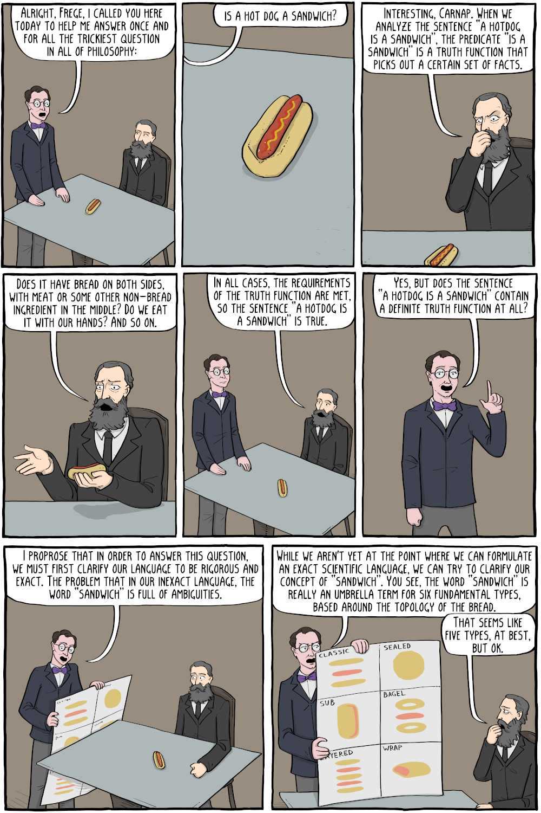
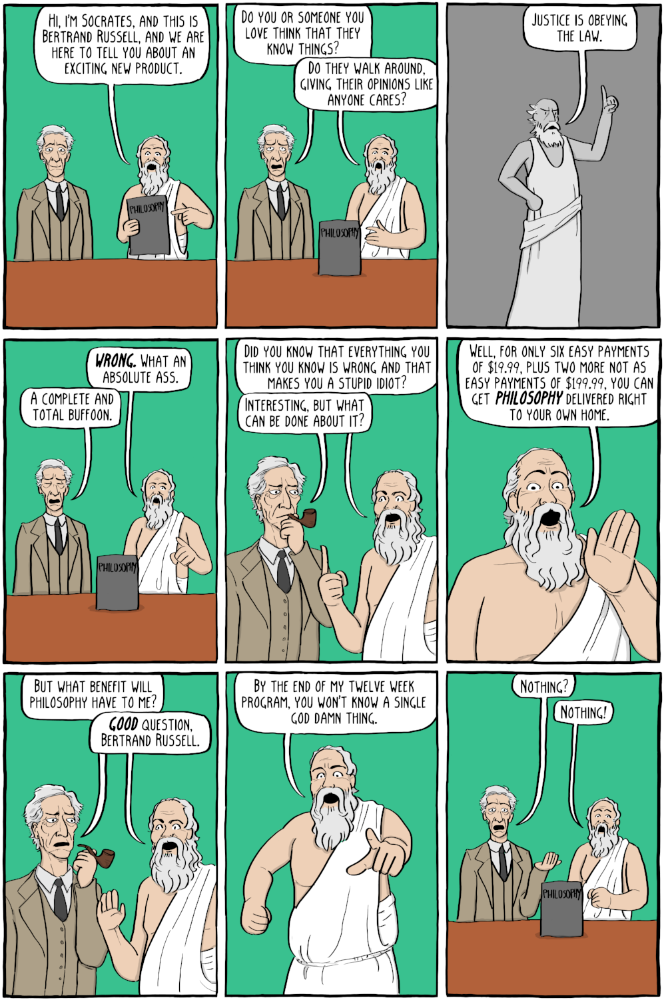
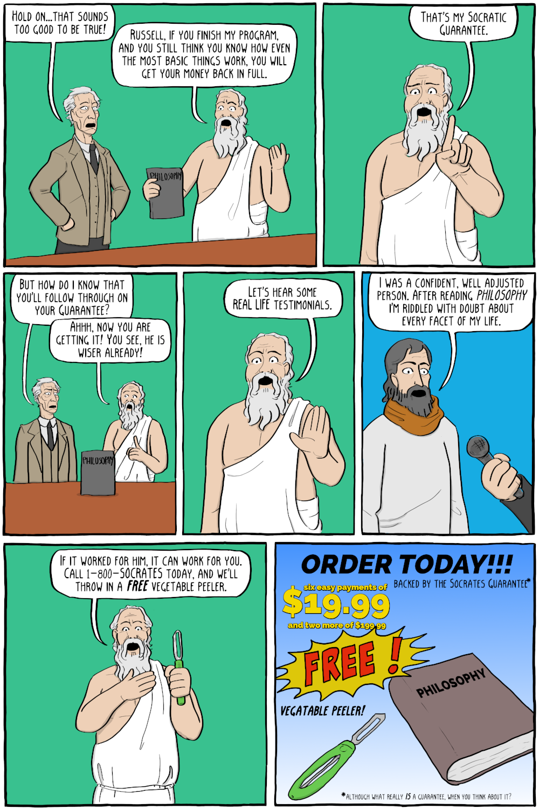
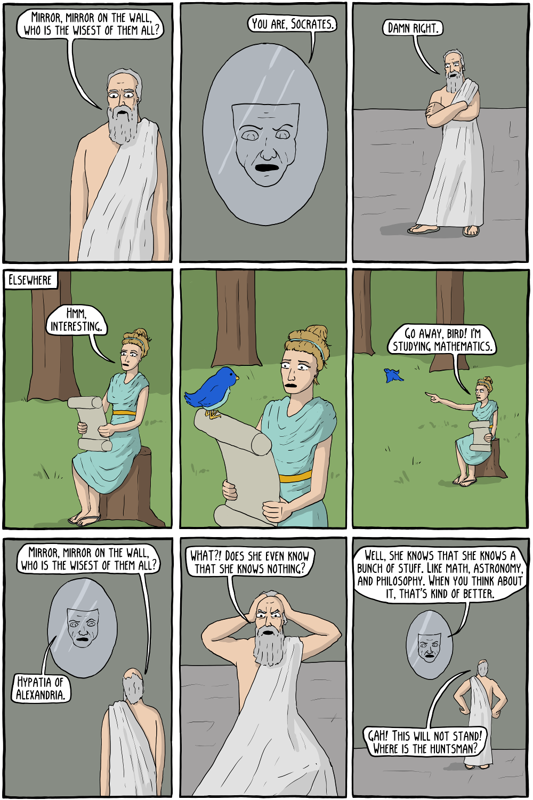
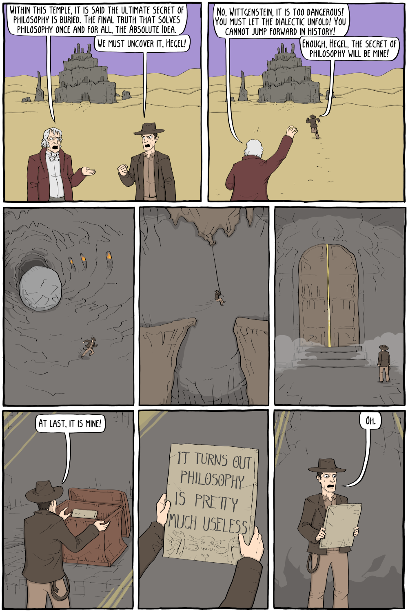

[Back to Part 4: Physics and Metaphones](./Part04_Physics_and_Metaphones.md#navigation). Up next, Part 5:

# an Invitation to the State of California

In celebration of Rational Approximation Day, 02022-07-22, I would like to offer "[Tools of Math Construction: an Aggregate Theory of Concrete Mathematics](./An_Aggregate_Theory_of_Concrete_Mathematics.md)" to the State of California as a means for building up the foundation of the elementary math curriculum.

It is an apology for the Indiana Pi Bill, and an Apology for Science, Faith, Reason, and Humanity. It includes the script "[Kevin Bacon and the Stern-Brocot Tree: a Sermon on Rational Approximation](../T001_Kevin_Bacon_and_the_Stern-Brocot_Tree/a_Sermon_on_Rational_Approximation.md)".

It introduces a new game to play: the Six Degrees of the Tree, the Triangle, and the Square. The Stern-Brocot Tree is like a Museum of Fractions. Pascal's Triangle is like a Maze of Counting. The Symmetry Group of the Square is like an entire Book of Algebra!

These core concepts are carefully curated to be very simple, yet also very powerful. If you can count to four and add two plus two, then I have tried hard to find simple explanations of these core concepts that I hope you find intruiging.

At the same time, all of the core concepts have suprising, highly non-obvious implications and generalizations that you could spend an entire mathematical career studying, if you so choose. My hope is that these core concepts can ease your path to a personal understanding of advanced mathematics.

For example, did you know you can use the Stern-Brocot tree to round 3.14 to 22/7? Well, now you have referential knowledge of it! Let's recognize March 14 as Pi Day, and July 22 as Rational Approximation Day. Taking the first steps towards making that knowledge more directly your own is just a few suprisingly short and easy lessons away.

Taking a free tour of the Stern-Brocot Museum of Fractions offers a new and exciting way to reduce fractions that even many college math professors don't yet know about! You can learn to contradict Euclid, all while learning to use the Euclidean Algorithm to navigate the Museum of Fractions!

The Tools of Math Construction are specifically designed to provoke vigorous growth in knowledge, intellect, wisdom, kindness, and courage. It aspires to efficiently and enjoyably prepare students for as wide a swath of advanced math classes as I could muster, including plausible educational paths to Bayesian networks, non-Euclidean geometry, and elliptic curve cryptography.

In _an Aggregate Theory of Concrete Mathematics_, computer programming is like Portland cement. The _Six Degrees of the Tree, the Triangle, and the Square_ provide the aggregates much like sand, gravel, and crushed stone. Heuristics is like water in this metaphor. Time spent practicing how to solve problems, often by writing short computer programs, is like mixing this recipe together and pouring a hydrated mixture of concrete math into your brain.

Let the result set up and harden for a while, and come back and polish your new understandings smooth with review and connect them together with synthesis. Learn to pour your own concrete mathematics, and you'll soon be left with a solid foundation to support deep explorations into science, technology, advanced mathematics, and much more.

The Symmetry Group of the Square leads very naturally to cartesian coordinates, computer graphics, and linear algebra. Pascal's Triangle leads very naturally to counting, probability, and statistics. The Stern-Brocot Tree is like a Rosetta Stone, translating between computer science, arithmetic, algebra, geometry, calculus and beyond, taking us into the unknown.

An Aggregate Theory of Concrete Mathematics is an introduction to constructive symmetry, computer programming, rational approximation, communications, signals, semantics, consensus, blockchain, radios, robots, relays, and induction.

I can already hear you asking "but what shall we cut?!!" I would cut fractions, of course! Or rather, fractions are still very much right there, in the Museum of Fractions. Our current approach to teaching fractions is very much analogous to Roman numerals.

From a modern perspective, the way we currently teach how to add and reduce fractions wastes many years of supremely valuable elementary math lessons. I enthusiastically endorse Dennis DeTurck's most excellent thesis, "Down With Fractions!", with my main rebuttal being the Stern-Brocot Museum of Fractions.

Fractions have been reconstructed into a new and much more potent form. We shouldn't practice fractions by hand every day.  Instead, we practice fractions by hand, and then we practice teaching the computer how to do fractions for us, rinse and repeat.  But we only do this once in a while, perhaps once a week, or whatever.

If you look more closely, nothing relevant has been removed. I'm just clearing up some time to play with computer programming to do... whatever the student wants, really. I'm not too picky. Unstructured and semistructured play times are very important, especially in computer programming!

Let's ensure that every child gets the best practical start in life that we can plausibly manage. We can do a lot better! I am personally inviting you to be better. I am inviting all of us to be better, together.

The State of California really can have its cake and eat it too on the topic of the currently ongoing controversy. I endorse the [Brown University Bootstrap Project](https://www.facebook.com/BootstrapWorld/posts/pfbid0UsCSCGMt2gz9xPVnmvLr8rRUEGZnjYjNyPPdUMUHrRmF9Xtfd9WKNEoHjhygiAdDl), and I endorse ["Calculus isn’t the only option. Let’s broaden and update the current math curriculum" by Jesús A. De Loera and Francis Su](https://www.sacbee.com/opinion/op-ed/article260529232.html).

This letter is also an acknowledgement of the social issues raised by the reform attempt, and also by Michael Render. Math tests and scores are frequently used to deny people education and jobs in ways that often are of no relevance.

A cousin of mine wanted to be an elementary school art teacher. She had great results during her student teaching. In one of the tragedies of life, she was denied certification due to an inability to pass a math test. Once, she came within one question of passing. I can't help but wonder how many students she would have touched, but now will not, because of this unnecessary and irrelevant means of exclusion.

At the same time, there will always be students that outpace the rest. Everybody should be allowed and encouraged to take on a more challenging math if they are interested, and everybody should be allowed to take easier math classes if they are not! Therefore, I am far from certain exactly how to approach the issue, but we really must find a more inclusive approach.

I myself was first introduced to Algebra I as a freshman at Triton High School. Thanks to the Indiana Academy for Science, Mathematics, and the Humanities, I graduated high school having successfully completed AP Calculus BC, Multivariable Calculus, Differential Equations, Discrete Mathematics, Linear Algebra, and Probability.

This was a life-changing experience for me. I had a lot of fun travelling to Ames City, Iowa with other top math students from across the state of Indiana, many of whom were smarter, and most of whom were far better prepared than I. We represented Indiana in the 1997 and 1998 American Regional Mathematics League contests. I was introduced to the writings of Karl Popper on the philosophy of science, an unexpectedly remarkable surprise. And I met a worthy and longstanding rival, my very dear friend Yuri Goldfeld.

Yuri brought the current controversy to my attention last year, and helped provoke this reponse. In response to Yuri, and in the name of Reason, Rationality, and a Reënlightenment, I offer everybody my love letters from this pandemic.

In the Aggregate Theory, fractions have been reconstructed into a new and more potent form. This form can plausibly be introduced at an even earlier age with the same or better chance of success. Learning how to reduce and add fractions becomes fundamentally easier and more interesting, when you have the Stern-Brocot Museum of Fractions and it's guidebook, the Euclidean Algorithm, to work from.  Furthermore, we can use the Stern-Brocot and Calkin-Wilf trees, and the Euclidean Algorithm, to playfully motivate introductions to integer multiplication, integer division, run-length encoding, and so very much more.

We shouldn't be spending more than a few days a month practicing how to add and reduce fractions by hand. I very much do encourage hand computation, you can certainly learn a lot that way. I know I did, and I still do. But there absolutely no reason to spend every day on that. That's boring and unproductive.

It's much more exciting to learn how to teach a computer to add and reduce fractions for you. Creating those computer programs are not much harder than playing chopsticks on the piano; it'll be hard at first, and you can always get better at it, but neither failure nor the fear of failure should stop you from trying and trying again, _especially_ with the tree, the square, and the triangle.

With the free time we've opened up, we have time to play with other ideas. We can pick up a topic, play with it for a day or two, and then go do something else.  Because we keep coming back to similar ideas over and over again, we build in spaced repetition into the curriculum. Even the ancient Greeks and Romans appreciated spaced repetition as a heuristic for improving the formation, retention, and recall of long-term memories.

And, as a bonus, you'll probably remember how to do fractions way easier and better than you ever did before! Your memory of doing it by hand, and your memory of teaching it to a computer, those two memories together reinforce each other in surprising ways. Learning to play these understandings off of each other is a catalyst for learning, allowing you to learn more with less effort, effectively making you more intelligent.

In the longer run, informal understandings, formal understandings, and philosophies of wise application are the all-important legs of the three-legged stool of science, technology, and mathematics: missing any one of these legs can create significant impediments and difficulties in teaching, learning, and using STEM ideas in ways that are reliable, constructive, and beneficial to humanity.

Learning how to teach a mindless, exquisitely precise robot how to calculate something for you, is an extraordinary, new, and profound opportunity for active learning. You get to be the teacher now. Your student is totally oblivious to everything you don't tell them about. Your student is unable to take initiative themselves. Though mindless, your student also has superhero powers. Your student can answer many of the questions you ask instantaneously, and your student almost never makes a mistake.

Well, mistakes are made, all the time. It's just that the mistake is very probably with your teaching, not your student's calculations. This is a great playground for exercising the inductive attitude by exploring cause-and-effect relationships and counterfactual reasoning.

In this epistemic frame, there's far less room for you to hide behind your own knowledge illusion. In this epistemic frame, it far more difficult to fool yourself into believing you understand something, when in fact you are either quite wrong, or your knowledge is only a few inches deep.

Besides, let's talk a moment about about the computer's superpowers really are for a second. Even if you are Arthur Benjamin and whiz at mental arithmetic, in the single blink of an eye, the biggest supercomputers can perform more mindless arithmetic than you yourself could possibly hope to accomplish over the course of billions of billions of lifetimes.

Comparing a marathon runner to the speed of light is a far more reasonable! If you ran a 42 kilometer marathon per day, every day, it would only take you 20 years to run a single light second, that is, the distance travelled by light in one second. That almost seems doable!

Although the smaller computers that you will start out with are nowhere nearly as capable as a supercomputer, it's still true that in the blink of an eye, they can perform more mindless arithmetic than you could possibly hope to accomplish over many lifetimes of mindless pencil-and-paper calculations. The marathon runner versus the speed of light is still a more reasonable matchup.

And yet, somehow, there is something peculiar and important about human intelligence and human self-awareness that we have not come anywhere close to replicating on a machine. Although today's machines are fairly mindless, and can certainly be engineered to be totally oblivious, a human marathon thinker is inherently self-aware, and can often compete with a supercomputer in terms of overall reasoning.

A human thinker will invent and adopt many practices that save time and energy. Instead of metaphorically running a light second around the world a couple of times, the human thinker can quite often find a shorter, more efficient path to the answer.  Sometimes the human thinker can teach the computer about this shorter path. The wise human thinker also realizes that they have much to learn from the computer.  There are many useful forms of reasoning that humans perform effortlessly, that we have yet to figure out how to teach to the computer.

Personally, I am not overly interested in the questions of whether any particular fantasy of artificial intelligence is plausible or not. Though I will say I do find the concept of the Singularity to be highly implausible. Also, I think that belief in the Singularity has rather negative consequences for our epistemic responsibilities, so there is that.

Instead, I am supremely interested in figuring out how to best use the strengths of both machine intelligence and human intelligence together in harmony to accomplish whatever we ultimately decide is worth doing together, as a community of wise individual human beings.  Humans and machines both have our own peculiar superpowers that the other cannot match. Let's learn how to work together in the most effective ways possible, to gain the best possible benefit of both, and for the greatest possible benefit of all humanity.

Significant reforms to the elementary mathematical curriculum do pose numerous practical difficulties, and we should expect significant teething problems. Not least of these is an initial reactive resistance to new ideas that aren't commonly known or understood in the general population. These reactions frequently cause parents to transmit negative attitudes and teach outright misconceptions about new math to their children, which can make the teacher's job way more difficult. In many cases, this can shut down the conversation, making the teacher's job practically impossible. Moreover, finding teachers who can teach the new material itself poses a natural chicken-and-egg problem.

This chicken-and-egg problem has been severely complicated in the US by the fact that mathematics has historically been taught by generalist elementary teachers. As a practical matter, enacting deep reform for the entire state of California would almost certainly require hiring tens of thousands of teachers specializing in early childhood math education, and trained to the new curriculum.

Ideally, every elementary student would be in math class taught by a specialist two or three days a week. Perhaps some of this time could be given back to the homeroom teacher for other purposes, but the homeroom teacher must be regularly included in the classes taught by the specialist. For starters, this presents an opportunity for the homeroom teacher to get comfortable with the new curriculum. This way, the homeroom teacher can learn how to better supervise the time allocated to mathematical practice and play on the other days of the week.

This also presents an opportunity for homeroom teachers to demonstrate to their students how to maintain a good attitude and show respect for the material that is being taught, even if that material is causing you great discomfort for whatever reason. New mathematical ideas can be extremely difficult to learn for the first time, that's ok and to be expected. Sometimes you just have to keep pressing on, until it suddenly starts to get easier. By reducing the inductance of the concepts, I hope to reduce that initial resistance for everybody.

And of course, specialist math teachers should have a semi-private forum for discussing any issues that the specialist themselves can't quite answer. Sometimes the specialist will need help to constructively address a particularly unusual and possibly insightful question and/or answer from a student. For example, this would be useful in cases when a student stumbles upon a "proof" that cannot possibly be entirely correct, and yet it isn't obvious what the problem really is.

My mother Eloise was an teacher at Triton Elementary School, where I was a student. Even though she has never learned how to teach a computer to do things, she was a highly effective facilitator in helping me to learn how to teach the computer to do things. To me, she was at all times an excellent rolemodel for the scout mentality and the inductive attitude.

As a student at Triton Elementary School, I was aware my teachers knew things about math than I did not know, and I eagerly learned any tiny nugget of information at any opportunity. But I was also aware that what I did understand about math, I understood more deeply than nearly all of my elementary school teachers.

This could cause friction in a multitude of ways. Especially in the earliest days, I would often be the last done with math worksheets, and not by a little bit. It would often take me multiple times longer than any other classmate who zipped through the homework. But I made very few mistakes.  And I could take some small nugget of whatever I had just learned in class, and use it to answer questions well beyond the scope of what was being taught.

I remember a conflict with a teacher over the question "Given the sum and difference of two numbers, what are those numbers?"  I had never considered questions of this type before that day in class. The teacher insisted that "Guess and Check" was the only way this problem could be solved.  But within about fifteen seconds I knew exactly how to solve this problem, no guesswork required.

Teachers can be bullies. While that has long been obvious to me, it took me a long time to build up the courage to stand up to them, and to figure out how to stand up to them without becoming a bully myself. As an occasional teacher, I learned how supremely difficult it can be to teach an idea that people aren't at all familiar with, even referentially.

When my mother Eloise was taking algebra as a student at Triton High School, her teacher refused to answer her questions, or explain anything. He said that only the smartest boys needed to know anything about algebra, and then they did not need to understand the formulas, they only needed to memorize them, so that they could attend Purdue and become engineers. He refused to help anybody else. I do know that if I had been his supervisor, I would have fired that man on the spot.

Of course, today I would have the backing of Title IX, thanks in large part to Indiana's own Birch Bayh, which prohibits excluding women from the class like this. I can only imagine how much more difficult that might have been, had I actually been my mother's school principal. But I want to emphasize that this teacher was also doing a profound disservice to the students he was nominally including, by teaching a piss-poor attitude towards the subject itself. Math is so much more than learning how to perform arithmetic by hand, and memorizing formulae.

Excluding women has been a profound disservice to the subsequent generation: my mother Eloise subsequently became a teacher at Triton Elementary School, andhistorically elementary education in the United States has been a job dominated by women. Even as a child I was aware that my elementary school teachers weren't really the math teachers I wanted and needed. Only after working on this essay did I put two and two together and realize that my elementary teachers were often prevented from becoming the math teachers I needed.

Not every elementary school teacher needs to be an expert in the new curriculum. My mother Eloise was an excellent facilitator for me learning math, even if she didn't always understand what I was learning. Yet every student should have have regular opportunities to learn from and talk to a specialist who has that expertise.

My father Byron Smith taught computer science at Manchester University. He earned a Masters Degree in Computer Science from Purdue. My great aunt Evelyn Rettinger was a Trustee of Purdue University, where she as a student met my great uncle Herman. Purdue is also where my great aunts Annabel and Esther Rupel managed 4-H and taught home economics.

My uncle Hugh Rettinger was the high school guidance counselor. Together, we supervise the counting of money, and help supervise elections. My cousin Wes Rettinger is a former math teacher, and is currently on the school board of Triton School Corporation. My grandfather Donald Rettinger was a longtime member of the Triton school board.

You could say education runs in the family.

The question "Algebra I. Grade eight or nine?" is a trifling concern, and one with deadly serious social consequences. If the State of California were to seriously fund practical interventions into enriching the mathematical curriculum, we can soon be looking backwards and be wondering why that question seemed relevant to anybody.

My assessment of the situation is that we are primarily lacking the human capital, the payroll, and the will to make it so.

Let us raise up a generation of capable engineers who build the very best robotic golems, and let the primary and ultimate purpose of those robotic golems be to meet the needs of ourselves and other living beings, without being destructive or extravagant. Grant our engineers the wisdom to judge how well these criteria are being met. Grant our engineers the will to help supervise their creations, the will to improve their creations, and the will to dismantle their creations. Grant out engineers the will to intervene, and grant them the wisdom to do so effectively.

Grant those engineers the wisdom of statistical rethinking and causal inference. Let a new generation of wise and prudent engineers build the very best ovens that bake empirical observations about what we see and what we do into tasty doughnuts. These treats should provide plausible, relevant, and actionable estimates of the mysterious world we find ourselves in.  Let these estimates be shared widely, for the benefit of all humankind. We want doughnuts, not excrement!

In celebration of Rational Approximation Day 2022, Friday, July 22, 02022-07-22, I personally invite you, no matter who you are, to start learning how to find your way around inside this Museum of Fractions, and to start learning how to play the Six Degrees of the Triangle, the Square, and the Tree.

To celebrate, I suggest cutting a pie into sevenths and sharing it with a circle of six other friends, both new and old.

I do sincerely hope the State of California takes me up on my invitation.

With Love and Respect,

Leon P Smith

Iterative Systems, Bourbon, Indiana  (02022-07-22)

## Sharing Pie with a Circle of Friends

On the topic of sevenths of a circular pie, assuming the pie is like a cake and wants a bit of sawing motion to get a clean cut, and assuming you care about trying to make seven nearly-identical wedge pieces... then I think you'd be best off by puncturing a circular hole in the center of the pie, topologically transforming the pie into a donut. That donut can then be neatly sliced into seven wedges, which you could share with a circle of six other friends.

Other kinds of pie will at least afford and possibly require radically different pie-cutting solutions! What about a pizza pie, which tends to cut better with a rolling slice? What about asymmetric cuts? What about fair division? What about social choice? The possibilities for new and interesting questions are endless!

The symmetric group of permutations of six elements, is a finite group with 6! = 720 permutations. This group, S_6, is exceptional because is the only finite symmetric group that has an outer automorphism! See John Baez's post ["Some Thoughts on the Number 6"](https://math.ucr.edu/home/baez/six.html) if you would like to try to understand what that even means.

In any case, remember to share pie with a circle of friends, both new and old. May all y'all have a blessed Rational Approximation Week, and a wonderful Rational Approximation Day!

# Author Bio

[Philosophy Infomercial](https://existentialcomics.com/comic/196)

Leon P Smith is a longtime enthusiast of computer science, programming languages and math education, especially concurrency, communication, semantics, queuing, Haskell, discrete mathematics, abstract algebra, and (semi-)formal methods. He is also an armchair cosmologist, a professional calendar nerd, and an aspiring time nut. As a software engineer, he is best known for postgresql-simple, which was part of a software system that assisted dispatchers in the process of answering and responding to emergency 911 calls in Parke County, Indiana. As a result of being a popular open source library, it is currently in use in countless publically unknown contexts all over the world.

At Obsidian Systems, Leon lead a team that provided the Avalanche blockchain community with their first integration with Ledger hardware wallets. Leon is a former campaign staffer for Joe Donnelly, a former Senator from Indiana who is currently United States Ambassador to the Holy See. Leon is also an alumnus of Beta Nu of Theta Chi fraternity at Case Western Reserve University, and was sleeping less than ten meters from original composite photographs that included Donald Knuth when the towers fell.

He is a graduate of the Indiana Academy for Science, Mathematics, and the Humanities at Ball State University. Later as a graduate student at Indiana University in Bloomington, Leon participated on a robotic golf cart team lead by professor Steven D. Johnson, where he developed a deep interest in industrial accidents and safety engineering. He aspires to become an epistemic frame engineer, and always a better philosopher of design.

## Epilogue

If you'd like to understand a bit more about me, here's a review of books that have had a particularly notable impact on me, or at least that I deeply appreciate:

Oh! Pascal! (3rd Ed.) by Doug Cooper
  * Junior High through High School, occasionally (but rarely) referenced this book as an undergraduate.
  * Exceptional for a number of reasons, but especially the attention to detail and creativity of the examples
  * Write down the story of senior year research colloquium final project and Dr. Fakhruddin
  * Book made the trip to undergrad and back.
  * If you are a student learning to program, this book probably isn't terribly relevant due to Turbo Pascal 6.0
  * If you are considering writing an introductory book on computer programming, well worth drawing inspiration from
  * Had some simpler fractals, reminscent of "Indra's Pearls: the Vision of Felix Klein".  The mathematical explanations are far deeper and more refined in Indra's Pearls, though.  "Oh! Pascal!" wasn't really enough to "sell" me on the study of fractals.

Programming Language Concepts (2nd Ed.) by Carlo Ghezzi and Mehdi Jazayeri
  * First read it over the course of a few days my freshman year of high school
  * I so very clearly remember the (Wulf 77) quote and the name "UTOPIA 84" from p 19 and 20; that really was a highlight of the book to me. Those criteria, and that hope, framed my thinking about a better programming language, which I immediately started searching for once I reached the Indiana Academy and had the internet and a university library at my disposal.
  * Good overview of what a runtime basically looks like for Pascal or C, which was a huge help for me as an imperative programmer.
  * Built my first intuitions for the non-linear tradeoffs inherent in programming language design, and how those tradeoffs correspond to features of a language's runtime environment
  * Deeply informed my philosophy of mathematics:  from early childhood I have identified computer programming with mathematics, and vice-versa. This book, along with my math classes in school, helped me revise and extend that analogy.
  * Had a section on functional programming which I clearly remember reading with great interest, but I had no language implementation to play with. It created a reference in my mind, but not one that I understood, nor was this book quite enough to "sell" me on functional programming.

Programming with Standard ML by Colin Myers, Chris Clack, and Ellen Poon
  * While I was a student at the Indiana Academy, I spent quite a bit of time conducting a fairly exhaustive literature search through the programming-language related books in the Computer Science stacks at Bracken Library.
  * I thought I was gathering raw data to make my own programming language.  Little did I know I was actually searching for this book.
  * I found this book the fall of my senior year of high school. It was certainly one of the momentous moments of my life.
  * Checked it out and read it cover to cover within the next 36 hours or so, was immediately sold on functional programming
  * It took a year and a half and considerable effort to start to actually get good at FP.
  * at first, I was learning SML and Haskell in parallel, alongside the "Gentle Introduction to Haskell"

Introduction to Functional Programming using Haskell (2nd Ed.) by Richard Bird
  * Spent a fair bit of time with this book fall of my freshman year of college
  * Taught me structural induction, which was a huge and immediate eye-opener
  * Induction schema for Regular Languages

Purely Functional Data Structures, by Chris Okasaki
  * Was reading this the same time as Bird's book.
  * Chapter 2 was especially helpful in getting better at functional programming, in much the same way that Ghezzi and Jazayeri was helpful when I was getting better at imperative programming.

Vicious Circles, by Jon Barwise and Lawrence Moss
  * spent quite a bit of time with this book towards the end of my undergraduate education
  * When I described the axiom of foundation and hypersets to David Singer,  he thought that was an incredibly bizzare and esoteric idea. Dr. Singer's obvious skill as a mathematician and lack of knowledge of axiomatic set theory was a data point that injected skepticism into my thinking, which helped me to start to differentiate the philosophy of mathematics from programming language theory in my mind, and later helped establish my belief in the Weak Paraconsistent Conjecture.
  * later met Dr Moss and attended a number of lectures
  * This esoteric interest helped me notice that the Stern-Brocot tree is a particularly fertile example
  * This book inspired "[Lloyd Allison's Corecursive Queues](https://hackage.haskell.org/package/control-monad-queue)" and "Fun with the Lazy State Monad"

Essentials of Programming Languages (2nd Ed.), by Daniel Friedman, Mitchell Wand, and Chris Haynes
  * also spent a fair bit of time with this book as an undergraduate
  * inspired a toy stepping debugger for a toy FP language
  * later took classes from Daniel Friedman

Limits of Software: People, Projects, and Perspectives, by Robert N. Britcher
  * Do you care deeply about design?  It's very challenging to do well.
  * All in all, I appreciate Chapter 4 quite a bit.
  * Unfortunately, Chapter 4 does also plainly libel Alan Turing.
  * Alan Turing has since been pardoned and has received a formal apology from the British government.
  * The final chapter contains a grim outlook on the future of software.
  * That vision has certainly arrived.

## Words of Gratitude

[Hypatia of Alexandria and the Seven Presocratics](https://existentialcomics.com/comic/95)

To Imre Lakatos and Ayn Rand, two very different yet both deeply flawed human beings, of the type that should make you turn your head and go "Holy Shit!"

They both lived experiences that no one should ever be subjected to. Every human being deserves the love and support of others. Every human being deserves encouragement and assistance to become the best that they can be. Every human being deserves to have doors open to them. Every human being deserves to have doors opened for them. Even if sometimes you mess up really big.

In the end, one took important stands against the dishonesty of men, and the other is Ayn Rand.

To Paul Feyerabend, Jon Michael Dunn, and Vladimir Kara-Murza, also for taking their own stands against the dishonesty of men.

To Judea Pearl, Doron Zeilberger, and Yuri Goldfeld, three dear friends of mine. Two by word, one by flesh. One new, and two old. Thank you all so very much for kindly provoking me into becoming better. Here's to the inductive attitude, heuristics, casual analysis, and counterfactual reasoning!

To Ozgun Ataman, for being a friend, for providing profound contributions to postgresql-simple, and for recommending Statistical Rethinking by Richard McIlreath to me.

To Donald Knuth, Haskell Brooks Curry, Douglas McIlroy, Gerald Sussman, Guy Steele, Daniel Friedman, Kent Dybvig, David Wise, Simon Peyton-Jones, Simon Marlow, Jon Barwise and so many countless others, for making my work on UTOPIA 84 even possible.

To my father Byron Smith, Carlo Ghezzi, and Mehdi Jazayeri for inspiring this quest. To William Wulf and George Lakoff for framing the goals for me. To Colin Myers, Chris Clack, and Ellen Poon for opening the first very remarkable door for me.

To Richard Bird and Chris Okasaki for dereferencing my understanding of functional programming. To Jeremy Gibbons, Richard Bird, and David Lester for giving me the frontispiece to my answer.

To Julian Gevirtz, Kimberly Foltz, John Racja, and Franklin Shobe, teachers of mine at the Indiana Academy, for teaching me Mathematics, and shaping and broadening the goals of this quest.

To Case Western Reserve University and the Indiana Academy, for deepening my appreciation for Science and the Humanities.

To William Deal, Timothy Beal, Marty Grundy, and the Cleveland Meeting of the Religious Society of Friends, for helping me to clarify my thoughts and for helping me to find my writing voice.

To Erin Clair, for recommending "There is No Case for the Humanities". To David J Eshelman, Louis Campbell, Ben Sigg, G. Alex Janevski, Tim Sentgeorge, Eric Kugler, Michael St. Clair, and so very many other brothers of Theta Chi Fraternity.

To some I very much owe an apology. I am sorry. I shall address proper apologies privately.

To Guo-Qiang Zhang, who introduced me to non-classical logics and kindly dissuaded me of Ronald A Fisher's bromide against Bayes, even if sadly that didn't kindle a deeper interest in statistics and it's connections to logic at the time.

To David Singer, for introducing me to epistemic framing via RSA cryptography. To David Doiron, for introducing me to signals and the erasure of Arabic science via optics. To Jim Al-Khalili, for teaching me how to pronounce al-Khwarizmi, and introducing me to al-Haytham.

To my dear friends Roshan James, Pooja Malpani, and Madhava of Sangamagrama, all of whom I first met while I was a student at Indiana University.

To George Voutsadakis for introducing me to Combinatorics and the Theory of Computation. To Dong-Hoon Lee and Ta-Sun Wu for introducing me to Abstract Algebra and enhancing the joy that I find in symbol-pushing proofs and induction. To Lee White, whose Data Structures class sent me down a rabbit-hole that resulted in me more deeply appreciating integer-valued polynomials, and whose graduate-level software engineering class was for me the easiest A at CWRU ever.

To the memory of Elizabeth Meckes and all the unknown, largely unappreciated scholastic summoners toiling away on the almost entirely thankless task of reforming the elementary math curriculum. Thank you, Paul Steury, and Paul for All 2022, for caring.

To Edward Kmett, an elemental wizard of heuristics, level unknown. Edward is plausibly the smartest and most knowledgable man I've ever met. Thank you for giving me an appreciation for iterative deepening depth first search, the seed that helped crystallize my answer.

To Doron Zeilberger and Ryan Trinkle, also for helping me achieve a much deeper practical appreciation for heuristics.

To Lee White and Steven D. Johnson, two first-rate philosophers of design. Thank you for sharing your deep insights into software, hardware, and safety engineering with me.

To Daniel Friedman and Kent Dybvig, for sharing your deep insights into the philosophy of education and design with me.

To Guo-Qiang Zhang, Larry Moss, Amr Sabry, Will Byrd, Jon Michael Dunn, Katalin Bimbó, and Cale Gibbard, eight superlative logicians whom I have been blessed by knowing.

To Obsidian Systems, by far the best software company I've ever seen.

To Ryan Trinkle, Ali Abrar, Morgan Tilleman, Jordan J Szymialis, Andrew B Jones, Maggie Marinocha, and the law firm of Stuart and Branigin LLP, for having a competent and ethical sense of the law.

To my parents and grandparents, as well as Jill Hassel, Karen Cox, Sam Davis, George Irvin, Michael Goldfeld, Kelley Fallon, Tom Adams, Hasan Fakhruddin, Joe Donnelly, and Lois Clark for helping me to more carefully observe how certain very specific parts of the world works, and for believing in me.

To Kenneth Arrow, Rob Richie, Chris Butler, Ka-Ping Yee, Warren Smith, William Poundstone, and Jameson Quinn for introducing me to Social Choice Theory. To Birch Bayh, Rob Ritchie, John Anderson, Jameson Quinn, Aaron Hamlin and the Center for Election Science for working to bring practical interventions to fruition. To Herbert Simon, Amarya Sen, Daniel Kahneman, and Elinor Ostrom, for all of their many wise contributions.

To Elizabeth Werner and my amused and dismayed teachers of Analysis, who helped me become referentially aware that informal mathematics exists. To Joel Langer, for introducing me to Visual Complex Analysis, which I found so supremely difficult yet utterly fascinating. To Warren Smith, for definitively slaying the illusion of the non-existence of informal mathematics in my mind. To Imre Lakatos, for getting me to laugh about it and helping me to heal. I missed a dental appointment laughing at "Proofs and Refutations", only to notice the text saying it had been cancelled two weeks later! Such has been my pandemic life.

To Norm Waggy. This essay was originally entitled "How To Be Reasonable: a Study Guide". With your profound assistance, that changed into "Tools of Math Construction: an Aggregate Theory of Concrete Mathematics", a vast improvement. Neither of us could have possibly been aware of what had actually happened at the time of the conversation, and that is wonderful!

To Benjamin Franklin and Karl Popper. I feel their motives for serving as Ambassador to France, and writing "The Open Society".

To Birch Bayh and Richard Lugar, for advocating for Title IX and for nutritional assistance, among many other worthy and noble endeavors.

To Christopher Clavius for his work on reforming the mathematical curriculum, and for serving as a wise referee for the Gregorian calendar reform. To Giovanni Girolamo Saccheri, for his outstanding investigations into geometry. To Pope Francis, for inspiring millions of disillusioned Catholics all over the world.

To Emin Gün Sirer, David Singer, George Lakoff, Existential Comics, Corey Mohler, Obsidian Systems, Elliot Cameron, Divam Narula, and every author recommended in this study guide, for their respective contributions to the construction of an epistemic frame. As my grandfather Donald enjoyed saying, here's to you, waggle your wings and fly level!

A very big thank you to everybody else, both known and unknown, who have also assisted in the construction of an epistemic frame.

A very big thank you to everybody, both known and unknown, who have assisted and facilitated my work on the philosophy of math education. Not least of all, many current and former colleagues, students, teachers, coworkers, supervisors, and other people of all kinds I have interacted with in many different contexts.

Love mercy, do justice, and walk humbly in faith and community with your fellow human beings.

Be honest with yourself and others.

Make an effort to include others.

Be generous to living beings.

Be kind to each other.

Intend to do good.

Think about causal factors.

Intervene wisely.

Have the moral courage and a will to intervene as necessary for your role.

Give people the confidence to say no, and respect their choices.

Have people around you that can tell you no.

Talk to one another, if at all possible.

Take a break, if necessary.

Apologize carefully.

If you choose to believe in some version of a multiverse, demonstrate epistemic responsibility to, and respect for, the timeline you are in.

If you choose to believe in God, demonstrate epistemic responsibility to, and respect for, the humanity around you.

If you choose to explore the unknown, respect the things that you find along the way.

The words you choose shape your destiny.

The things you do shape your legacy.

Thank you, Rabbi Joseph Teluskin, for your kind words, enriching us all.

Thank you, Emily Miller, for bringing both the Oven of Akhnai and the song "Twenty two (22) letters" by Victoria Hanna about the Sefer Yetzira to my attention!

To my grandfather, Donald Rettinger, for teaching me so much about shit, not least of all the smell of it from far, far away.

To Lois Clark, for having a heart and tongue of gold, and for caring deeply about all children.  In Lois's world, children were first and primary among so many other supremely important concerns.

Bless all parents and caregivers with patience, warmth, caring, and encouragement.  Bless them with wisdom, kind words, and just deeds, with material resources to share, and with time to spend with their children and beneficiaries.

To Camp Alexander Mack, the Prince of Peace Church, and the Indiana Academy, for their many profound legacies.

May everybody have a blessed Rational Approximation Week, and a wonderful Rational Approximation Day.

Peace out.

[The Ultimate Secret of Philosophy](https://existentialcomics.com/comic/437)

# Navigation

[Bibliography](./Bibliography.md)

[Part 1: Global Suggestions](./An_Aggregate_Theory_of_Concrete_Mathematics.md#tools-of-math-construction)

[Part 2: Deconstructing Bertrand Russell](./Part02_Deconstructing_Bertrand_Russell.md#deconstructing-bertrand-russell)

[Part 3: an Aggregate Theory of Concrete Mathematics](./Part03_Aggregate_Theory.md#suggestions-for-further-study)

[Part 4: Physics and Metaphones](./Part04_Physics_and_Metaphones.md#physics-and-metaphones)

[Part 5: an Invitation to the State of California](./Part05_an_Invitation_to_the_State_of_California.md#an-invitation-to-the-state-of-california)

[Author Bio](./Part05_an_Invitation_to_the_State_of_California.md#author-bio)